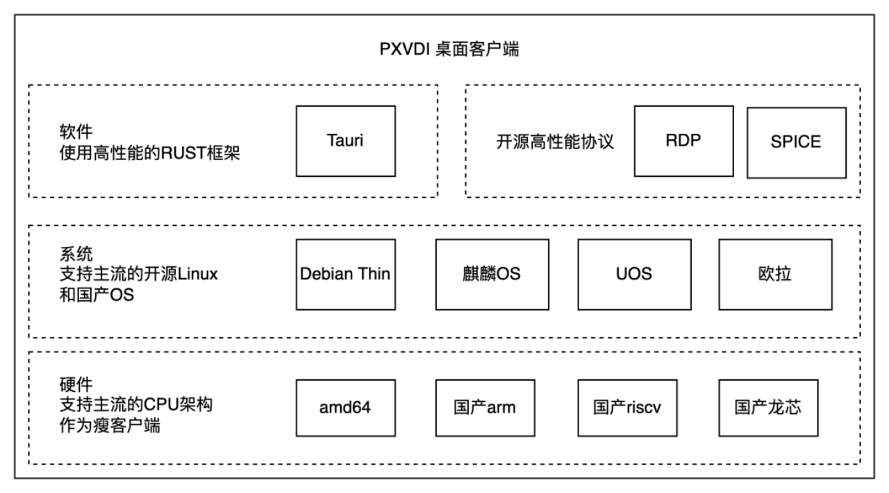

# PXVDI Client Architecture

PXVDI uses a high-performance Rust framework, supporting multiple architectures and operating systems."

## PXVDI Client Components
Below are the components required for the PXVDI client.

| Platform      | Components        | Version | Program Call Path   |
| ----------- | ------------- | ------ | ------------------------------------------------------------------------- |
| Linux     | Freerdp     | 2    | /usr/bin/xfreerdp                                                       |
| Linux     | Freerdp     | 3    | /usr/bin/xfreerdp3                                                      |
| Linux     | virt-viewer | 11   | /usr/bin/remote-viewer                                                  |
| Linux-Uos | Freerdp     | 2    | /opt/apps/com.lierfang.pxvdi/files/pxvd-xfreerdp                        |
| Windows   | Freerdp     | 2    | ./pxvdirdp.exe            |
| Windows   | Freerdp     | 3    | ./pxvdirdp.exe|
| Windows   | virt-viewer | 11   | `C:\Program Files (x86)\VirtViewer v10.0-256\bin\remote-viewer.exe` |
| Macos     | Freerdp     | 3    | /Applications/MacFreeRDP.app/Contents/MacOS/sdl-freerdp    |
| Macos     | virt-viewer | 11   | /usr/local/bin/remote-viewer                                            |

## PXVDI Client Version

| File Name    | Description          |
| ----------------- | -------------------------------- |
| pxvdi\_{version}\_amd64.AppImage      | Universal package for x86_64 architecture Linux, compatible with Zhaoxin, Haiguang, Intel, AMD, VIA, etc.                         |
| pxvdi\_{version}\_arm64.AppImage      | Universal package for arm64 architecture Linux, compatible with Rockchip, Feiteng, Kunpeng, Ampere, Broadcom, etc.                  |
| pxvdi\_{version}\_debian12\_amd64.deb | Debian 12 packages for x86_64 architecture, compatible with Zhaoxin, Haiguang, Intel, AMD, VIA, including Armbian Bookworm packages.    |
| pxvdi_{version}\_debian12\_arm64.deb | Debian 12 packages for arm64 architecture, compatible with Rockchip, Feiteng, Kunpeng, Ampere, Broadcom, including Armbian Bookworm packages. |
| pxvdi_{version}\_live\_amd64.iso     | Thin client system for x86_64 architecture, compatible with Zhaoxin, Haiguang, Intel, AMD, and VIA.                        |
|pxvdi_{version}_arm64.dmg|Compatible with macOS Apple chips, version >= macOS 12.

## Supported modes of the PXVDI client.

| Platform    | Support status          |
| ----------------- | -------------------------------- |
| Linux      | Direct connection mode and central control mode with seamless switching.                     |
| Windows     |           Central control mode           |
| MacOS |  Central control mode  

## Download link.
https://download.lierfang.com/pxvdi/Client/

