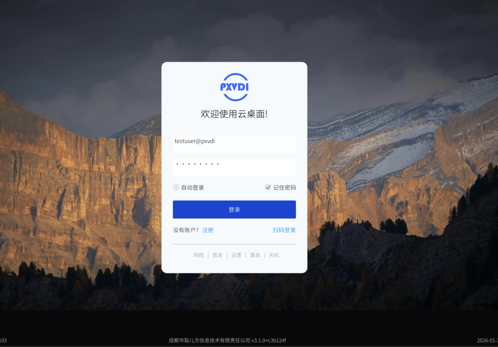
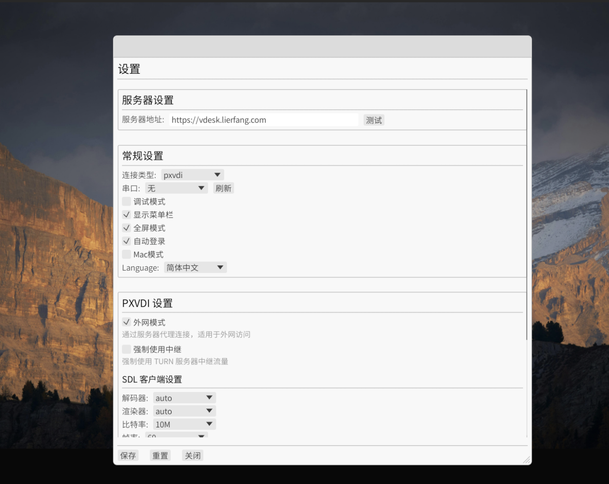

# 瘦客户端使用说明

PXVDI 客户端有2种，一种是桌面客户端，一种是瘦客户端，瘦客户端为嵌入式或者低配置机器设计！占用系统资源小，功能简单高效，并且被我们的瘦客户端系统集成。

## 瘦客户端支持的系统和架构

Linux: arm64/amd64/riscv64/loongarch64

## 瘦客户端软件下载

瘦客户端仅提供基于debian13的deb包，集成到瘦客户端系统中，如果需要单独下载，可前往[镜像目录](https://mirrors.lierfang.com/pxcloud/pxvdi/dists/trixie/main/)下载。

## 瘦客户端配置

主程序路径: `/opt/com.lierfang.pxvdi/pxvdi-thin-client`
配置文件路径: `~/.lierfang/pxvdithinclientconfig.json`

## 相关截图

