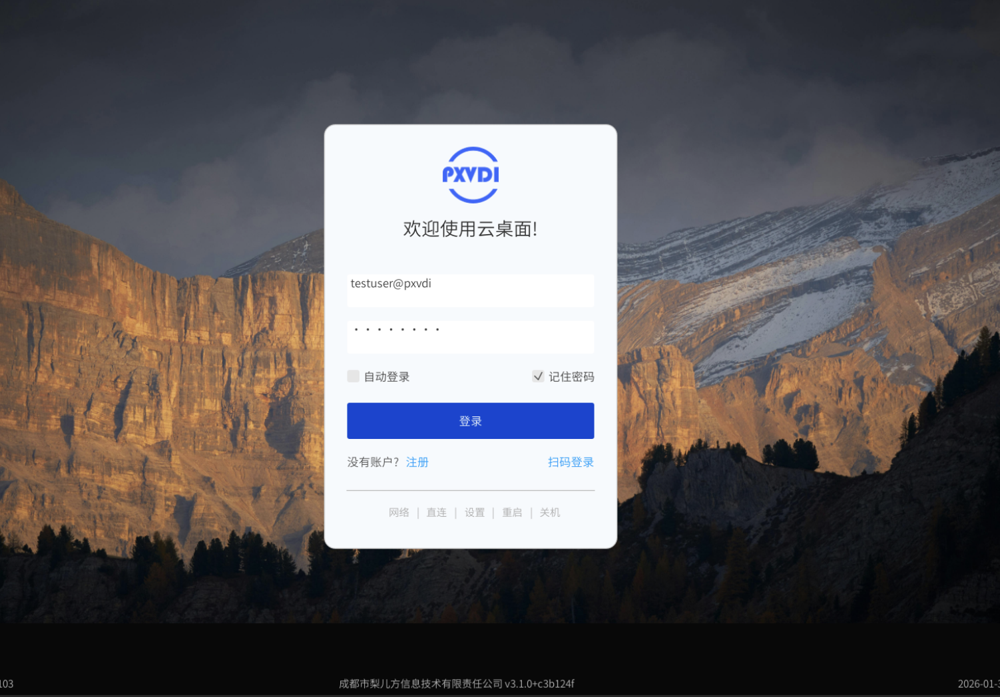
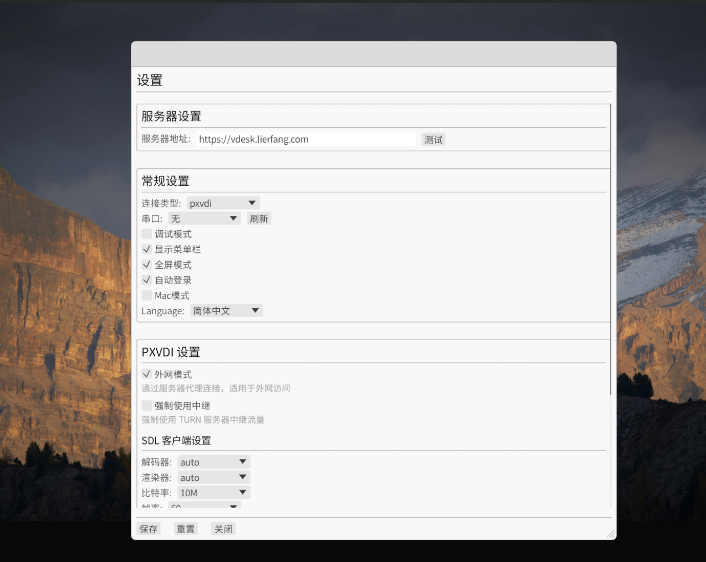

# 瘦客户端使用说明

PXVDI 提供桌面客户端和瘦客户端。瘦客户端使用 Rust/egui 开发，面向嵌入式设备和低配置机器，占用系统资源小，并集成在我们的瘦客户端系统中。

本文配置说明依据 pxvdi-egui 当前源码（主程序版本 3.3.3），包含设置界面和配置文件中的选项。旧版本或系统镜像预置的配置可能不同。

## 瘦客户端支持的系统和架构

Linux：arm64 / amd64 / riscv64 / loongarch64。

## 瘦客户端软件下载

瘦客户端提供基于 Debian 13 的 deb 包，集成到瘦客户端系统中。如果需要单独下载，可前往[镜像目录](https://mirrors.lierfang.com/pxcloud/pxvdi/dists/trixie/main/)。

## 瘦客户端配置

| 项目 | 路径 |
| --- | --- |
| 主程序 | `/opt/com.lierfang.pxvdi/pxvdi-thin-client` |
| 配置文件 | `~/.lierfang/pxvdiconfig.json` |
| 日志文件 | `~/.lierfang/logs/pxvdi_sdk_YYYY-MM-DD.log` |

`~` 指运行瘦客户端的用户主目录。部署时应修改实际登录用户的配置文件。

配置文件是一个扁平 JSON 对象。布尔值写为 `true` / `false`，码率、帧率、色深等选项写为字符串，例如 `"pxvdi_fps": "60"`。不必填写所有字段，未填写的字段会使用默认值。

建议通过设置界面修改，并在“常规”或“连接设置”页面点击“保存”。部分开关（如全屏、自动登录、语言）会立即应用或保存；“重置”按钮是重新读取当前配置，并非恢复出厂设置。

手工编辑前先退出客户端并备份配置，修改后重新启动，避免运行中的程序保存设置时覆盖文件。JSON 不支持注释和末尾多余的逗号；格式错误时程序会回退到默认配置。

首次启动时，如果当前配置文件不存在，程序会尝试迁移旧文件 `~/.pxvdithinclientconfig.json` 和 `~/.lierfang/pxvdi_config.json`。新配置统一使用本文列出的键名，例如 `connecttype`、`moonlight_bitrate`、`language`。

### 配置示例

以下示例用于内网 PXVDI 连接，服务器地址请替换为实际地址。将这些字段合并到现有配置中即可：

```json
{
    "server": "https://pxvdi.example.com:3002",
    "connecttype": "pxvdi",
    "fullscreen": true,
    "multimon": false,
    "autologin": false,
    "save_password": false,
    "macmode": false,
    "language": "zh-CN",
    "pxvdi_external_mode": false,
    "pxvdi_use_relay": false,
    "pxvdi_transport": "webrtc",
    "sdl_decoder": "auto",
    "sdl_renderer": "auto",
    "pxvdi_bitrate": "10",
    "pxvdi_fps": "60",
    "hdpi": true
}
```

下文默认值指没有已有配置、也没有系统镜像预置配置时的初始化值。当前 SDK 初始化默认开启全屏、多屏、自动登录、记住密码和 HDPI；已有配置中的显式值会保留。

## 瘦客户端设置菜单

### 常规设置

| 设置 | 配置键 | 默认值 | 说明 |
| --- | --- | --- | --- |
| 服务器地址 | `server` | `"https://vdesk.lierfang.com"` | PXVDI 服务地址，包含协议和实际端口；可点击“测试”检查连接 |
| 连接类型 | `connecttype` | `"pxvdi"` | 可选 `freerdp`、`moonlight`、`pxvdi`、`spice`、`blast`；桌面池允许全部连接方式（`all`）时，点击桌面卡片使用此首选方式，否则按桌面池指定方式连接 |
| 串口 | `serial` | `""` | 界面保留的串口选择项，当前没有接入连接参数；不能用于启用串口重定向 |
| 调试模式 | `debug` | `false` | 开启 Debug 日志，输出到终端及日志文件 |
| 显示菜单栏 | `menubar` | `true` | 显示连接窗口菜单栏，可用于 USB 设备、全屏等操作；具体功能取决于连接组件 |
| 全屏模式 | `fullscreen` | `true` | 主界面及远程连接使用全屏；主界面勾选后立即切换 |
| 多屏模式 | `multimon` | `true` | 全屏时可开启，供 FreeRDP 使用多显示器 |
| 自动登录 | `autologin` | `true` | 启动时尝试登录；登录后的自动连接规则见下文 |
| 外网模式 | `pxvdi_external_mode` | `false` | 使用服务器代理等外网连接路径；RDP 在桌面池启用并配置网关时使用该网关 |
| MAC 模式 | `macmode` | `false` | 使用网卡 MAC 地址登录，配合服务端 MAC 用户和机房模式管理 |
| 语言 | `language` | `""` | 空字符串跟随系统；可选 `zh-CN`、`en-US`、`ja-JP`、`ko-KR`、`ru-RU`，在界面中切换立即生效 |

### 登录、记住密码和自动连接

登录页提供“自动登录”和“记住密码”。这些选项对应的文件字段如下：

| 配置键 | 默认值 | 说明 |
| --- | --- | --- |
| `username` | `""` | 保存的登录用户名，普通账号没有域后缀时自动补充 `@pxvdi` |
| `password` | `""` | 客户端保存的加密密码，建议通过登录页生成 |
| `save_password` | `true` | 是否保存密码；关闭时清空已保存密码 |
| `favorite_vm_id` | `""` | 收藏桌面的 ID，通过桌面卡片星标设置，当前只保存一个收藏 |
| `favorite_vm_name` | `""` | 收藏桌面的显示名称 |

普通账号要在重启后自动登录，需要先勾选“记住密码”并成功登录，再开启自动登录。仅设置 `autologin` 而没有已保存的用户名和密码，无法完成普通账号自动登录。扫码登录的令牌仅保存在进程内存中，不会作为密码保存。

MAC 模式使用 `<MAC地址>@mac` 作为用户名、MAC 地址作为密码，不依赖普通账号保存的密码。需要先在服务端注册或创建对应的 MAC 用户。

开启自动登录后，进入桌面列表时优先连接已收藏且正在运行的桌面。没有连接到收藏桌面且列表只有一台虚拟机时，运行中的虚拟机会自动连接；关机的普通虚拟机会尝试开机，共享桌面池入口不会执行开机操作。自动连接使用桌面池连接类型，类型为 `all` 时使用本地首选连接类型。

### 连接设置 - RDP

`auto` 表示不覆盖相应的本地选项。解码模式、色深、声音、麦克风和网络类型沿用桌面池下发值；缩放为 `auto` 时根据本机 DPI 自动计算。选定具体值后，本地设置覆盖对应的服务端配置。

| 设置 | 配置键 | 默认值 | 可选值与说明 |
| --- | --- | --- | --- |
| 解码器 | `rdp_decoder` | `"auto"` | `auto`、`420`（AVC420/H.264）、`444`（AVC444/H.264）、`rfx`（RFX） |
| 色深 | `rdp_bpp` | `"auto"` | `auto`、`32`、`24`、`16`、`15`，单位为位 |
| 声音 | `rdp_sounds` | `"auto"` | `auto`、`on`、`off`，控制远程声音播放 |
| 麦克风 | `rdp_mic` | `"auto"` | `auto`、`on`、`off`，控制麦克风重定向 |
| 缩放 | `rdp_scale` | `"auto"` | `auto`、`100`、`140`、`180`，对应自动或百分比缩放 |
| 网络类型 | `rdp_network` | `"auto"` | `auto`、`modem`、`broadband-low`、`broadband-high`、`wan`、`lan` |
| Admin 会话 | `rdp_admin` | `false` | 连接管理员会话 |
| 显示菜单栏 | `menubar` | `true` | 与常规设置中的选项共用同一个字段 |

AVC420、AVC444 和 RFX 是图形编解码模式，不能仅凭此选项判断是否使用硬件解码。性能取决于 FreeRDP 构建、设备和驱动；可先使用 `auto`，遇到兼容性问题再切换模式。AVC444 对文字和颜色细节更有利，但可能增加资源消耗。

磁盘、打印机、剪贴板、USB 和串口等资源重定向主要由桌面池配置下发，本地设置菜单没有提供这些资源的完整覆盖选项。

### 连接设置 - PXVDI

| 设置 | 配置键 | 默认值 | 可选值与说明 |
| --- | --- | --- | --- |
| 解码器 | `sdl_decoder` | `"auto"` | `auto`、`software`（软解码）、`h264`、`h265`；硬件解码出现黑屏、花屏或驱动兼容问题时可尝试 `software` |
| 渲染器 | `sdl_renderer` | `"auto"` | `auto`、`gl`（OpenGL）、`sdl`（SDL Canvas）、`sink`；实际支持和效果取决于串流客户端及设备 |
| 比特率 | `pxvdi_bitrate` | `"10"` | 界面可选 `10`、`30`、`50`、`100`、`auto`，显示单位为 Mbps；提高码率通常提升画质，也增加带宽需求 |
| 帧率 | `pxvdi_fps` | `"60"` | `30`、`60`、`120`、`auto`；低性能设备可先使用 30 FPS |
| 传输协议 | `pxvdi_transport` | `"webrtc"` | `webrtc`、`websocket`，需与服务端和串流客户端的支持情况匹配 |
| 强制中继 | `pxvdi_use_relay` | `false` | 外网模式开启后才显示此选项；使用 TURN 还要求桌面池启用 TURN 并下发中继配置 |
| HDPI | `hdpi` | `true` | 向串流客户端传递按物理像素设置远程分辨率的选项，适用于高 DPI 显示环境 |

当前 PXVDI 码率和帧率虽然在界面中提供 `auto`，但连接参数构建时会转成数值，`auto` 分别回退为 10 Mbps 和 60 FPS。

SDL Canvas 的加速方式取决于具体后端和驱动，不能直接视为纯 CPU 渲染。建议先用 `auto`，再根据设备兼容性测试 OpenGL 或 SDL Canvas。

外网使用 TURN 时，需要同时开启 `pxvdi_external_mode` 和 `pxvdi_use_relay`，并在桌面池配置 TURN。仅开启本地“强制中继”不会自动创建中继服务。

### 连接设置 - Moonlight

| 设置 | 配置键 | 默认值 | 可选值与说明 |
| --- | --- | --- | --- |
| 比特率 | `moonlight_bitrate` | `"auto"` | `10`、`30`、`50`、`100`、`200`、`400`、`auto`，界面以 M 显示；`auto` 不向 Moonlight 指定码率 |
| 帧率 | `moonlight_fps` | `"60"` | `60`、`120`、`144`、`240`、`auto`；当前 `auto` 按 60 FPS 启动 |
| 编码器 | `moonlight_encoder` | `"auto"` | `auto`、`H.264`、`HEVC`（H.265）、`AV1`；选择视频编码格式，需要服务端和客户端共同支持 |
| 解码器 | `moonlight_decoder` | `"auto"` | `auto`、`hardware`（硬解码）、`software`（软解码） |
| 游戏优化 | `moonlight_game` | `false` | 启用 Moonlight 游戏优化选项 |
| YUV 4:4:4 | `moonlight_444` | `false` | 提高色度细节，需编码与解码两端支持，可能增加带宽和性能开销 |

界面中的“444 色深”实际是 YUV 4:4:4 色度采样选项，不是 444 位色深。硬解码是否可用取决于设备和驱动；出现兼容性问题时可尝试软解码或 H.264。

配置文件还支持 `"moonlight_hdr": true`（默认 `false`），当前设置界面没有 HDR 开关。启用 HDR 需要服务端、客户端解码器和显示设备支持。

### 以太网设置（Linux）

选择网卡后可查看连接状态、MAC、MTU、IP 地址、网关和 DNS，并配置：

- 网卡启用或禁用。
- IPv4 DHCP 或静态地址；静态模式填写地址、前缀长度（例如 `24`）、网关和 DNS，多个 DNS 使用逗号分隔。
- IPv6 启用或禁用，以及自动或静态地址、前缀长度和网关。
- MTU，填写后点击页面内的“应用”。

### Wi-Fi 设置（Linux）

选择无线网卡后扫描热点，选择网络并输入密码连接；已连接网络可以断开。网络配置通过系统的 nmstate / NetworkManager 和 `nmcli` 管理，需要系统组件正常运行及相应的配置权限。

### 显示器设置（Linux）

支持显示器启用或禁用、分辨率、刷新率、旋转、主显示器，以及多屏相对位置（左、右、上、下或镜像）。多屏时还可快速选择启用全部显示器或仅外接显示器。

修改后点击“应用”，并在 15 秒内确认保留设置；未确认时会尝试恢复之前的显示配置。当前实现依赖 `xrandr` 获取显示信息、`/usr/bin/screensetting` 应用配置，单独安装客户端时需确保系统提供这些组件和兼容的显示环境。

网络与显示器配置由系统组件处理，不写入 `pxvdiconfig.json`。本机显示器布局与 RDP 的“多屏模式”是两项独立设置。

## 瘦客户端 OEM 配置

可以通过配置文件自定义登录页 Logo、底部文字和登录背景。将图片上传到本机可读目录，例如 `/usr/share/mylogo.png`，再合并以下字段：

```json
{
    "logo_path": "/usr/share/mylogo.png",
    "footer": "你的公司名称",
    "bg": true
}
```

| 配置键 | 默认值 | 说明 |
| --- | --- | --- |
| `logo_path` | `""` | 本机图片路径，建议使用绝对路径；文件不存在或不能解码时回退到内置 Logo |
| `footer` | `""` | 自定义底部文字；留空使用默认公司名称和版本号，自定义文字不会自动追加版本号 |
| `bg` | `true` | 是否显示内置登录背景图；设为 `false` 可减少背景绘制开销，不是自定义背景图片路径 |

修改后重启客户端。如果主程序同目录存在 `loongson` 标记文件，或存在 `/usr/share/pxvdi/loongson`，会启用龙芯 OEM 品牌，其 Logo 和底部公司名称优先于自定义配置。

## 启动参数和日志排查

可以在终端启动客户端查看日志：

```bash
/opt/com.lierfang.pxvdi/pxvdi-thin-client --debug
```

| 参数 | 作用 |
| --- | --- |
| `--debug` / `-d` | 使用 Debug 日志级别 |
| `--info` / `-i` | 使用 Info 日志级别 |
| `--low` / `-l` | 将 `bg` 设置并保存为 `false`，关闭登录背景图 |

日志级别优先级为：命令行参数 → `PXVDI_LOG_LEVEL` → `RUST_LOG` → 配置文件的 `debug`。不指定参数或环境变量时，`debug: true` 使用 Debug，否则使用 Warn。环境变量支持 `error`、`warn`、`info`、`debug`、`trace`。

`--low` 会持久修改背景开关。恢复背景图时，将配置中的 `bg` 改为 `true`，并去掉启动参数 `--low`。

遇到问题时，可先检查服务器地址和“测试”结果，再确认当前使用的连接协议、对应连接组件是否安装，以及日志中的错误。PXVDI 连接需要 `pxvdistreamclient`；FreeRDP、Moonlight 等也需要相应的连接组件，单独安装主程序不代表已经具备所有协议的运行环境。

## 相关截图

截图用于参考，具体选项以当前安装版本为准。




