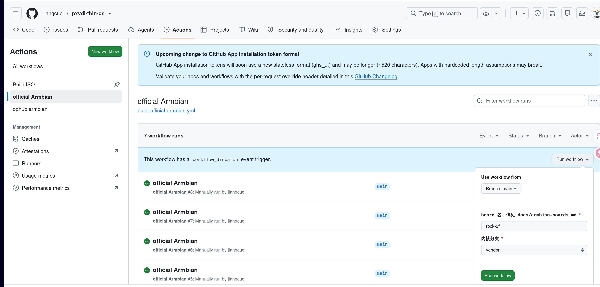
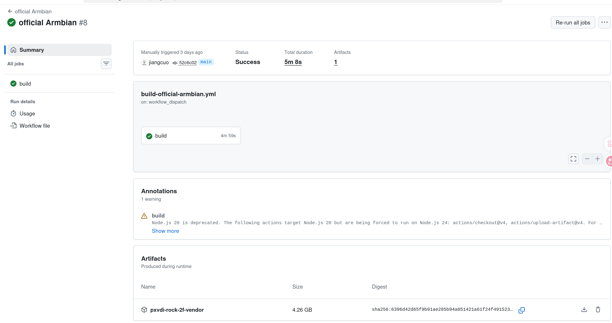

# 瘦客户端系统使用说明

## 2. PXVDI 瘦客户机系统和硬件兼容性

### 瘦客户机系统和硬件兼容性

| 显卡兼容性 | 核显 | A卡 | N卡 | N卡+核显     |
| ------------ | ------ | ----- | ----- | -------------- |
| intel处理器      | √   | √  | x   | 仅核显输出√ |
| amd处理器      | √   | √  | x   | 仅核显输出√ |
| arm处理器      | √   | √  | x   | x |
| 龙芯处理器      | √   | √ | x   | x |


### PXVDI 瘦客户机系统不支持N卡，如果是双显卡，请使用核显输出。

| WIFI硬件 | WIFI兼容性 |
| ---------- | ------ |
| intel    | √         |
| broadcom | √         |
| marvell  | √         |
| mediatek | √         |
| realtek  | √         |

#### 与品牌瘦客户机兼容性

| 品牌瘦客户机 |系统兼容性 |连接协议兼容性|
| ---------- | ------ |------ |
| dell 3040     |  完全兼容  |仅pxvdi |
| dell 5070 |  完全兼容 |全兼容 |
| 升腾c92 | 完全兼容   |全兼容 |


### PXVDI 支持以下启动环境

* 64位efi
* bios引导
* 32位efi环境

### PXVDI要求系统盘大于等于8G

## 3. PXVDI 瘦客户端系统安装
PXVDI瘦客户端ISO 重启将会还原，不会保存任何数据，需要安装到硬盘内
使用rufus将iso写入到U盘

直接使用U盘即可进入瘦客户机系统，瘦客户系统是运行在内存中的RAMOS，重启之后保存的数据将会消失，需要安装到硬盘。

系统默认会启动PXVDI程序，请使用ctrl+F4组合键，连续3次即可退出PXVDI程序守护程序。

右击打开终端，

运行lsblk查看需要安装的硬盘，如/dev/sda，可以根据大小来判断。
注意，安装磁盘最小为8G。


使用`pxvdi-install-old /dev/sda` 进行安装。


出现success就代表安装成功

## 4.PXVDI 基本操作

### 4.1 退出程序

PXVDI具有守护进程，连续按下操作键`ALT + f4` 3次，即可退出守护进程，进入到桌面

### 4.2 网络连接

直接点击瘦客户机下面的菜单，即可打开网络连接。


支持有线和无线网络连接。


### 4.3 系统声音设置

必须要对系统层面的声音进行设置，才能够保证远程桌面能够有声音。

在桌面空白处，右击设置声音。


声音设置页如下


带锁的图标是锁定的意思，绿色图标是设为默认的意思，灰色带x的图标是音频静音图标。

如果有多个声卡，请前往配置中切换即可。

### 4.4 壁纸设置

请准备一个壁纸文件，jpg格式，替换掉/usr/share/bizhi.jpg文件，重新设置一下分辨率即可生效

### 4.5  系统分辨率设置

如果默认的分辨率不对，可以手动设置，默认提供了3个分辨率档次。
- 1920x1080@60
- 2560x1440@60
- 3840x2160@60

在桌面空白处右击，点击分辨率设置即可设置分辨率。


也可以直接在瘦客户端设置中修改设置


暂时不支持缩放设置，如果需要缩放设置，请手动使用xrandr配置

### 4.6 语言设置

在桌面空白处右击，点击lang setting就可以修改语言


修改语言之后，不会重新生效，点击 `其他操作`-`重启桌面生效`


### 4.7 系统更新

#### 手动更新

执行命令

```bash
apt update
apt dist-upgrade
```


####  批量更新

请在pxvdi管理端 机房模式中进行批量更新


## 5. ARM嵌入式设备说明

PXVDI 支持ARM嵌入式设备，这类设备分为2类 armbian开发板和一些机顶盒。

因为此类设备的内核态均有不同，我们通过使用社区的armbian系统进行兼容。

用户可以使用我们托管在github上的项目https://github.com/jiangcuo/pxvdi-thin-os，利用action构建刷机包

### 解码兼容性

针对嵌入式设备，我们仅支持PXVDI协议进行硬件解码，仅支持rockchip芯片支持硬件解码，最低支持rockchip3328。

### 支持的硬件

https://github.com/jiangcuo/pxvdi-thin-os/tree/main/docs 请参考本文内部的板子型号

一般机顶盒在ophub中
开发板在armbian中

### 构建刷机包

请用户注册github账号，fork本项目。

找到你的板子型号。假设你的板子是rock-2f

我们可以在armbian-boards里面找到

|Board |	内核分支|
|-|-|
|rock-2f  |vendor|

前往项目的actions选项卡



在左边workflows里面选择`official armbian`分支，点击右边的`run workflow`，输入`board`名为`rock-2f` 内核分支选择`vendor`

随后就可以开始构建。时间可能是10分钟-2小时都有可能

构建成功之后，点进去，底部的artifacts就是刷机包，下载之后写入emmc或者 直接用刷机工具写入即可，具体请参考各自板子的刷机流程




## 瘦客户端定制

请直接参考https://github.com/jiangcuo/pxvdi-thin-os 项目说明