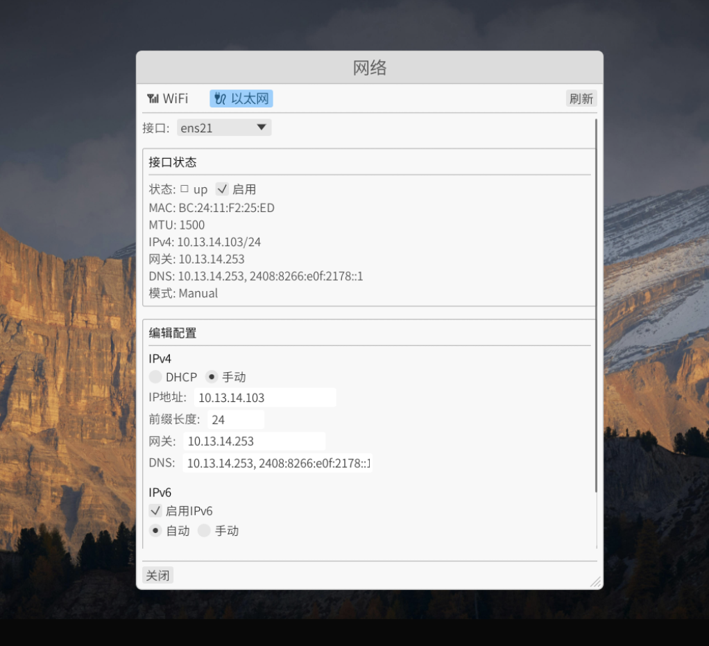
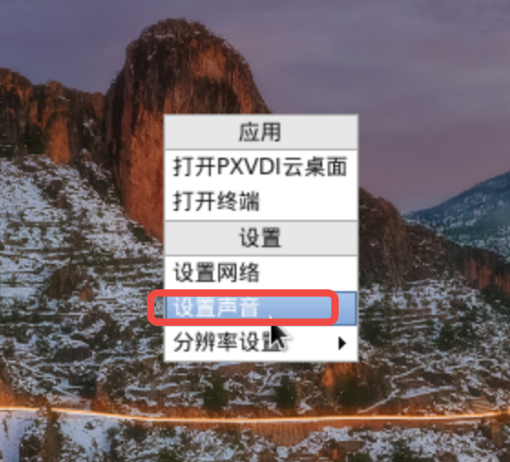
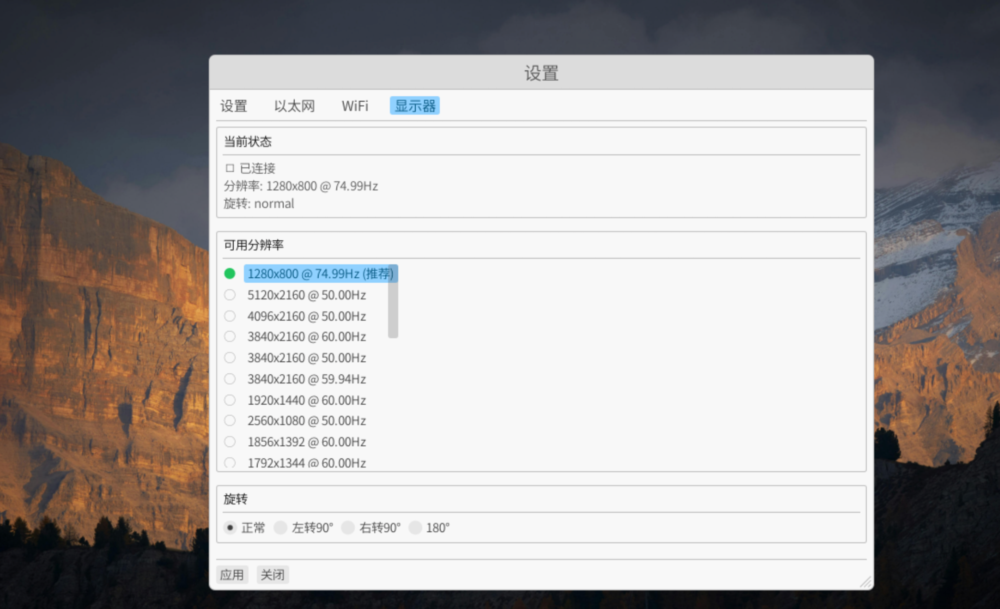

# 瘦客户端系统使用说明

## 2. PXVDI 瘦客户机系统和硬件兼容性

### 瘦客户机系统和硬件兼容性

| 显卡兼容性 | 核显 | A卡 | N卡 | N卡+核显     |
| ------------ | ------ | ----- | ----- | -------------- |
| intel处理器      | √   | √  | x   | 仅核显输出√ |
| amd处理器      | √   | √  | x   | 仅核显输出√ |
| arm处理器      | √   | √  | x   | x |
| 龙芯处理器      | √   | √ | x   | x |


### PXVDI 瘦客户机系统不支持N卡，如果是双显卡，请使用核显输出。

| WIFI硬件 | WIFI兼容性 |
| ---------- | ------ |
| intel    | √         |
| broadcom | √         |
| marvell  | √         |
| mediatek | √         |
| realtek  | √         |

### PXVDI 支持以下启动环境

* 64位efi
* bios引导
* 32位efi环境

### PXVDI要求系统盘大于等于8G

## 4. PXVDI 瘦客户端系统安装
PXVDI瘦客户端ISO 重启将会还原，不会保存任何数据，需要安装到硬盘内
使用rufus将iso写入到U盘

直接使用U盘即可进入瘦客户机系统，瘦客户系统是运行在内存中的RAMOS，重启之后保存的数据将会消失，需要安装到硬盘。

系统默认会启动PXVDI程序，请使用ctrl+F4组合键，连续3次即可退出PXVDI程序守护程序。

右击打开终端，

运行lsblk查看需要安装的硬盘，如/dev/sda，可以根据大小来判断。
注意，安装磁盘最小为8G。


使用`pxvdi-install-old /dev/sda` 进行安装。


出现success就代表安装成功

## 5.PXVDI 基本操作

### 5.1 退出程序

PXVDI具有守护进程，连续按下操作键`ALT + f4` 3次，即可退出守护进程，进入到桌面

### 5.2 网络连接

直接点击瘦客户机下面的菜单，即可打开网络连接。



支持有线和无线网络连接。


### 5.3 系统声音设置

必须要对系统层面的声音进行设置，才能够保证远程桌面能够有声音。

在桌面空白处，右击设置声音。



声音设置页如下


带锁的图标是锁定的意思，绿色图标是设为默认的意思，灰色带x的图标是音频静音图标。

如果有多个声卡，请前往配置中切换即可。

### 5.4 壁纸设置

请准备一个壁纸文件，jpg格式，替换掉/usr/share/bizhi.jpg文件，重新设置一下分辨率即可生效

### 5.5  系统分辨率设置

如果默认的分辨率不对，可以手动设置，默认提供了3个分辨率档次。
- 1920x1080@60
- 2560x1440@60
- 3840x2160@60

在桌面空白处右击，点击分辨率设置即可设置分辨率。


也可以直接在瘦客户端设置中修改设置



暂时不支持缩放设置，如果需要缩放设置，请手动使用xrandr配置

### 5.6 语言设置

在桌面空白处右击，点击lang setting就可以修改语言


修改语言之后，不会重新生效，点击 `其他操作`-`重启桌面生效`


### 5.7 系统更新

#### 手动更新

执行命令

```bash
apt update
apt dist-upgrade
```


#### 批量更新

请在pxvdi管理端 机房模式中进行批量更新
