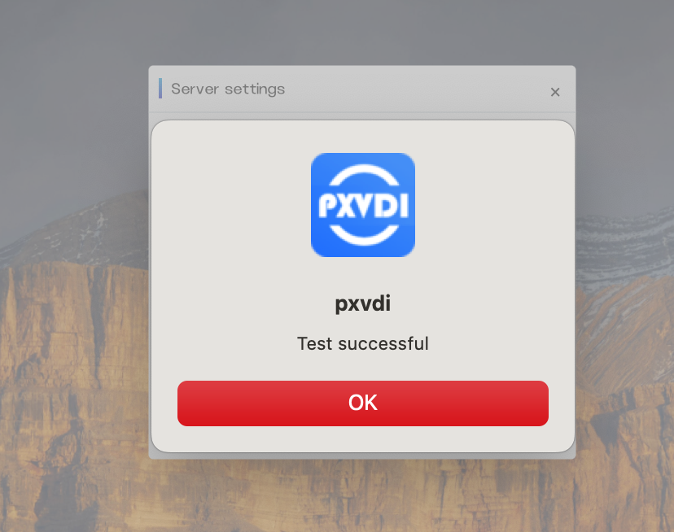
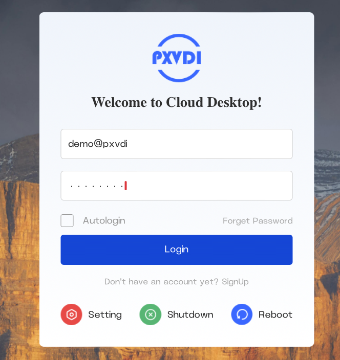
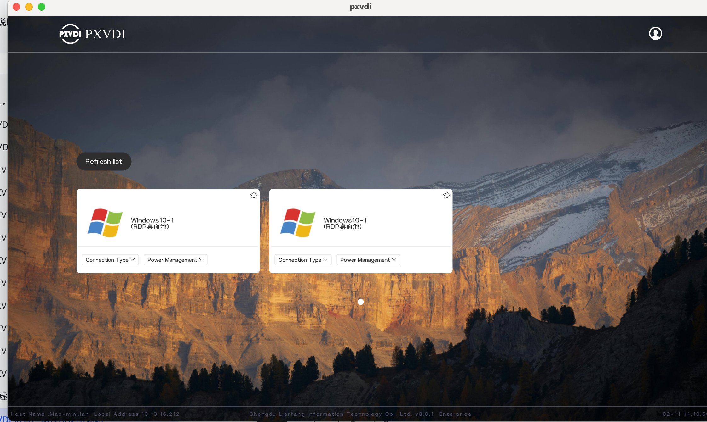
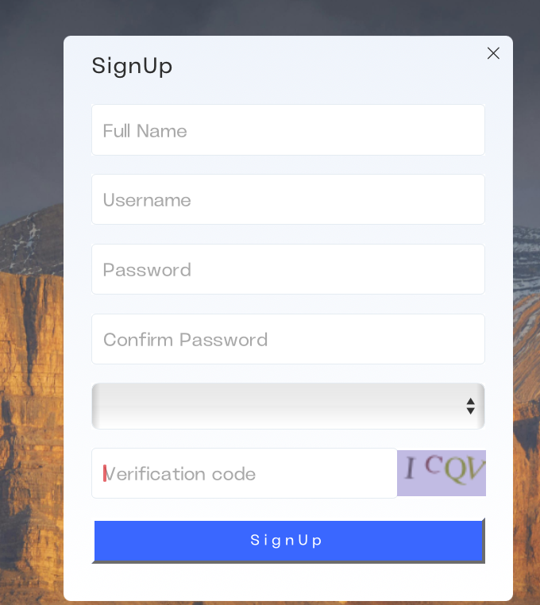
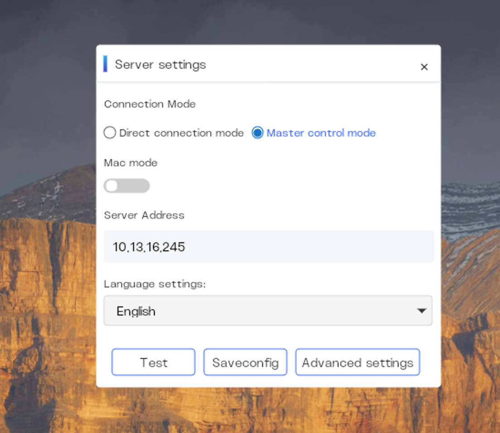
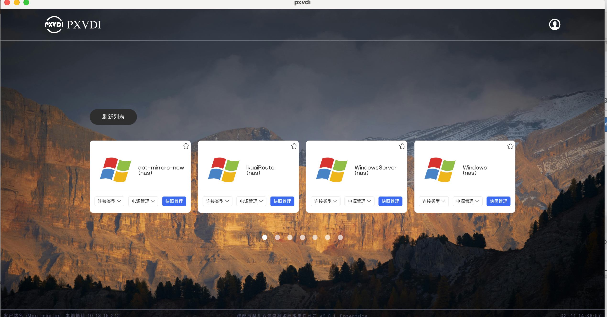
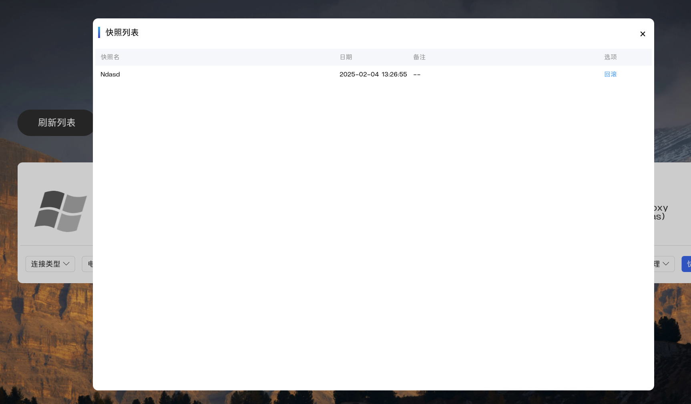
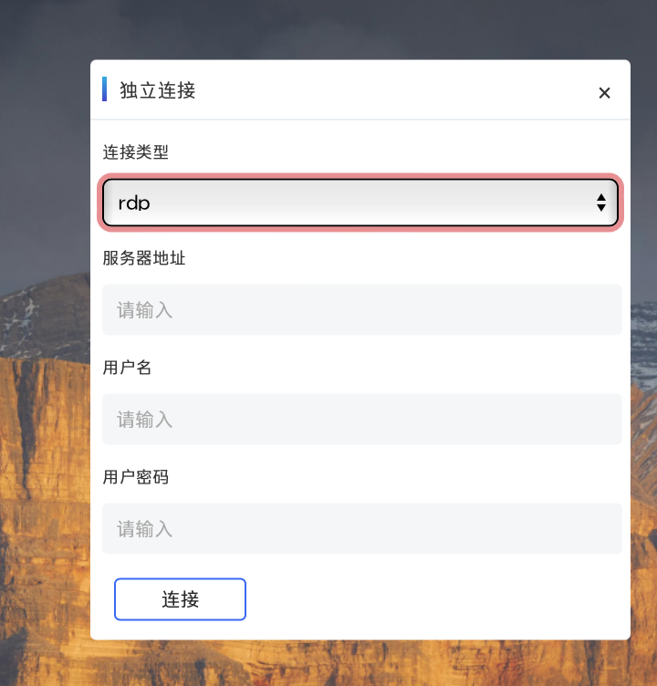

# PXVDI Client User Guide


## 1. Installation

### 1.1 Main Program Installation
#### Linux OS

Download the corresponding version based on the client's CPU architecture.


```
wget https://download.lierfang.com/pxvdi/Client/linux/pxvdi_latest_amd64.AppImage
OR
curl -L -O https://download.lierfang.com/pxvdi/Client/linux/pxvdi_latest_amd64.AppImage
```

Grant permissions and execute.

```
chmod +x pxvdi_latest_amd64.AppImage
./pxvdi_latest_amd64.AppImage
```

#### Debian OS

We have built the installation package based on Debian, which can be directly installed using Debian and will automatically download the components.
```
wget https://download.lierfang.com/pxvdi/Client/linux/pxvdi_latest_amd64.deb
apt update
apt install -f ./pxvdi_latest_amd64.deb
```

#### MacOS

Download the client, open the DMG file, and drag the application into the Applications folder.

https://download.lierfang.com/pxvdi/Client/macos/pxvdi_latest_arm64.dmg


#### Windows

Please download the Windows client, extract it, and run pxvdi. If it doesn't run, please download WebView2.

https://developer.microsoft.com/zh-cn/microsoft-edge/webview2

### 1.2 组件安装

debian
```
apt update && apt -y install freerdp2-x11 virt-viewer
```

rhel
```
dnf makecache --refresh && dnf -y install freerdp virt-viewer
```

archlinux
```
pacman -S freerdp virt-viewer
```

macos
```
brew install virt-viewer
```
### 1.3 Compatibility with glibc on Linux.
- GLIBC_2.3
- GLIBC_2.35
- GLIBC_2.27
- GLIBC_2.2.5
- GLIBC_2.29
- GLIBC_2.11
- GLIBC_2.14
- GLIBC_2.32
- GLIBC_2.34
- GLIBC_2.4
- GLIBC_2.3.4
- GLIBC_2.7
- GLIBC_2.33


## 2. Usage Instructions

### 2.1 First Use

Click on `Settings`, select the appropriate `language`, and enter the server address. The server address should include the protocol and port number, such as `https://gw.pxvdi.lierfang.com:16003`. Click `Save`, then click `Test`. If the test is successful, it means the server is available.



Return to the homepage and click on Login:





Click on the virtual machine to connect.

### 2.2 Settings Instructions

#### 登录页

Enabling `autologin` will allow the program to log in automatically.

Click `SignUp` to register with the server.

Click `Setting` to access the settings page.

Click `Shutdown` to power off (effective only on Linux).

Click `Reboot` to restart (effective only on Linux).

#### 注册页

进入注册页面，用户可以自主注册。



#### 设置页



在Linux上，可以自由切换连接模式。

`Mac mode`, 客户端可以使用mac进行注册和登录，而无需账号密码验证，仅在总控模式中启用

`Server address`,服务端地址或者pve的地址

`Language setting`, 语言设置

`Test`, 测试服务器地址是否有效

`Saveconfig`,保存当前页数据

`Advanced settings`,高级设置

#### Advanced Settings

- Fullscreen Toggle

  - Controls whether the software runs in fullscreen mode and whether future connections will be fullscreen. All protocols can be controlled.
- Debug
  - Enable DEBUG mode.
- Auto Login
  - Enable automatic login.
- Rollback
  - Run a snapshot rollback to restore the desktop to a previous state.
- Other Connection
  - Enable an option to use this program to connect to specified RDP or VNC servers.
- Connection Method
  - Choose between SPICE, FreeRDP, or Horizon protocols.
- FreeRDP Settings
  - FreeRDP Version: Configure the version of FreeRDP; version 3 is the latest and fixes bugs present in version 2, which is a stable version.
  - Codec: Configure the decoding method for FreeRDP; it is recommended to use 420. If hardware decoding is not supported, please use software decoding.
  - bpp: Configure the color depth for FreeRDP; a higher value results in better color quality.
  - Scaling: Configure the scaling ratio for FreeRDP, suitable for use on high-resolution screens.
- VMware Settings
  - Protocol: Choose between Blast and PCOIP; PCOIP is suitable for low-performance thin clients.
  - Menu Bar: Decide whether to display the connection status bar. When enabled, advanced options such as USB redirection and connection decoding configuration can be shown in the cloud desktop.
- IPv6 Settings: Enable or disable IPv6.

- Gateway Settings:
  - AD Mode: Use the user's login information as the login account for the cloud desktop, allowing users to log in without entering their password twice. If configured for auto login, users can boot directly into the desktop. This requires the cloud desktop and server to be domain-joined.
  - Enable Gateway: Configure the use of an RDP gateway. In cases where IPv6 is enabled, the gateway will be ignored.
  - Ad Gateway: Use the user's account password as RDP gateway credentials.
  - Gateway UserName: RDP gateway account.
  - Gateway Password: RDP gateway password. This feature allows external clients to access internal desktops.

- Resource Settings:

  - Multi-Monitor: Allow the use of multiple screens. Once enabled, the cloud desktop will be fullscreen regardless of whether fullscreen mode is selected.
  - Drive Redirection: Allow redirection of the thin client's disks, such as removable drives and built-in disks.
  - Audio Redirection: Allow the cloud desktop to play sound and output it through the thin client.
  - Print Redirection: Allow the cloud desktop to use local printers.
  - USB Redirection: Allow the cloud desktop to access local USB devices.
  - Microphone Redirection: Allow the cloud desktop to use the microphone.
  - Clipboard Redirection: Enable clipboard synchronization while running the cloud desktop.
  - Serial Port Redirection: Redirect the serial port to RDP.

#### Virtual Machine List Page


- Star Icon: Set the virtual machine to automatically start after login.
- Refresh List: Update the virtual machine list to reflect the latest status and changes.
- Profile Icon: Log out of the current session.

- Connect Method：
    - RDP
    - Horizon
    - SPICE

- Power Management

  - Shutdown: Gracefully shut down the virtual machine.

  - Force Shutdown: Immediately power off the virtual machine without a graceful shutdown.

  - Restart: Restart the virtual machine normally.

  - Force Restart: Immediately restart the virtual machine without a graceful shutdown.

- Snapshot Management




  - roollback Rollback to Snapshot


### 2.3 Special Settings

####  UserMode
In User Mode, the path for FreeRDP called by PXVDI is located at ~/.xfreerdp. This setup allows users to connect to the desktop without requiring root privileges.

Example Scenario

A regular user downloads pxvdi.appimage and freerdp.appimage.
The user renames freerdp.appimage to ~/.xfreerdp.

By double-clicking pxvdi, the user can connect to the desktop seamlessly, without needing any root access during the process.

#### Other Connect

After enabling other connections, an "Other Connections" button will appear on the home page. This feature allows users to manually connect to additional desktops.



#### Hide Settings

To hide the settings feature, you can edit the configuration file using the terminal. Follow these steps:

- Open Terminal: Launch your terminal application.

- Edit Configuration File:

  Run the following command to open the configuration file in a text editor (e.g., nano):
  ```
  nano ~/.pxvdiconfig.json
  ```
- Modify the Setting:

  Locate the line that contains "setting": true and change it to:

  ```
  "setting": false
  ````
- Save Changes:

  If using nano, press `CTRL + O` to save and `CTRL + X` to exit.

- Restart the Application:
  
  Close and reopen the PXVDI application for the changes to take effect.

After completing these steps, the settings feature will be hidden from the user interface.