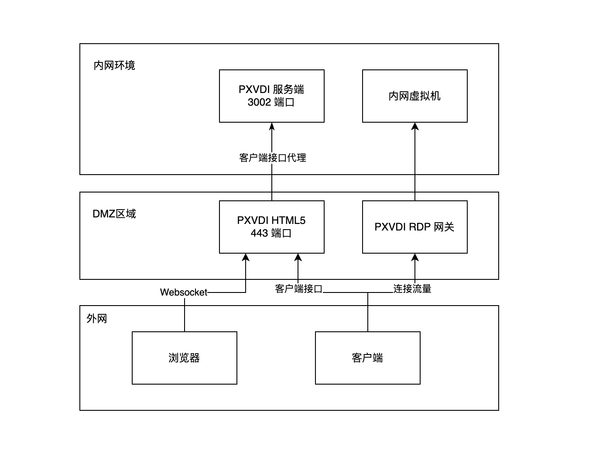
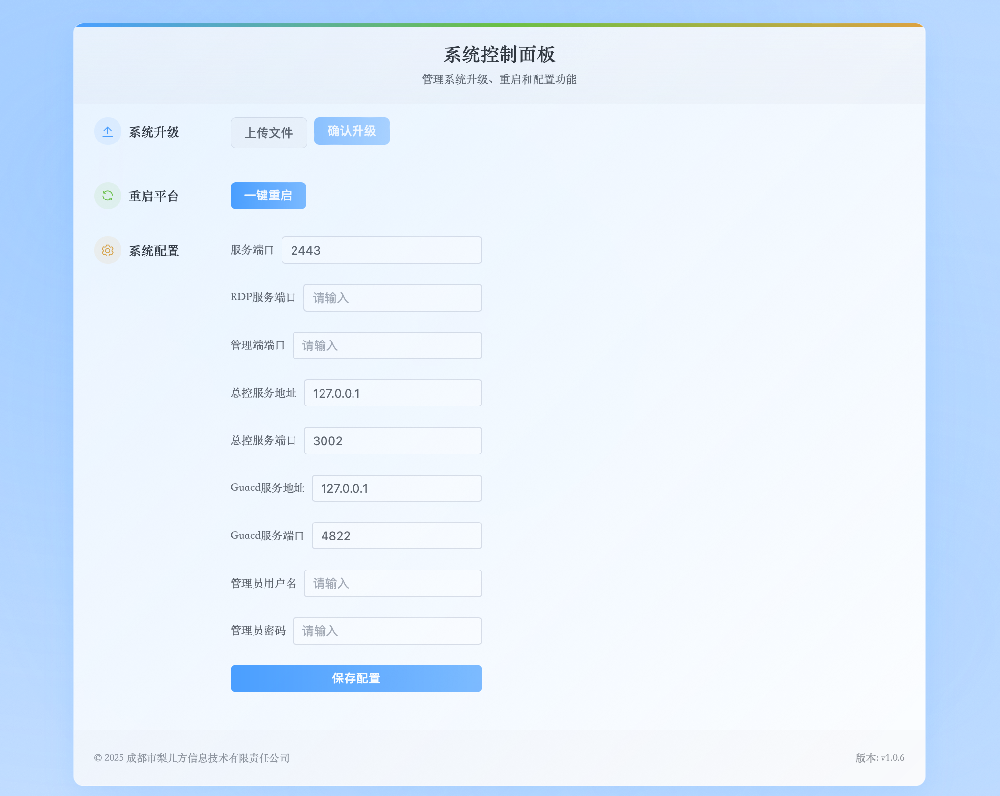
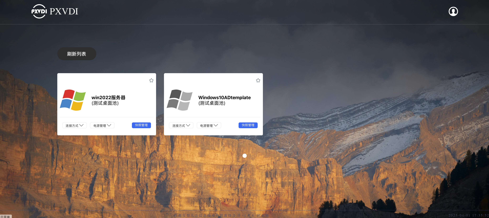

# PXVDI HTML5 客户端

PXVDI HTML5 有2个功能。

1. 支持HTML5 访问桌面会话
2. 位于DMZ区域，安全将服务端的接口暴露到外网。（需要1.0.5版本及其以上）



利用 PXVDI HTML5 可以创建内外网访问安全代理，外部的客户端可以通过HTML5的地址进行连接，而不需要将PXVDI 服务端暴露到公网，极大地增加架构安全性。

## 硬件要求
PXVDI HTML5 客户端建议 2核 4G内存 10G磁盘即可。

系统使用debian12。

架构支持arm64 和 amd64。

## 安装guacd

我们使用docker进行安装
```bash
docker run --name some-guacd  --restart=always  -idt -p 4822:4822 guacamole/guacd
```

## 安装pxvdihtml5

添加apt key

```bash
curl -L https://download.lierfang.com/pxcloud/lierfang.gpg -o /etc/apt/trusted.gpg.d/lierfang.gpg

```
添加源

```bash
echo "deb https://download.lierfang.com/pxcloud/pxvdi bookworm main" > /etc/apt/sources.list.d/pxvdi-sources.list
```

安装pxvdihtml5

```bash
apt update 
apt install pxvdihtml5
systemctl enable pxvdihtml5
```

## 修改pxvdihtml5配置

安装好了之后，pxvdihtml5将会被安装到/usr/share/pxvdi/

配置文件为`/usr/share/pxvdi/pxvdiConfig.json`

```json
{
"webport":443,   //pxvdihtml5的监听端口，默认是443端口
"security":"any",    //默认的身份认证方式，any的兼容性更好。可选nla，tls，rdp
"midserver":"10.1.2.1",   //服务端的地址
"midport":3002,           //服务端的端口
"guacdserver":"127.0.0.1", //guacd服务器的地址，如上面的guacd的安装
"guacdport":4822,           //guacd服务器的端口，如上面的guacd的安装
"log":"QUIET"   //日志等级
}
```

修改之后，使用命令重启服务

```bash
systemctl restart pxvdihtml5 
```


当升级到1.0.6版本之后，访问https://服务器ip:9091即可访问服务端管理后台。

默认的账号密码为admin P@SSw0rd

进去之后可以做一下配置修改



上传文件就是上传pxvdihtml5的deb包。需要重启才会生效


之后可以通过浏览器访问 https://ip 地址进入到网页版。



网页版有3个连接选项，通过

- 本地: 唤起本地的app打开。
- HTML: 直接网页访问桌面。
- 救援模式: 访问桌面的控制台，在桌面无法连接时，进行诊断非常有效。


## 反向代理

PXVDI HTML5客户端可以被nginx 反向代理，配置如下

```nginx
server{
listen 443 ssl;
server_name vdesk.lierfang.com;
ssl_certificate /etc/letsencrypt/live/vdesk.lierfang.com/fullchain.pem;
ssl_certificate_key /etc/letsencrypt/live/vdesk.lierfang.com/privkey.pem;
ssl_protocols         TLSv1.1 TLSv1.2 TLSv1.3;
add_header Access-Control-Allow-Origin *;

location / {
	proxy_pass https://10.13.16.250;
      proxy_buffering off;
        proxy_buffer_size 4k;
        proxy_connect_timeout 300s;
        proxy_read_timeout 300s;
        proxy_send_timeout 300s;
        send_timeout 300s;
        #开启websocket
        proxy_http_version 1.1;
        proxy_set_header Upgrade $http_upgrade;
        proxy_set_header Connection "upgrade";
}
}

```