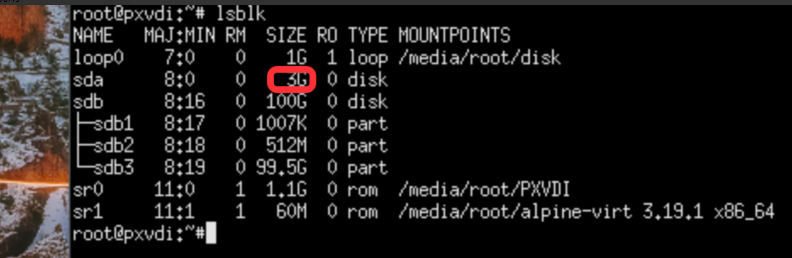
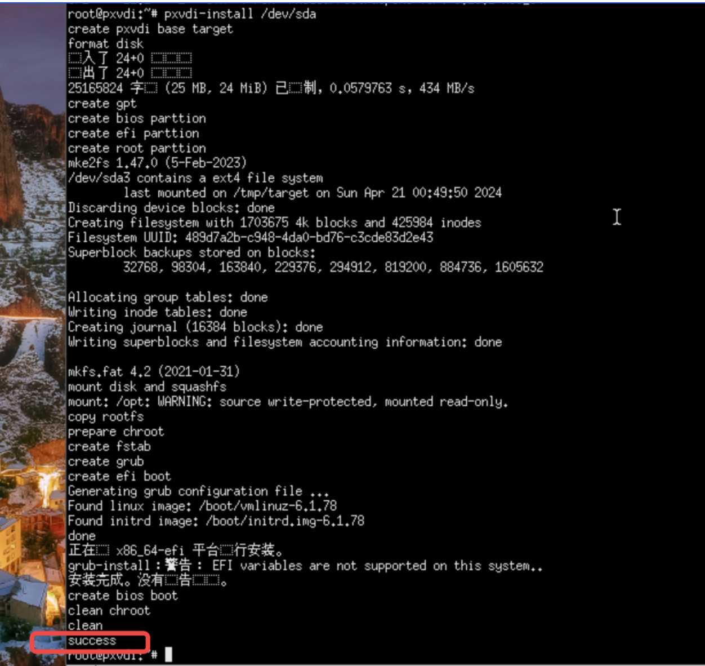
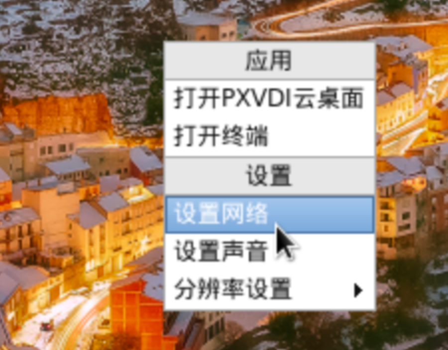
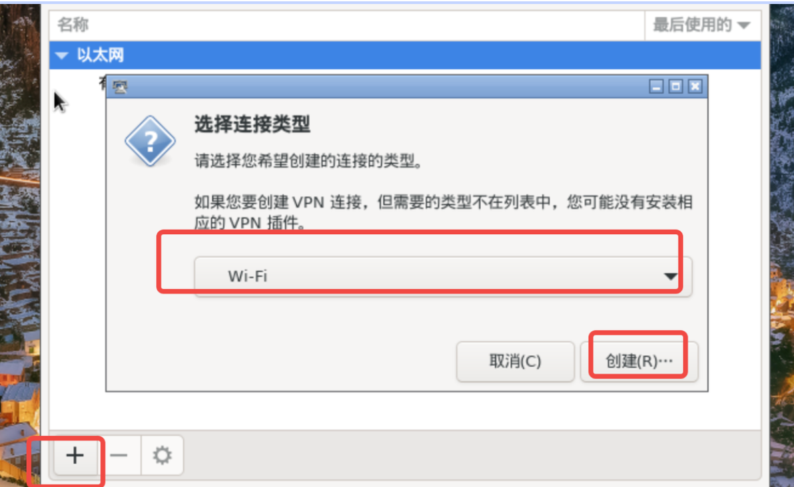
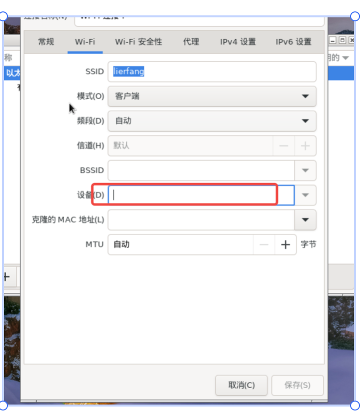
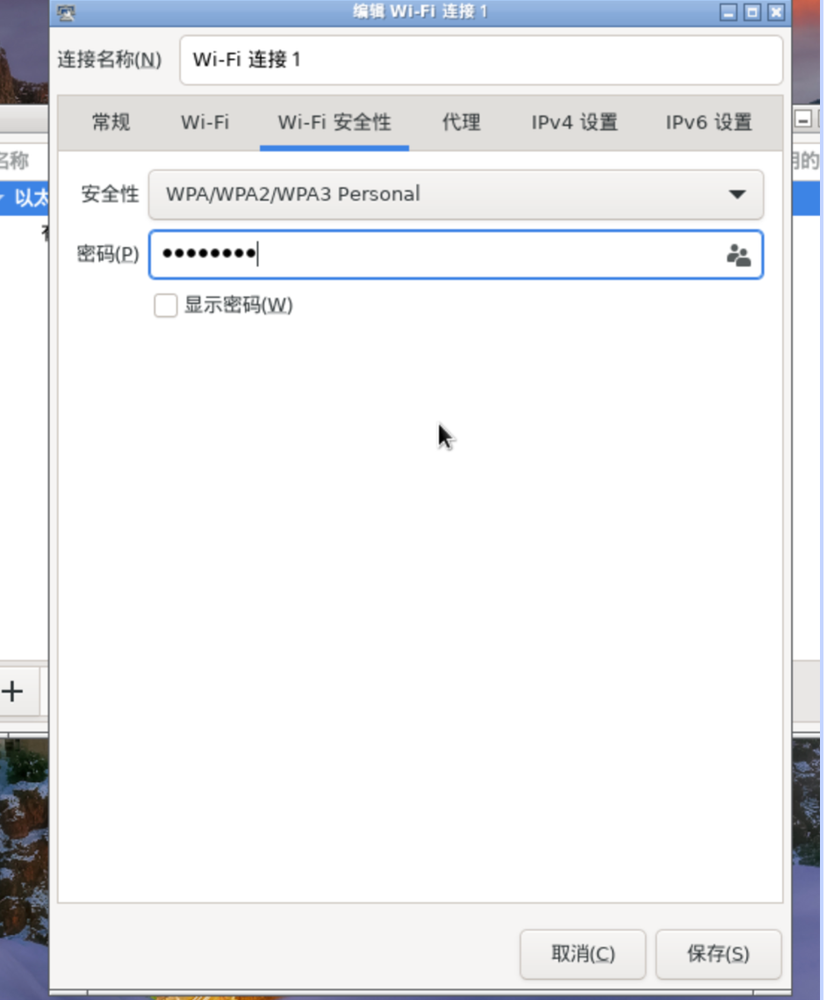
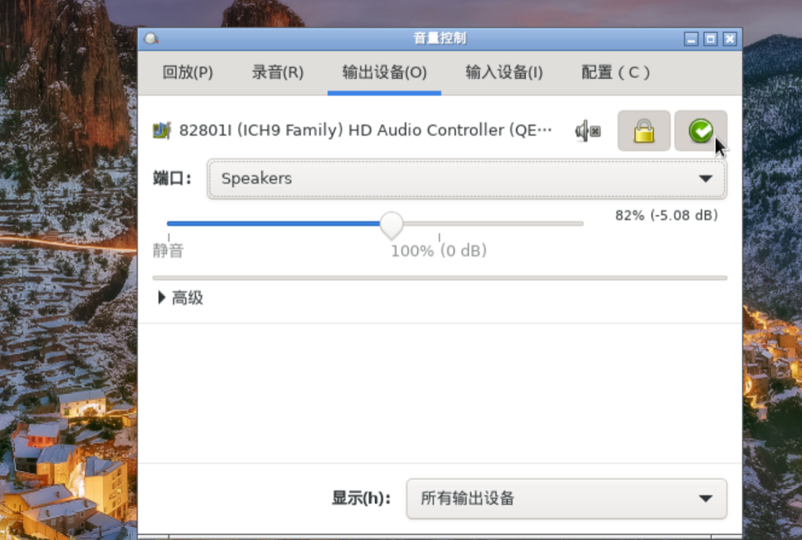
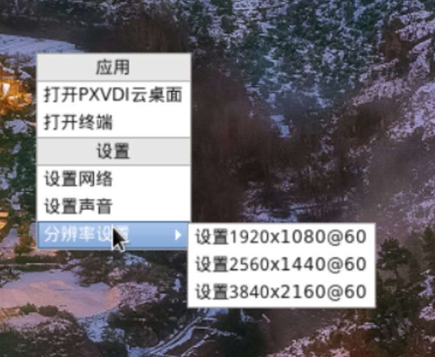
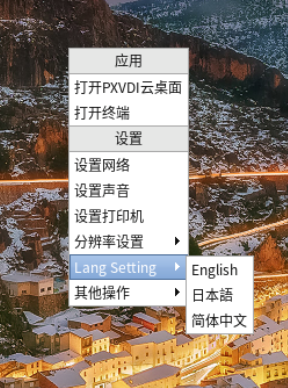

# PXVDI Thin Client System User Guide

## 1. PXVDI Thin Client System and Hardware Compatibility

### Thin Client System and Hardware Compatibility

| Graphics Card Compatibility | Integrated Graphics | AMDGPU	 | Nvidia GPU	 | NVIDIA + Integrated Graphics     |
| ------------ | ------ | ----- | ----- | -------------- |
| Intel Processor	      | √   | √  | x   | Integrated output only √ |
| AMD Processor	      | √   | √  | x   | Integrated output only √ |

PXVDI Thin Client System does not support NVIDIA graphics cards. If you are using dual graphics cards, please use the integrated graphics output.

### PXVDI Thin Client System and WIFI Compatibility:

| Hardware | Compatibility |
| ---------- | ------ |
| intel    | √         |
| broadcom | √         |
| marvell  | √         |
| mediatek | √         |
| realtek  | √         |

PXVDI supports the following boot environments

- 64-bit EFI
- BIOS Boot
- Does not support 32-bit EFI environment

### PXVDI requires the system disk to be at least 8GB

## 2. PXVDI Thin Client System Architecture Description

The PXVDI Thin Client System is based on Debian 12 and includes SPICE/RDP/Horizon components. The thin client system has two versions:

- Version ≤ 2.2.6 (Old Version)
- Version > 2.2.6 (New Version)

This document will cover the new version.


PXVDI uses dual system booting, allowing users to choose to upgrade either the primary or backup system during an upgrade. It also features a restore mode that can clean system data.

To switch between dual systems, quickly press the arrow keys at the GRUB page to interrupt the automatic boot and select the PXVDI restore mode.


## 3. PXVDI Thin Client System Installation
The PXVDI thin client ISO will restore upon reboot and will not save any data. It needs to be installed on the hard drive. Use Rufus to write the ISO to a USB drive.

You can directly boot from the USB drive to enter the thin client system. The thin client system runs in memory (RAMOS), so any saved data will be lost upon reboot. It must be installed on the hard drive.

The system will automatically start the PXVDI program. To exit the PXVDI program daemon, press `Ctrl + F4` `three` times in quick succession.

`Right-click` to open the terminal.

Run `lsblk` to view the hard drive you need to install on, such as `/dev/sda`, and determine it based on size. Note that the minimum installation disk size is 8GB.




To install the PXVDI Thin Client System, execute the command:

```
pxvdi-install /dev/sda
```
If you are using a newer version of the system (version number higher than 2.2.6) and need to install an older version, please use the following command:

```
pxvdi-install-old /dev/sda
```



If you see the message "success," it indicates that the installation was successful.

## 4.PXVDI Basic Operations

### 4.1 Exiting the Program

PXVDI has a daemon process. To exit the daemon and return to the desktop, press the operation keys `ALT + F4` `three` times in succession.
### 4.2 网络连接

Wired Network Card

The PXVDI Thin Client System integrates most mainstream Linux drivers and automatically obtains an IP address via DHCP upon startup.

Wireless WIFI

As of now, the PXVDI Thin Client System does not have a visual method for connecting to WIFI. This feature will be available in the future, and you will no longer see this statement. You can right-click on an empty area of the desktop and click on "Network Settings" to configure your network.



Click the plus sign (+) in the lower-left corner, select WIFI, and then click "Create."



In the SSID field, enter the WIFI name, and in the device section, select the WIFI hardware.



Then click on "WIFI Security." For a standard WIFI connection, select the authentication method shown in the image below, enter the password, and click "Save."



If all goes well, the WIFI will connect automatically.

### 4.3 System Sound Settings

It is necessary to configure the system-level sound settings to ensure that the remote desktop has audio.

Right-click on an empty area of the desktop and select "Sound Settings."


The sound settings page is as follows:


The locked icon indicates that the setting is locked, the green icon means it is set as default, and the gray icon with an 'x' signifies that the audio is muted.

If there are multiple sound cards, please go to the configuration to switch between them.

### 4.4  Wallpaper Settings

Please prepare a wallpaper file in JPG format and replace the existing file at `/usr/share/bizhi.jpg`. Adjust the resolution to make the changes effective.

### 4.5   System Resolution Settings

If the default resolution is incorrect, you can manually set it. Three resolution options are provided by default:

- 1920x1080@60
- 2560x1440@60
- 3840x2160@60

Right-click on an empty area of the desktop and select "Resolution Settings" to adjust the resolution.




For other resolutions, please use the following command to change it:

```
echo "1366x768" >/root/.screensetting
```
The default refresh rate is set to 60 Hz, and the changes will take effect after restarting. Scaling settings are currently not supported; if scaling is needed, please configure it manually using `xrandr`.

### 4.6 Language Settings

Right-click on an empty area of the desktop and select "Lang Setting" to change the language.



After changing the language, it will not take effect immediately. Click on `Other Operations` - `Restart Desktop`.

