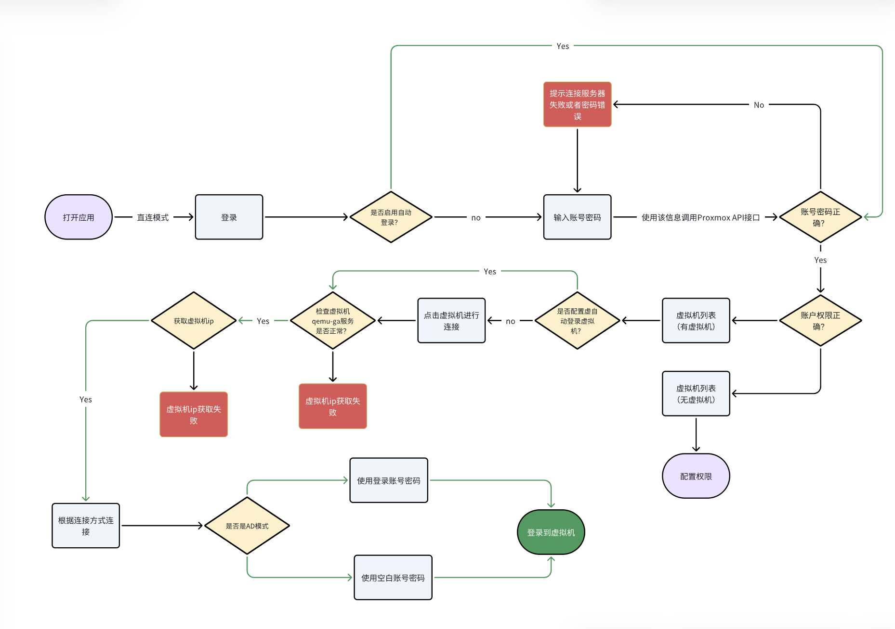
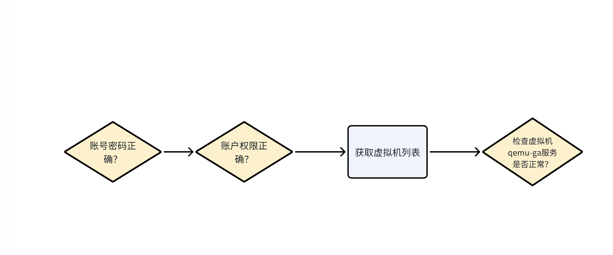

# Direct connection mode

## The workflow of the PXVDI direct connection mode 
In PXVDI direct connection mode, the client locally calls the Proxmox VE API to obtain the virtual machine's IP address. It then connects using RDP/SPICE/Horizon without any broker involvement, hence the term 'direct connection mode.'

The diagram below illustrates the entire workflow of the PXVDI client

The flowchart above clearly illustrates the main process, highlighting several essential steps that will be explained in the following text.

## Interaction methods between PXVDI direct connection mode and Proxmox VE.
The main interaction between direct connection mode and Proxmox VE is the exchange of permissions.

If the permissions are not correct, login will fail, and it will be impossible to retrieve the virtual machine list or communicate with the virtual machines.

Therefore, the core of the interaction between PXVDI direct connection mode and Proxmox VE is the permission exchange.

Once the permissions are granted, the PXVDI desktop client can use the qemu-guest-agent to obtain information about the virtual machines, such as whether they are running Windows or Linux, which will dictate different connection strategies.

In summary, the logic of PXVDI direct connection mode can be encapsulated in one sentence: request the virtual machine list and IP address from Proxmox VE.