# 快速入门

The quick start guide aims to help users quickly experience PXVDI. For detailed tutorials, please refer to the subsequent documentation.
## 1. Install Proxmox VE.
 
Version > 7.0

## 2. Create a virtual machine. 

### 2.1 Create
Click the `Create VM` button on the webpage, select the Windows ISO for the OS, and choose the `Guest OS` type based on the ISO type. If you are using PVE 8, check `Add additional drive for VirtIO drivers` and add the VirtIO drivers.

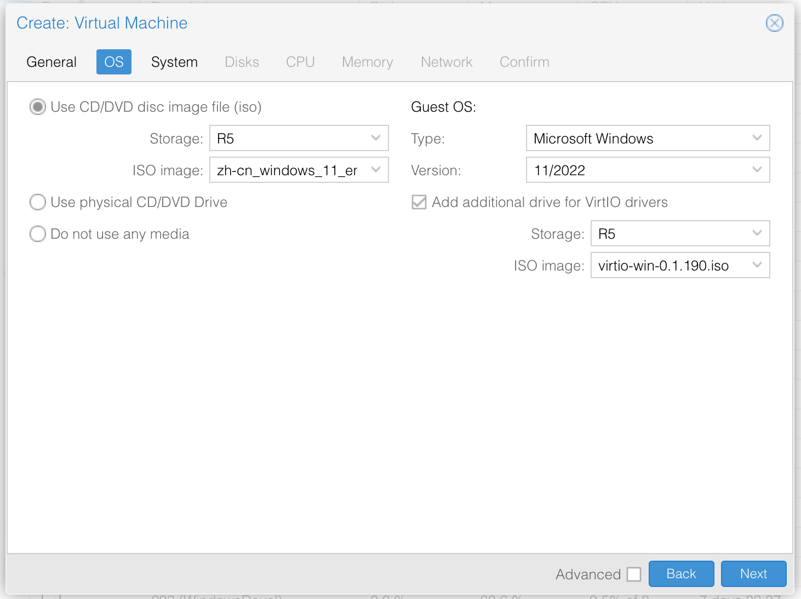

>Note: 
>VirtIO drivers can be downloaded from here: https://download.lierfang.com/proxmox/drivers/
>For Windows 7 or 2008/2008 R2 versions, please use `virtio-win-0.1.164-1` version.

If it’s not PVE8, you can add a CDROM device after the virtual machine is created and select the driver.

### 2.2 System Configuration
Click Next to enter the System configuration page.

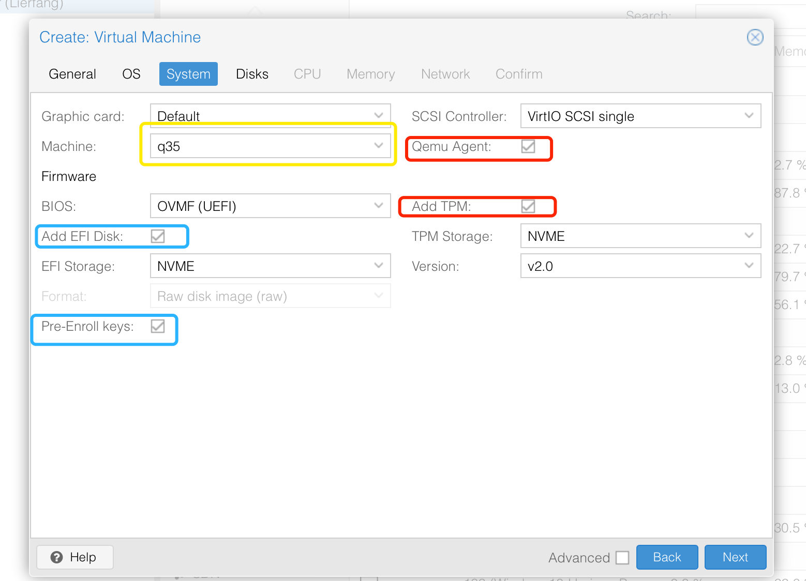

If your version is Windows 10 or above, we recommend:

- Select `q35` for Machine.
- Check `Qemu Agent`, which is a necessary component for communication with the virtual machine.
- Check `Add EFI Disk` to enable UEFI boot.
- Check `Add TPM` to add a TPM device, which is required for installing Windows 11.
- Check `Pre-Enroll keys` to support secure boot, which is also required for installing Windows 11.

If your version is Windows 8 or Windows 7, we recommend:

- Check `Qemu Agent`, which is a necessary component for communication with the - - virtual machine.
- Set `BIOS` to `seabios`.
- Leave other settings as default.


If your version is Windows 2003 or XP, we recommend:

- Check `Qemu Agent`, which is a necessary component for communication with the virtual machine.
- Leave `Machine` as default.
- Set `BIOS` to `seabios`.
- Set `Scsi Controller` to `LSI`.
- Leave other settings as default.

### 2.3 Disks Configuration
点击Next,进入Disks Configuration页面

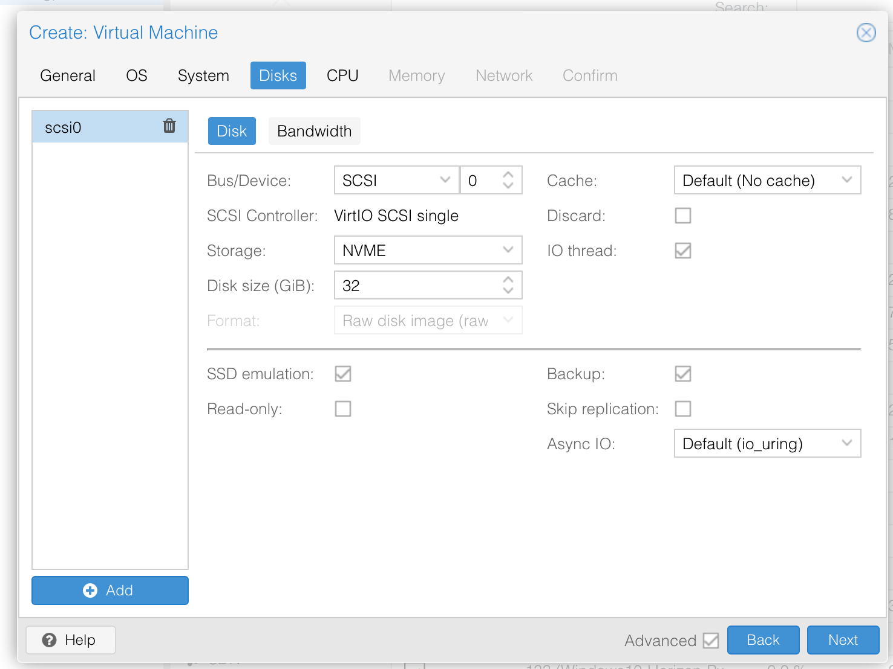

如果您的版本是2003/xp，那么我们建议
- `Bus/Device` IDE

如果您的版本是高于2003/xp，那么我们建议
- `Bus/Device` SCSI
- `SSD emulation` 勾选，这将把磁盘模拟成固态硬盘
- `Discard` 勾选，为磁盘启用TRIM，能够节省磁盘空间

如果您的版本是win11，建议给VM分配60G以上的磁盘


### 2.4 CPU Configuration

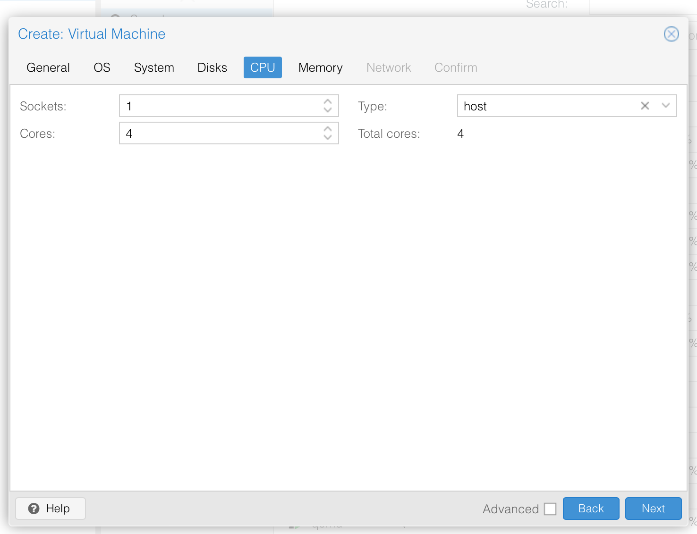

We recommend:

- Set `Sockets` to `1`.
- Set `Cores` to the number of CPUs for the virtual machine; a reasonable configuration is suggested to be `4`.
- Select `Type` as `host`.

### 2.5 Memory Configuration

Click Next to enter the Memory Configuration page; please configure it reasonably.


### 2.6 Network Configuration

Click Next to enter the Network Configuration page. You can use the default configuration.


### 2.7 Confirm

Click Next to enter the Confirm page. This page will display the configuration of the virtual machine. If anything is incorrect, please go back and reconfigure.

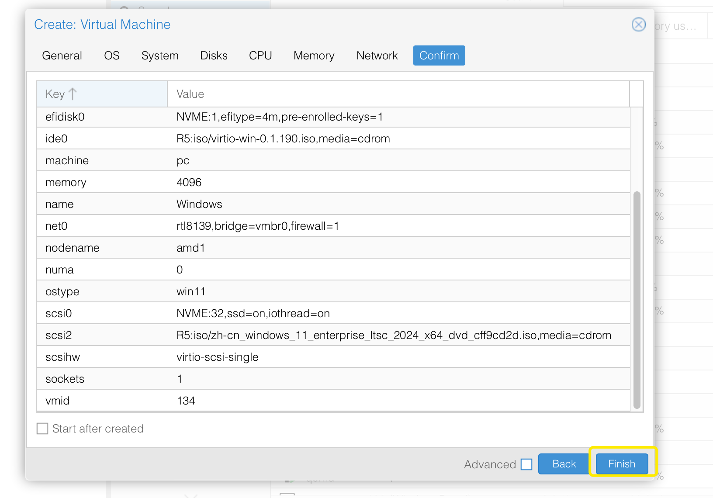

## 3. Start installing the virtual machine

After starting the virtual machine, if the following image appears, be sure to click inside the window with your mouse and then press any key to trigger the Windows installation process.

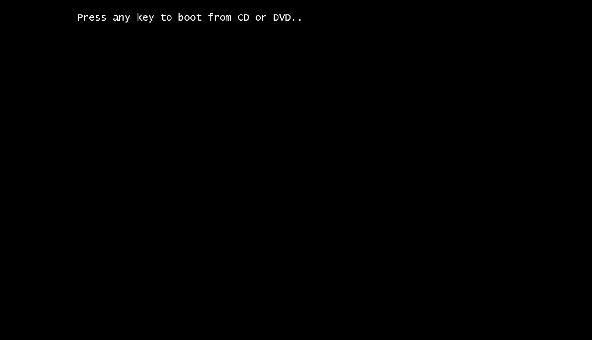


Once you enter the installation process, if you see a message indicating that no disks were found, click the `Browse` button at this point.

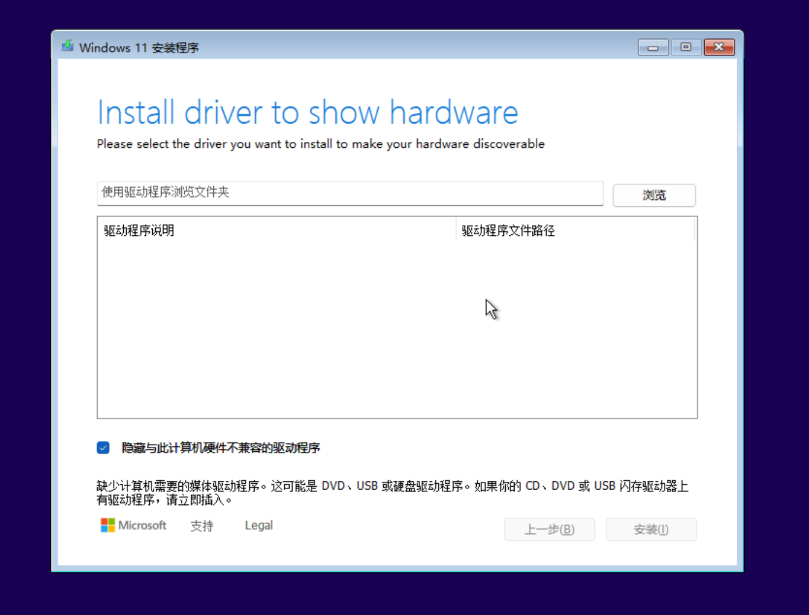

On the pop-up page, select the driver disk.

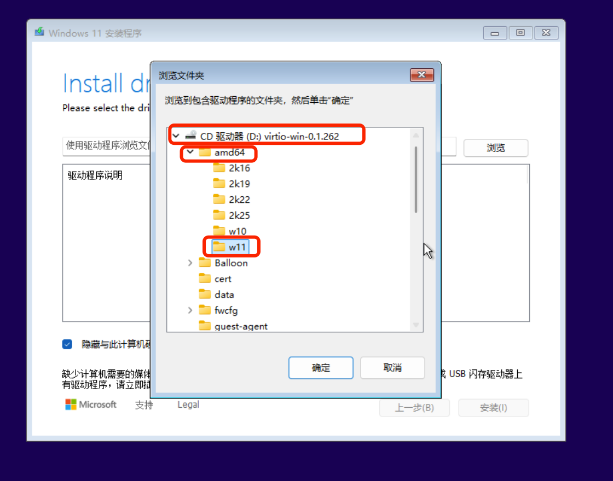

Expand the driver disk, then select `amd64` -> `win11` or choose the corresponding version of the operating system.

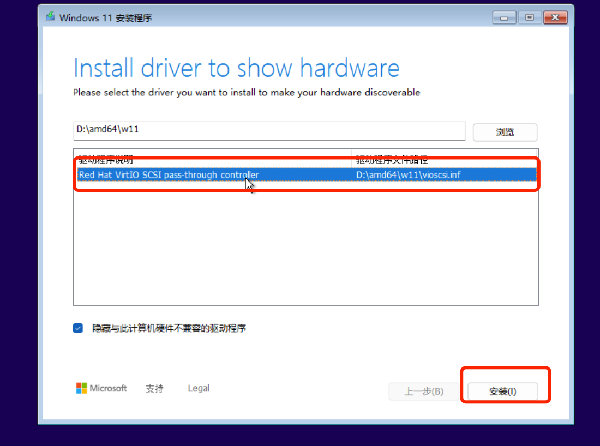

Click on the driver, then click Next or Install to proceed to the normal installation phase.

## 4. Configuration VM

### 4.1 Install the driver.

After entering the desktop, open the file manager, find the driver disk (usually a virtual CD/DVD), and then locate and run `virtio-win-guest-tools`. This will install the VirtIO drivers, optimizing the performance and compatibility of the virtual machine. Once the installation is complete, restart the virtual machine to ensure all drivers take effect.

You can see the IP information on the PVE web interface.

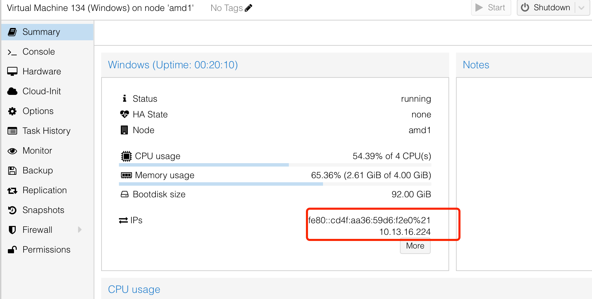

If you cannot see the IP information, please shut down the virtual machine, and in the virtual machine's `Options`, enable `QEMU Guest Agent`.

### 4.2 To enable RDP 

Please uncheck `Allow connections only from computers running Remote Desktop with Network Level Authentication` on the RDP settings page.

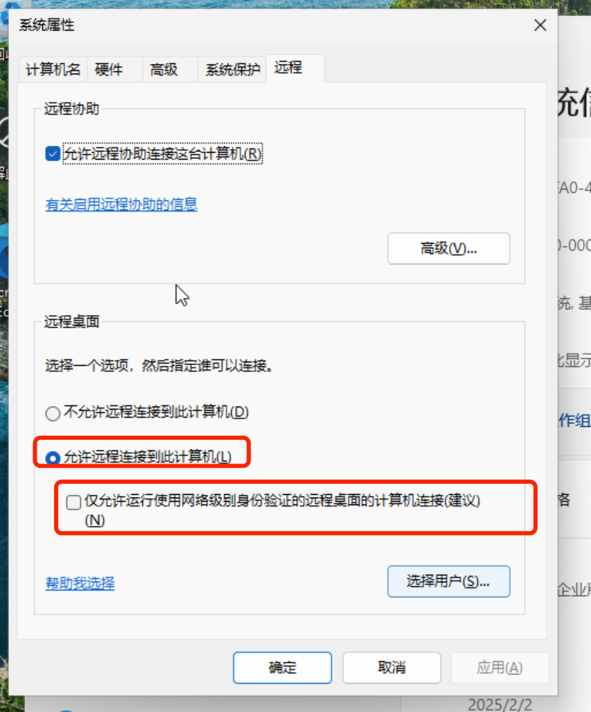


Open the firewall settings and allow RDP connections in the inbound rules.

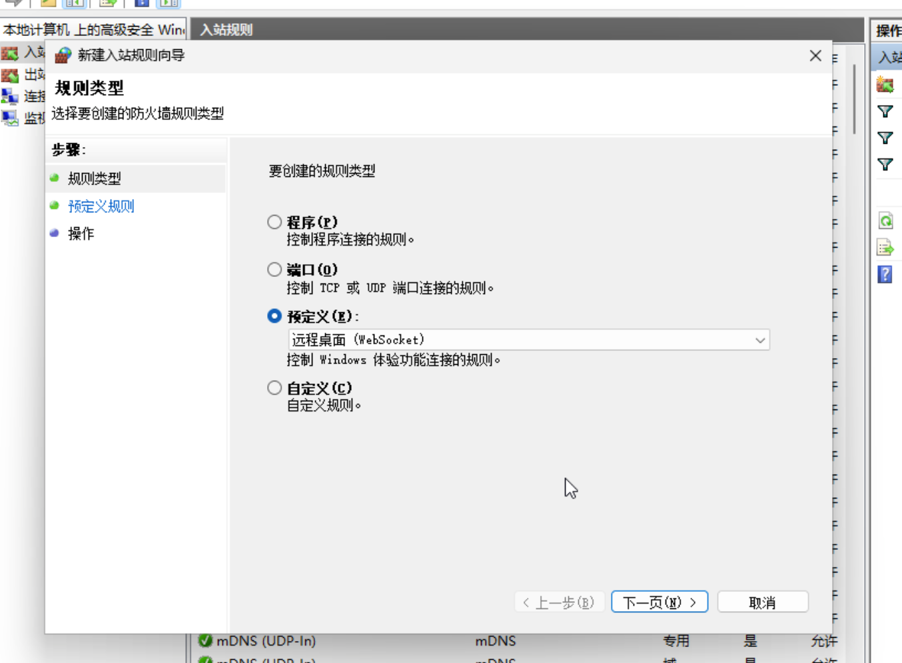


## 5. Create the roles required for PXVDI.

Switch to the web shell and enter the following command to quickly create a role with permissions to view virtual machines, snapshot virtual machines, and manage virtual machine power.

```bash
pveum role add PxvdiUsers --privs "VM.Audit VM.Snapshot.Rollback VM.Console VM.PowerMgmt VM.Monitor"
```
## 6. Create a PXVDI user.

We click on `Permissions` -> `Users` -> `Add` to access the add user page. In the Domain field, select `Proxmox VE authentication server`.

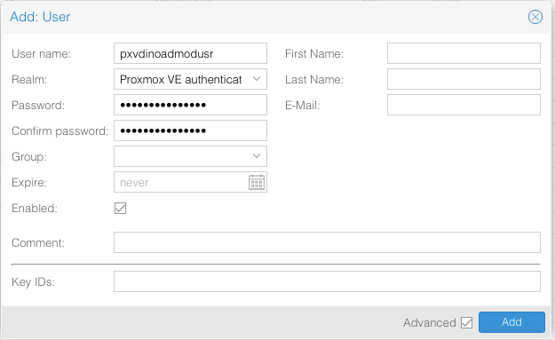

Once added, you can see it on the webpage. At this point, we can assign resource permissions to it according to Chapter 3. You can also modify user information or change the password on this page.

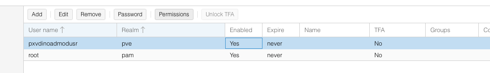


If the user wants to log in to PVE, they should select `Proxmox VE authentication server` in the domain field during the login process.

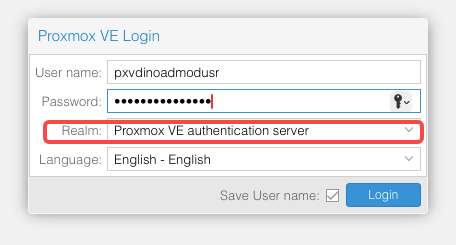


To log in to PXVDI, please use `pxvdinoadmodusr@pve` to log in.

## 7. Assign virtual machines to the user.

Select the virtual machine, click on `Permissions`, and choose `Add` - `User Permission`.

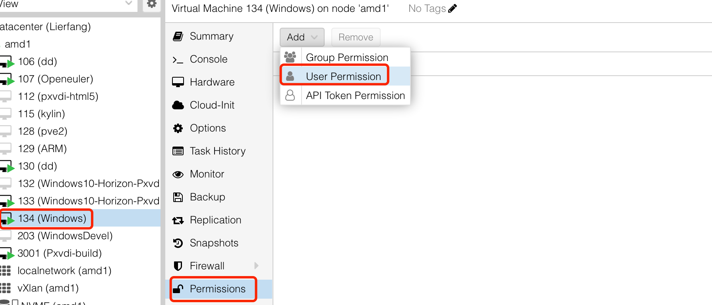

Select the user you just added, and for the Role, choose `PxvdiUsers`.

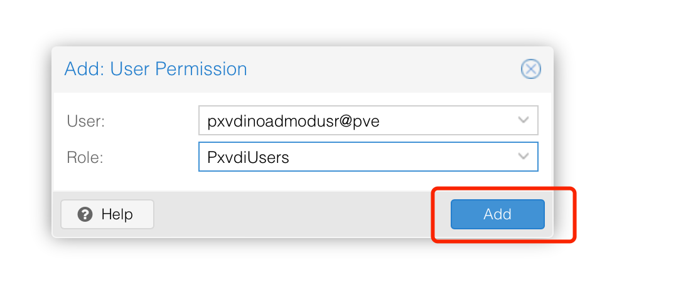

## 8. Test PXVDI.

Click this link to download the latest ISO.

https://download.lierfang.com/pxvdi/Client/iso/pxvdi_lastest_live_amd64.iso

Please upload it to PVE, and then use PVE to boot from the ISO to quickly start.

### 8.1 Configuration Server Address

In the settings, enter the server address.If you are using a Linux terminal, you need to set the mode to "Direct Connection" in the settings.

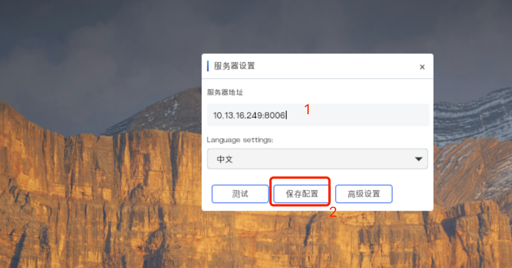

Then save the settings. You can click on "Test" to check if the address is available.

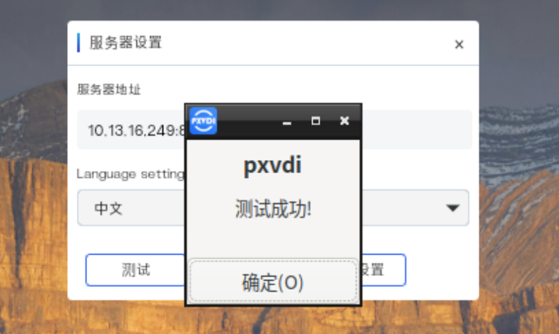

### 8.2 Log in to PXVDI.

Enter `pxvdinoadmodusr@pve` in the username field.

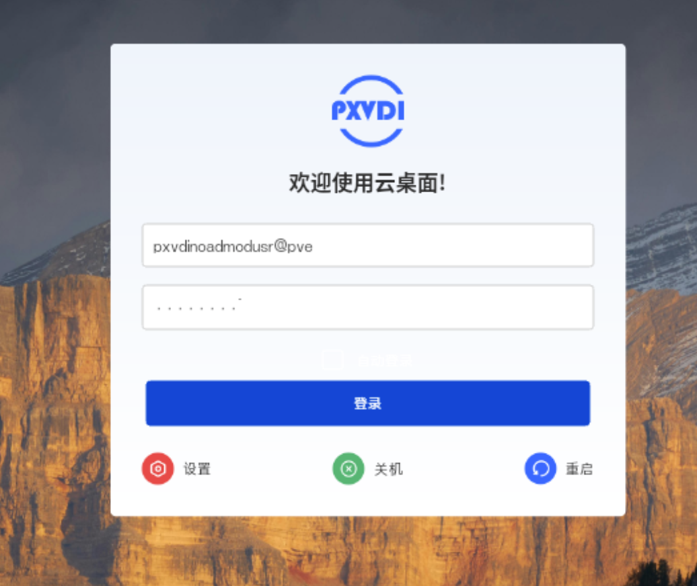

After successfully logging in, you will see a list of virtual machines. Click on the virtual machine you want to connect to, and you can start using it.


If the configuration is correct, you will be connected to the desktop.

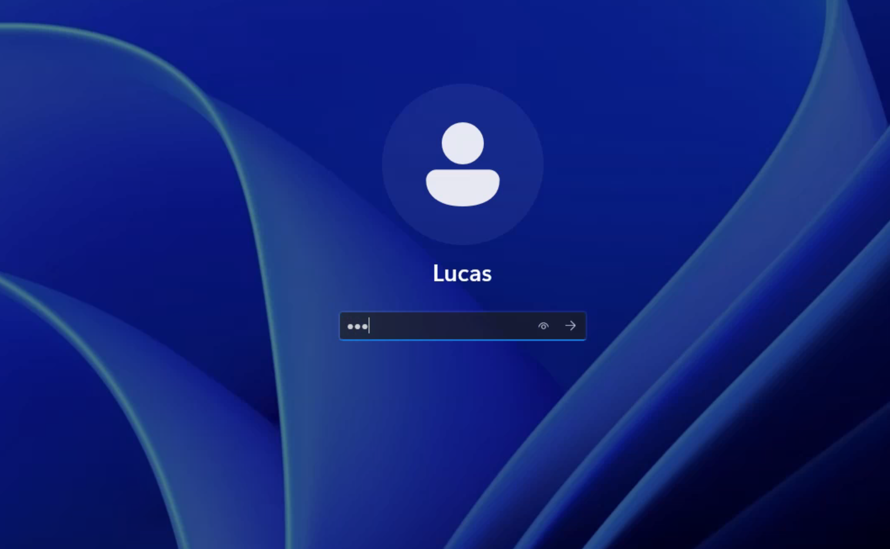
