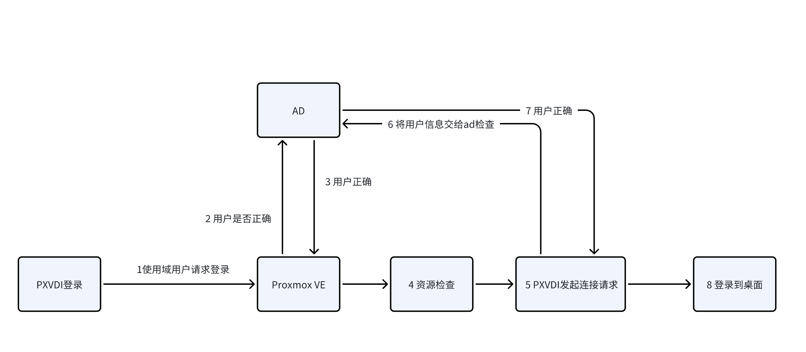

# 用户管理

Direct connection mode relies on PVE's own user authentication, supporting PAM users, LDAP/AD, and OpenID users.

> PXVDI does not support two-factor authentication.

Common user types include the following:

- Linux Users: Users from the Linux system, such as root@pam.
- PVE Users: Users from the PVE cluster's user management module, such as user@pve.
- LDAP/AD Users: External domain users, such as jiangcuo@lierfang.com.

Users can choose to manage Proxmox VE resources using all or any one of these types.

The table below outlines the main similarities and differences among the three user types.

| User Type     | Shared Between Nodes | Shell Access | Password Change |Interoperability with VMs|
| --------------- | -------------- | ----------- | ---------- |---------- |
| Linux Users | X            | √        | √       |X       |
| PVE Users       | √           | X         | √       |X       |
| Domain Users        | √           | X         | √         |√       |

For the PXVDI scenario, we recommend using domain users. Domain users can utilize the same user management backend for both PVE authentication and desktop authentication, allowing for automatic login to the desktop.

## 1. Proxmox VE and AD Domain Integration

You can add an AD domain to Proxmox VE, allowing it to read users from the AD domain. Administrators can then assign resource permissions to these AD users. However, it is not possible to configure Proxmox VE's resource permissions within the AD; the AD only provides users, while the permissions themselves are assigned by Proxmox VE.

Let's look at the authentication process under the AD model in conjunction with PXVDI.

In this process, we can see that Proxmox VE verifies user information through the AD, while the resource check is completed by Proxmox VE.

>Since the virtual machines are also joined to the domain, user information must be verified through the domain as well.
>
>Because they are in the same domain, if the user can log in, then theoretically, the second user verification should also be no problem. Therefore, in the AD model, users only need to enter their password once to log in to both PXVDI and the desktop.

## 2. AD Mode of PXVDI

PXVDI uses the `ADmode` option to control the account credentials passed to the desktop.

When `ADmode` is enabled, PXVDI will pass the user's login credentials to the virtual machine. For example, if a user logs into the PXVDI client with the account `root@pam` and the password `12345678`, the PXVDI client will send the account `root@pam` and the password `12345678` as connection credentials to the virtual machine.

If the virtual machine's credentials are not `root@pam` and `12345678`, the connection will fail.

When `ADmode` is disabled, PXVDI will not pass the account credentials to the virtual machine, so the virtual machine must have `nla authentication` turned off.

For example, if a user logs into the PXVDI client with the account `root@pam` and the password `12345678`, the PXVDI client will send an empty account and password as connection credentials to the virtual machine. The user will need to enter their credentials on the page to log in, as shown in the image below:

We recommend using an AD domain as the backend for PXVDI to achieve better security and virtual machine management.

## 3. add an AD domain in Proxmox VE

Please refer to the relevant documentation online.