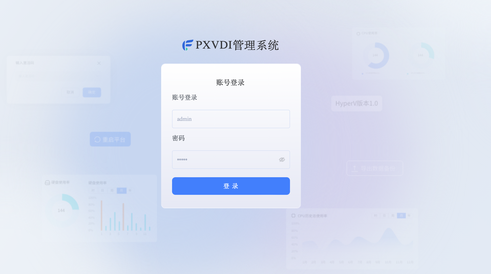
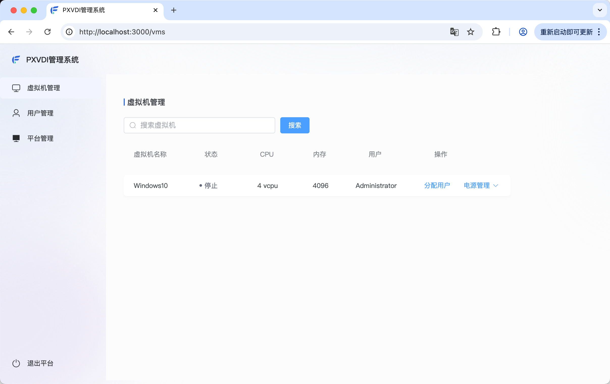
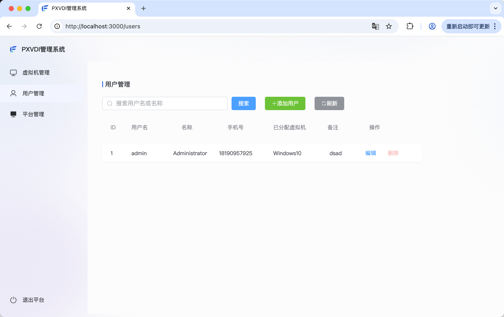

# PXVDI For Hyper-V

PXVDI 提供了针对Hyper-V 的云桌面解决方案。

## 特点

1. 功能简单明了。
    相对于复杂的云桌面架构，PXVDI for Hyper-V 仅需要安装服务端exe，所有的管理操作均通过GUI进行。只要会使用Hyper-V，就会使用PXVDI for Hyper-V。

2. 性能强劲。
    PXVDI for Hyper-V 利用Hyper-V的API，以及RDP协议的无缝集合，支持更强的性能，更低的延迟.

3. 资源占用低。
    依靠Hyper-V的强大性能。支持动态内存，可以有效减少主机内存，增加内存的利用率。虚拟化CPU性能的损耗不到5%。
    
4. 图形增强。
    PXVDI for Hyper-V 支持GPU直通和GPU共享，可以利用GPU的强大性能，提供更好的图形性能。 

4. 支持多用户。
    PXVDI for Hyper-V 支持多用户，每个用户可以拥有自己的虚拟机，并且可以随时切换。

## 卖点

PXVDI For Hyper-V 采用永久授权模式，不限制用户数量。适合低成本使用云桌面的用户。

## 相关截图

