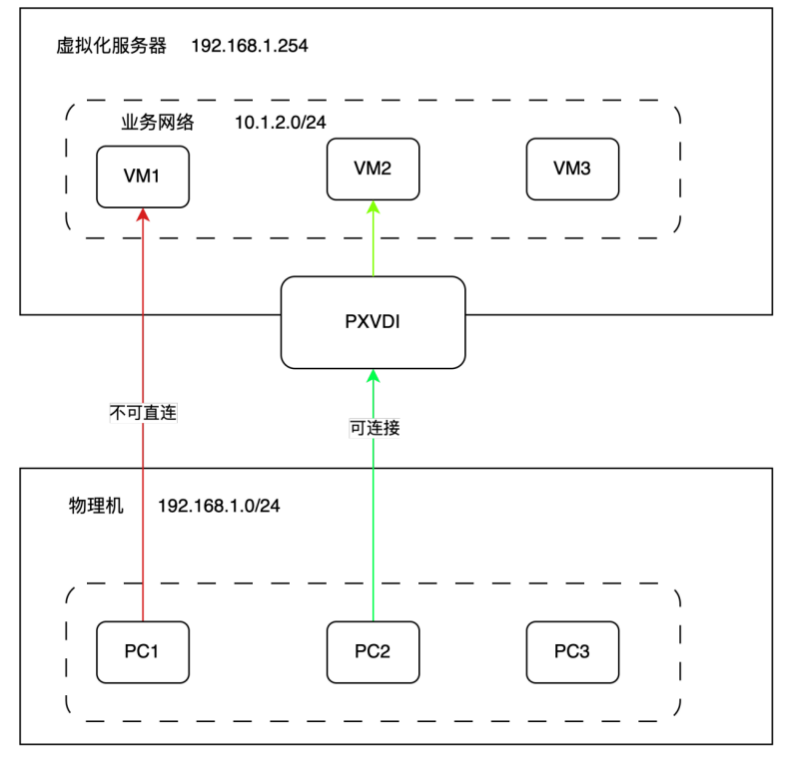

# PXVDI For Hyper-V

PXVDI 提供了针对Hyper-V 的云桌面解决方案。

## 特点

1. 功能简单明了。
    相对于复杂的云桌面架构，PXVDI for Hyper-V 仅需要安装服务端exe，所有的管理操作均通过GUI进行。只要会使用Hyper-V，就会使用PXVDI for Hyper-V。

2. 性能强劲。
    PXVDI for Hyper-V 利用Hyper-V的API，以及RDP协议的无缝集合，支持更强的性能，更低的延迟.

3. 资源占用低。
    依靠Hyper-V的强大性能。支持动态内存，可以有效减少主机内存，增加内存的利用率。虚拟化CPU性能的损耗不到5%。
    
4. 图形增强。
    PXVDI for Hyper-V 支持GPU共享，可以利用GPU的强大性能，提供更好的图形性能。 

4. 支持多用户。
    PXVDI for Hyper-V 支持多用户，每个用户可以拥有自己的虚拟机，并且可以随时切换。

## 卖点

1.永久授权

        (1)授权属于永久类型，一次付费，终身使用

        (2)服务器故障可以免费更换授权码2次。

        (3)永久享受软件更新。

2.不限制用户数量

        (1)不会因为点数而收费

        (2)并发数量因服务器和虚拟机的配置决定。资源越多，可实际使用用户越多。

3.策略管理

        (1)支持按时间周期限制登录，如工作日、工作时间登录，有效进行资源限制

4.简单vGPU

        (1)通过Hyperv Gpu-PV技术，可以把消费级显卡如3070，4090甚至核显进行切分。最多32个。

## 适用场景

本产品是远程办公的软件，为办公设计，因此不适用于一下场景

        1. 玩fps类游戏
        2. 做大型项目剪辑和工程制图

如果用户没有设置vGPU，那么虚拟机内将不会有GPU，所以需要GPU场景都很吃力。

因此很适合一下场景：

        1. 文字办公
        2. 炒股
        3. 课堂教学
        4. 网络隔离

            在研发场景中，虚拟机可以连外网。研发物理机不可连外网，促进了业务安全隔离。

## 相关截图

