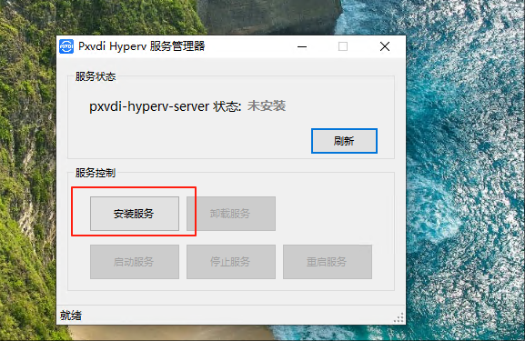
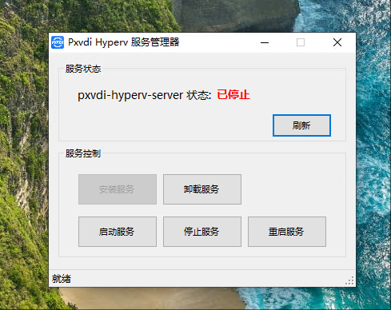

# Pxvdi Hyper-v Server

## 下载

https://download.lierfang.com/pxvdi/MIDServer/server/

名称为 Pxvdi-Hyperv-Setup.exe

## 运行环境

请使用Windows10 以上的开启了Hyper-V的系统。例如Server 2016 - Server 2025。如果使用vGpu功能，请参考[系统使用](./system.md)

本软件需要vc运行时，可以前往 `https://www.downza.cn/soft/186638.html` 下载。注意点`普通下载`

## 安装

本程序没有签名，会被Windows 检测，届时请保留或者允许。

请直接双击运行exe，程序安装成功之后，在桌面上有一个Pxvdi-Hyperv的快捷方式。

程序默认会安装在`C:\Program Files (x86)\lierfang\pxvdi-hyperv`。

请使用右击管理员身份运行。

第一次安装，使用安装服务

成功之后，再启动服务。此时PXVDI-Hyperv-Server就启动了，并且开机自动运行。此时程序会在安装目录生成数据库文件和配置文件。

如果需要卸载，请务必先停止服务，卸载服务，再卸载程序

## 登陆

打开浏览器，访问https://localhost:9921端口可以访问，默认的账号为admin，密码为admin

请务必安装好Hyperv，否则网页会报错！

## 防火墙例外

请打开防火墙允许9921端口出站

## 使用

1. 请在HyperV中创建好虚拟机，建议使用2代BIOS，且Windows8.1以上的虚拟机作为Guest，这将启动增强功能，在虚拟机中需要勾选来宾服务。以便可以PXVDI-Server可以和虚拟机通信。如果使用vGpu功能，请参考[系统使用](./system.md)

2. 创建用户，并且为虚拟机分配用户

3. 激活程序，以使非admin用户能够正常客户端登陆。

## 外网

需要映射端口9921 和 2179到程序所在的服务器！

## 版本更新

请使用服务管理器，停止服务，然后运行新版本的exe，安装成功之后，再启动服务即可。

