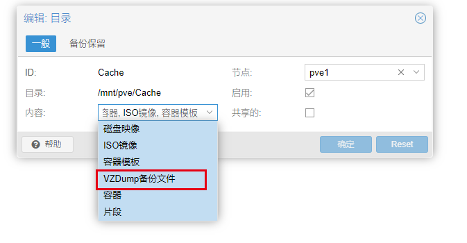
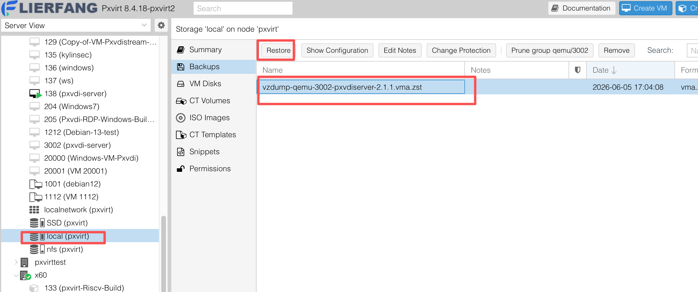
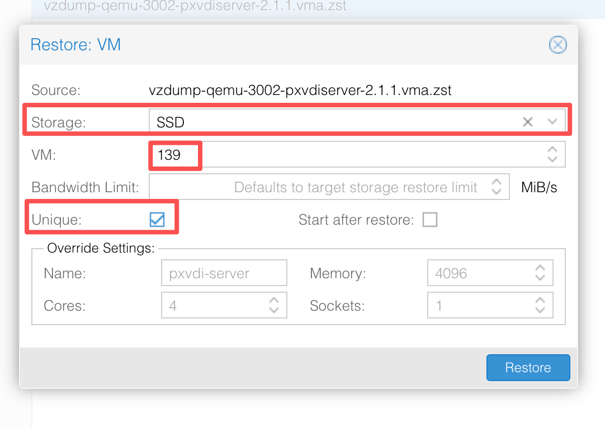
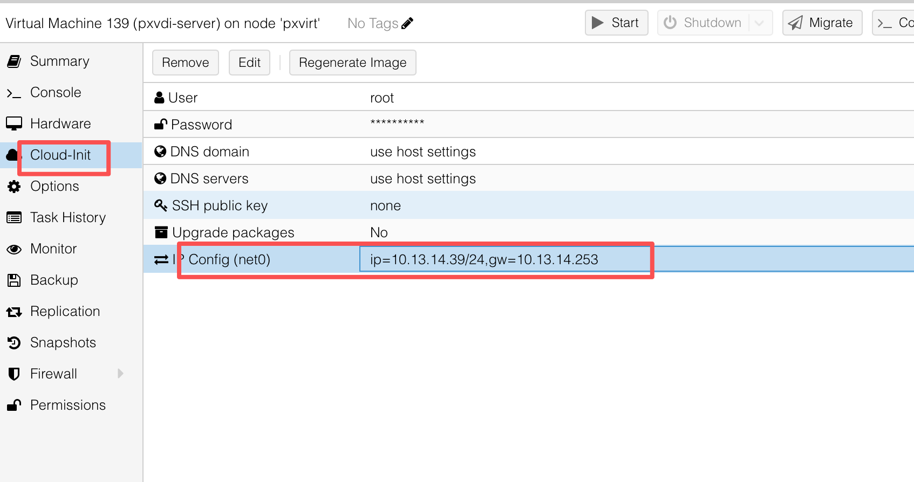
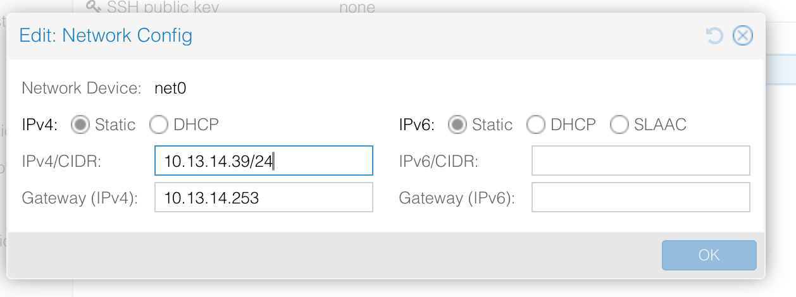
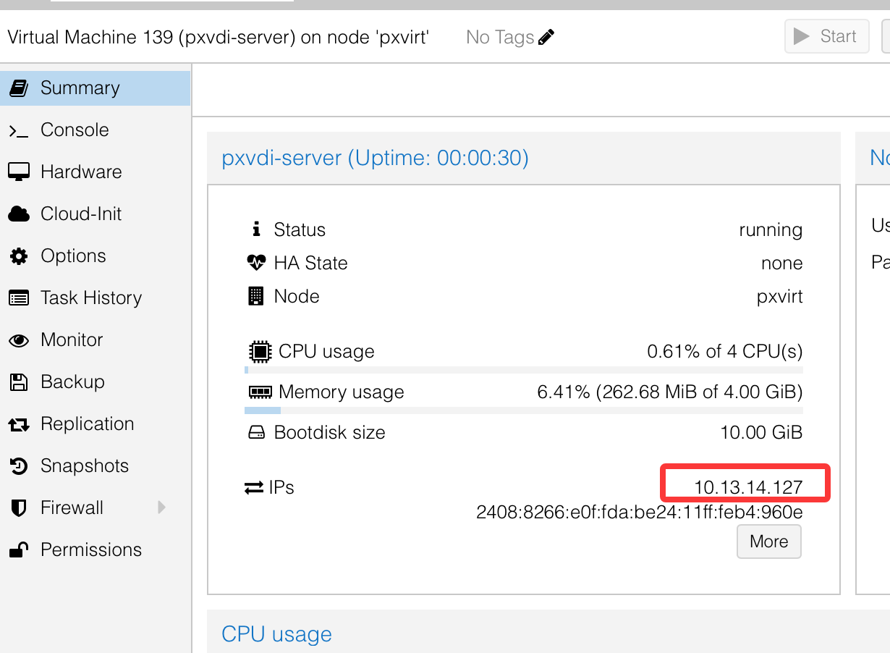
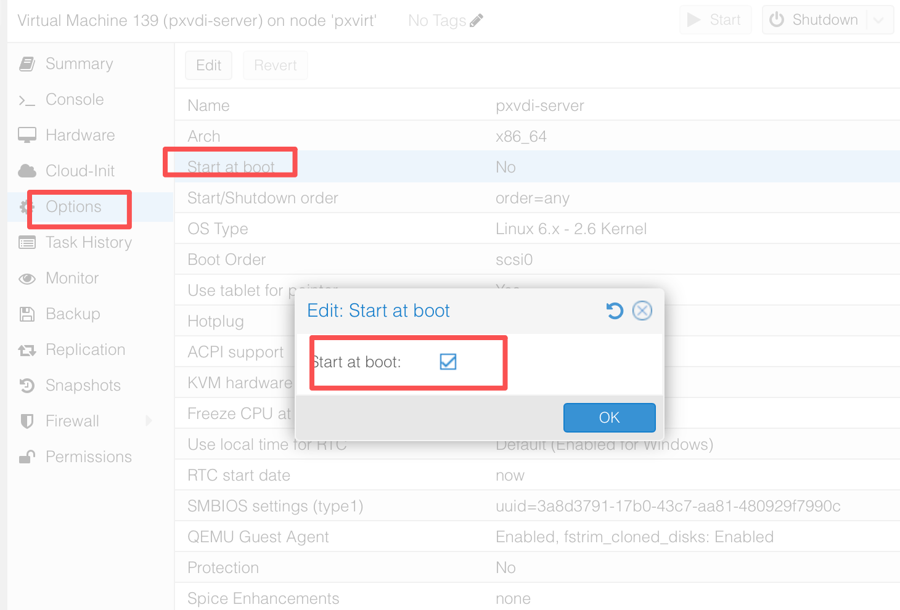

# Pxvdi 预构建镜像

为了方便用户调试，

我们提供了虚拟机备份文件，用户可以直接还原备份就可以，不需要安装虚拟机，安装系统等复杂操作

## 备份使用说明

备份是PVE的专属备份格式，

vzdump-qemu-3002-pxvdiserver-2.1.1.vma.zst

请勿更改文件名，在vmid，也就是类似3002后面，就是一些描述

## 备份的使用

###  配置内容库

默认local目录可以放备份文件，路径为/var/lib/vz/dump 。

如果你准备把这备份文件放到其他内容库，请参考下面

首先在存储栏，添加一个dump的权限。最后请把文件放置到目录下的dump目录中，如下

###  上传备份包到对应的存储库

这里直接传到local目录

可以通过scp 将文件放到/var/lib/vz/dump，也可以直接在pxvirt上进行下载

`wget -P /var/lib/vz/dump  https://mirrors.lierfang.com/pxcloud/pxvirt/system-prebuild-img/vzdump-qemu-3002-pxvdiserver-2.1.1.vma.zst`

这样！等待下载完成即可

### 还原备份

在页面上，点击`local`，找到备份，选中对应的备份

点击还原，在弹窗中，先选择机器自身的存储，一般是`local-lvm`，VMID可以自己输入，`唯一Unique`需要勾选

随后还原成功即可！

## 预构建镜像列表

一般存放的位置位于 `https://mirrors.lierfang.com/pxcloud/pxvirt/system-prebuild-img/`

### PxvdiServer

文件名为 `vzdump-qemu-3002-pxvdiserver-2.1.1.vma.zst`

默认用户名为root，密码为lierfang

#### 使用方法：

参考上面还原的方法，还原pxvdiserver，随后找到cloud-init，

在弹出的ip编辑弹窗，输入属于自己网络环境ip，这个ip会自动配置到虚拟机内部

修改之后，开机，可以在页面上看到虚拟机的ip

我们通过这个ip访问后台即可配置，`https://ip:3002`

#### 配置开机启动

在选项内部，配置开机启动就行了

#### 系统密码修改

在VNC上，登录之后，直接使用命令 `passwd root` 修改即可

### Windows客户机系统

