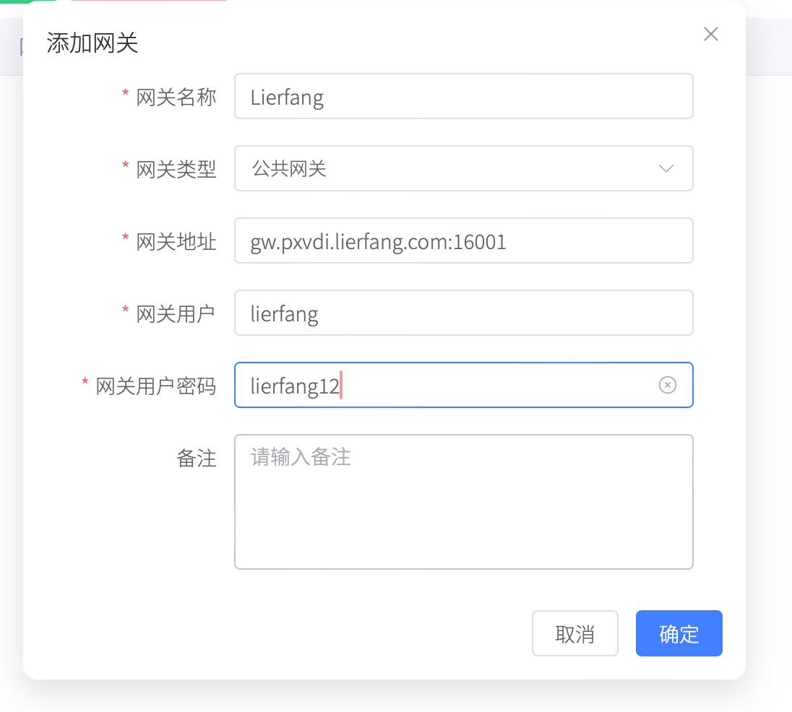

# 网关管理

当PXVDI客户端和PXVDI桌面虚拟机无法网络互访时，即需要使用网关进行中转连接。

PXVDI支持2种类型的rdp网关。

- 公共网关

    公共网关就是谁都可以用的网关，必须指定网关用户和密码。客户端会使用该凭据连接到网关。

- 域网关

    域环境中的网关。用户的登录账号和密码就是网关的凭据。只适合域环境中使用。

这个区分是网关的用法区分，而不是网关所在的环境做区分。域环境中的网关也可以做公共网关。

RDP网关有2种实现方式.

|实现方式|msrdp网关|rdpGW网关|
|-|-|-|
|开源|x|√|
|域网关|√|x|
|账号密码认证|√|√|
|反向代理|x|√|

* [msrdp网关](gw/msrdpgw.md)
* [rdpGW网关](gw/rdpgw.md)

