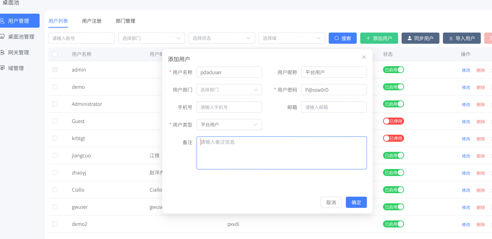
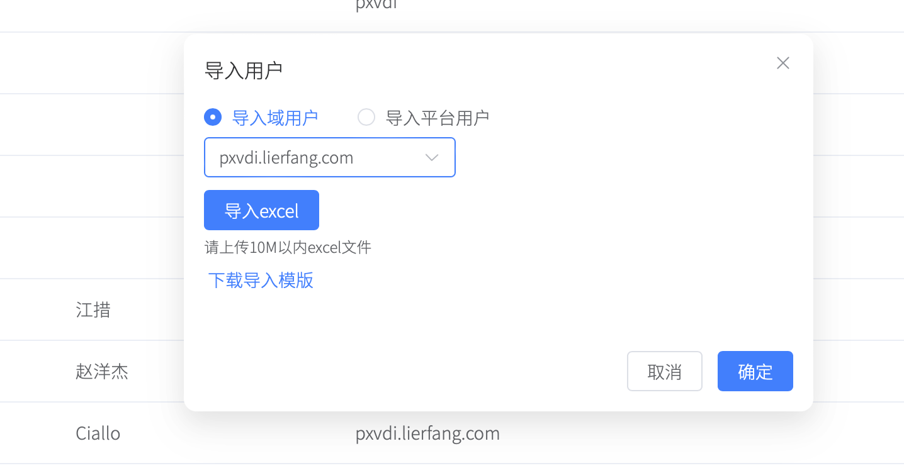
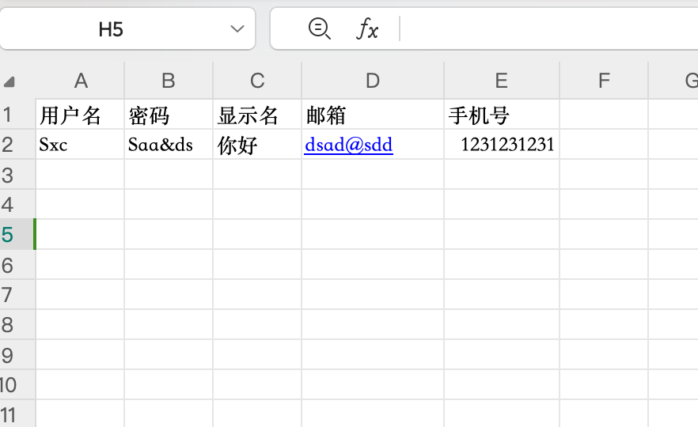
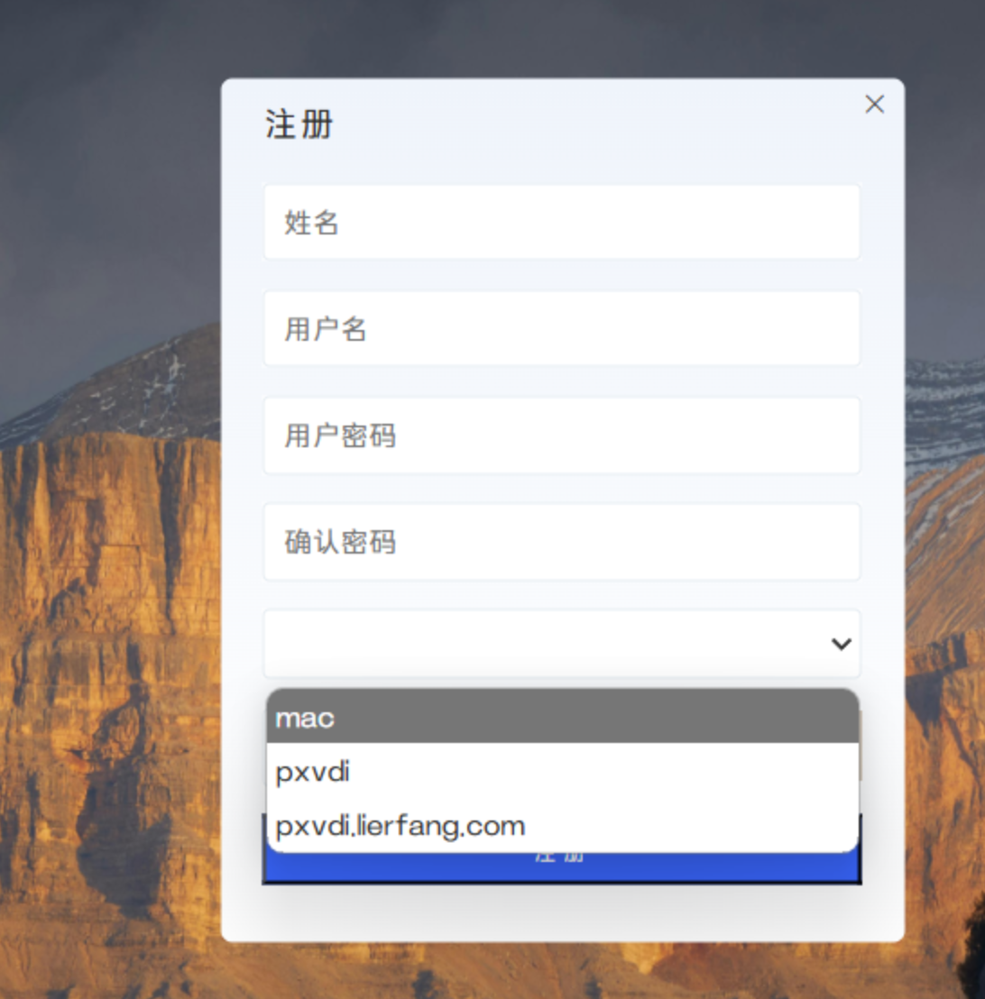
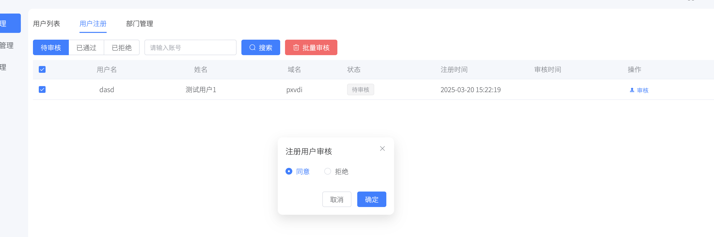

# 添加用户

PXVDI服务端支持添加平台用户或者域用户。

# 通过平台添加用户

只需要在用户管理中，点击添加。用户类型选择对应的域即可添加。

>注意用户名必须是英文或者英文和数字的组合

# 批量导入用户

点击导入用户，选择下载模板

打开导入模板中，填写对应的信息

>注意用户名必须是英文或者英文和数字的组合
>
>必填项是用户名和密码

最后点击导入即可导入用户

# 用户自主注册

在客户端设置好服务器地址时，可以点击注册进行自主注册

注册时，选择对应的域即可

# MAC地址自主注册

在客户端设置中修改为mac模式，即可注册成mac地址

# 用户审核

当用户进行注册后，不会直接就生效，需要管理员在后台审核

如果是ad用户，用户状态默认为禁用，还需要管理员手动启用一下。

