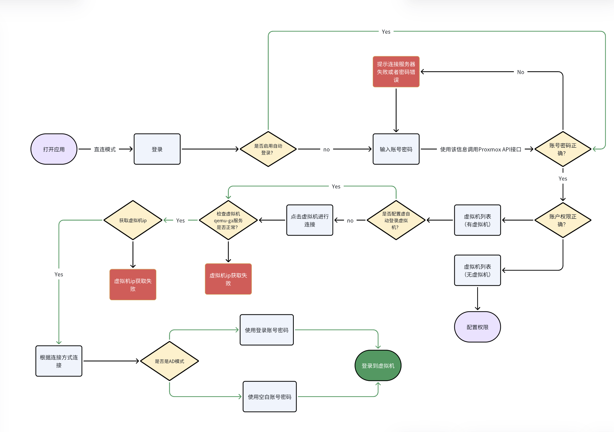
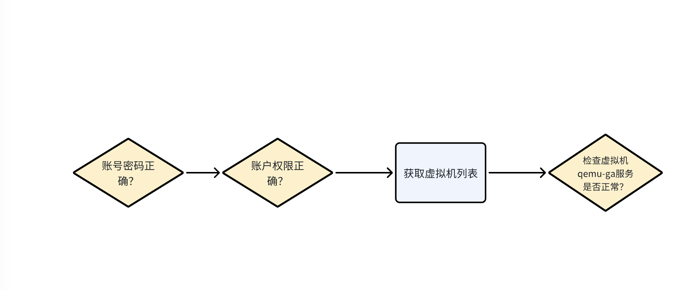

# 直连模式

## PXVDI直连模式工作流程
PXVDI直连模式本地调用Proxmox VE API接口，获取虚拟机ip，随后通过RDP/SPICE/Horizon进行连接，中间没有任何broker的参与，因此叫做直连模式。

下图是整个PXVDI客户端的工作流程图。

上面的流程图，清晰的展示了整个主要流程，其中有一些必要的环节，将在下文中介绍。

## PXVDI直连模式和Proxmox VE的交互方法
直连模式和Proxmox VE的主要交互是权限的交互。

如果权限不正确，则无法进行登录，无法获取虚拟机列表，也无法和虚拟机通信。

因此PXVDI直连模式和Proxmox VE的交互核心就是权限交互。

有了权限之后，PXVDI桌面客户端才能去通过qemu-guest-agent去获取虚拟机的信息，例如虚拟机是Windows系统还是Linux系统，这些都会有不同的连接策略。

一句话就能概括PXVDI直连模式的逻辑，向Proxmox VE获取虚拟机列表，获取虚拟机ip。