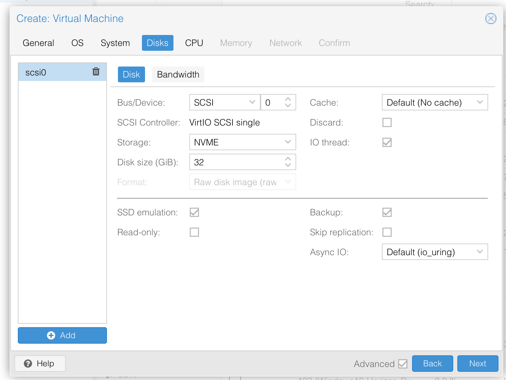
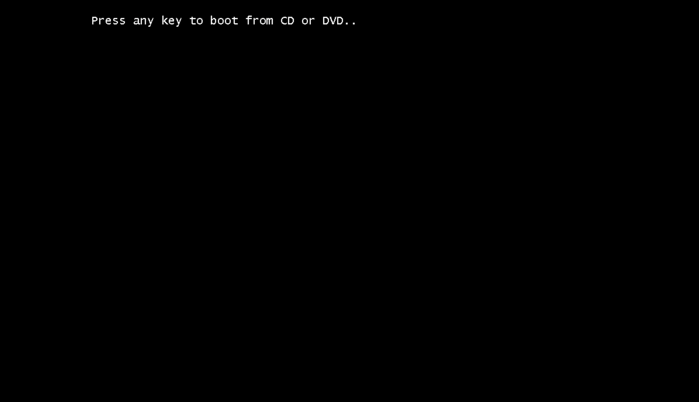
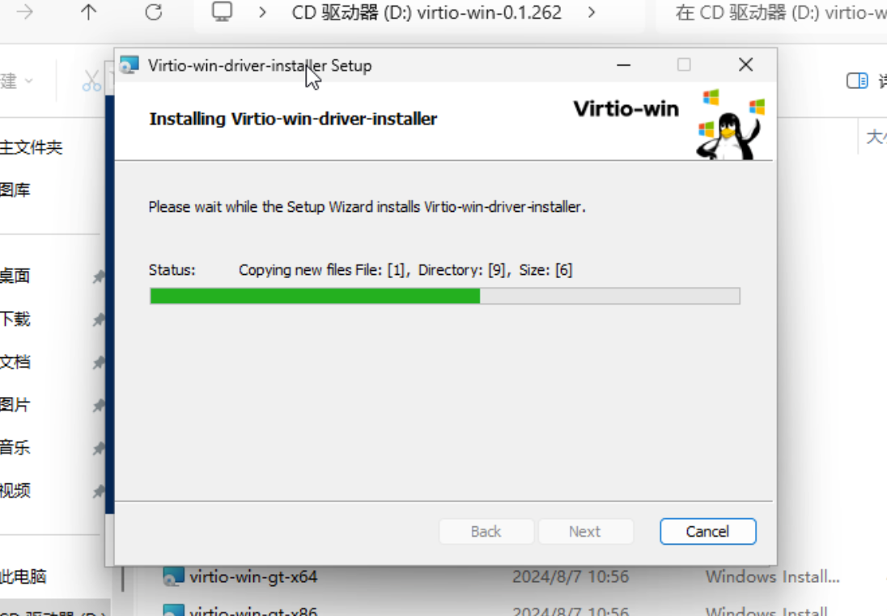

# 快速入门

快速入门旨在指导用户快速体验PXVDI，详细的教程请参考后续文档

## 1. 安装Proxmox VE
 
版本 > 7.0

## 2. 创建虚拟机 

### 2.1 创建
点击网页上的`Create VM`按钮，OS处选择Windows的ISO，`Guest os`类型根据iso的类型来选择，如果是PVE 8版本，请勾选 `Add additional drive for VirtIO drivers`,同时添加Virtio驱动.


>Note: 
>virtio驱动可以从此处下载：https://download.lierfang.com/proxmox/drivers/
>Windows7或者2008/2008r2版本请使用`virtio-win-0.1.164-1`版本

如果不是PVE8，可以在虚拟机创建完成之后，添加一个CDROM设备，并且选择驱动

### 2.2 System 配置
点击Next,进入System配置页面


如果您的版本是Windows10以上，我们建议
- `Machine` 选择q35
- `Qemu Agent` 必须勾选，这是和虚拟机通信的必要组件
- `Add EFI Disk` 勾选，这将启用UEFI启动
- `Add TPM` 勾选，将会添加一个TPM设备，安装Win11必须勾选
- `Pre-Enroll keys` 勾选之后，会支持安全启动，安装Win11必须勾选。

如果您的版本是Win8或者Win7，那么，我们建议
- `Qemu Agent` 必须勾选，这是和虚拟机通信的必要组件
- `BIOS` seabios
其他默认即可

如果您的版本是2003/xp，那么我们建议
- `Qemu Agent` 必须勾选，这是和虚拟机通信的必要组件
- `Machine` 默认
- `BIOS` seabios
- `Scsi Controller` LSI
其他默认即可

### 2.3 Disks 配置
点击Next,进入Disks配置页面



如果您的版本是2003/xp，那么我们建议
- `Bus/Device` IDE

如果您的版本是高于2003/xp，那么我们建议
- `Bus/Device` SCSI
- `SSD emulation` 勾选，这将把磁盘模拟成固态硬盘
- `Discard` 勾选，为磁盘启用TRIM，能够节省磁盘空间

如果您的版本是win11，建议给VM分配60G以上的磁盘


### 2.4 CPU 配置
点击Next,进入CPU配置页面


我们建议:
- `Sockets` 固定为1
- `Cores` 虚拟机的cpu数量，合理配置，建议为4
- `Type` 选择host

### 2.5 Memory 配置

点击Next,进入Memory配置页面，请合理配置。


### 2.6 Network 配置

点击Next,进入Network配置页面。使用默认配置即可。

如果您的版本是2003/xp，那么我们建议
- `Model` RTL 8196

### 2.7 Confirm

点击Next,进入Confirm页面。本页面会展示虚拟机的配置，如果不对，请回退重新设置。


## 3. 安装虚拟机

开启虚拟机之后，如果出现下面的图像，务必使用鼠标点击窗口，再按任意键，出发Windows安装进程。




进入安装流程之后，会提示未找不到磁盘，此时我们点击`浏览按钮`


在弹出的页面中，选择驱动光盘。


展开驱动光盘，选择`amd64` -> `win11` 或者选择对应的系统版本


点击驱动，点击下一步或者安装，进入正常安装环节。
## 4. 配置虚拟机

### 4.1 安装驱动

进入桌面之后，在文件管理器中，找到驱动光盘，并且运行`virtio-win-guest-tools`


随后直接下一步即可



当驱动安装好之后，可以在设备管理器中看到没有未知驱动


在PVE的web上可以看到ip信息


如果看不到ip信息，请在关闭虚拟机，在虚拟机的`Options`中，启用`QEMU Guest Agent`

### 4.2 开启RDP配置

请在开启RDP的页面，取消勾选`仅允许运行使用网络级别身份验证的远程桌面的计算机连接`


打开防火墙设置，在入站规则中，允许rdp连接,


## 5. 创建PXVDI所需要的角色

切换到网页shell，输入下面命令快速创建具有查看虚拟机、快照虚拟机、虚拟机电源管理权限的角色。
```bash
pveum role add PxvdiUsers --privs "VM.Audit VM.Snapshot.Rollback VM.Console VM.PowerMgmt VM.Monitor"
```
## 6. 创建PXVDI用户

我们点击权限->用户->添加就能进入添加页面。其中领域选择Proxmox VE authentication server


添加好了，可以在网页上看到，此时我们就可以按照第三章给他分配资源权限。还可以在这个页面修改用户信息或者修改密码。


如果用户想登录PVE，在登录的时候领域选择Proxmox VE authentication server


如果想登录PXVDI，请使用pxvdinoadmodusr@pve或者直接输入pxvdinoadmodusr进行登录。

## 7. 为用户分配虚拟机

选中虚拟机，点击`Permissions`,选择`Add`-`User Permission`


选择刚才添加的用户，Role选择`PxvdiUsers`


## 8. 测试PXVDI ISO

点击此链接 下载最新的iso 

https://download.lierfang.com/pxvdi/pxvdi-linux/latest/pxvdi_2_latest_live_amd64.iso

请上传到PVE中，使用PVE启动该ISO，即可快速启动

### 8.1 配置服务器地址

在设置中，输入服务器地址。


随后进行保存，您可以点击测试，进行测试该地址是否可用。


### 8.2 登录pve

在用户名处输入pxvdinoadmodusr@pve


登录成功，会出现虚拟机列表，此时点击虚拟机即可连接到虚拟机


如果配置正确，将连接到桌面


