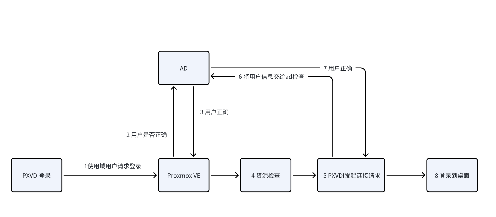
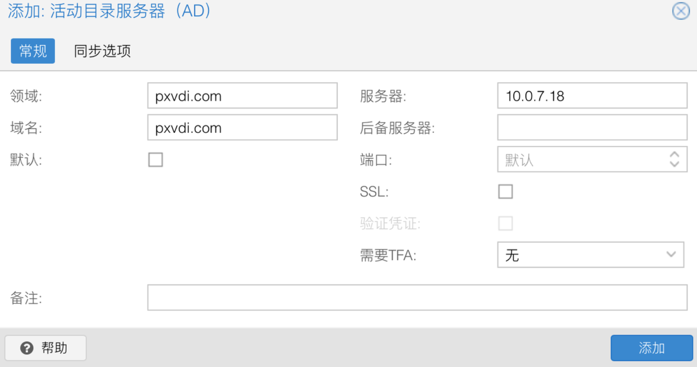
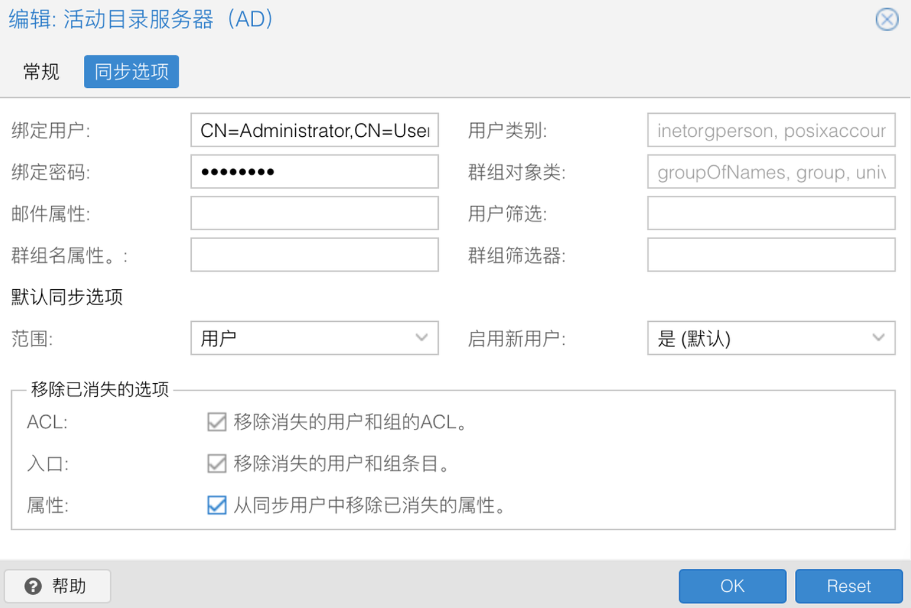
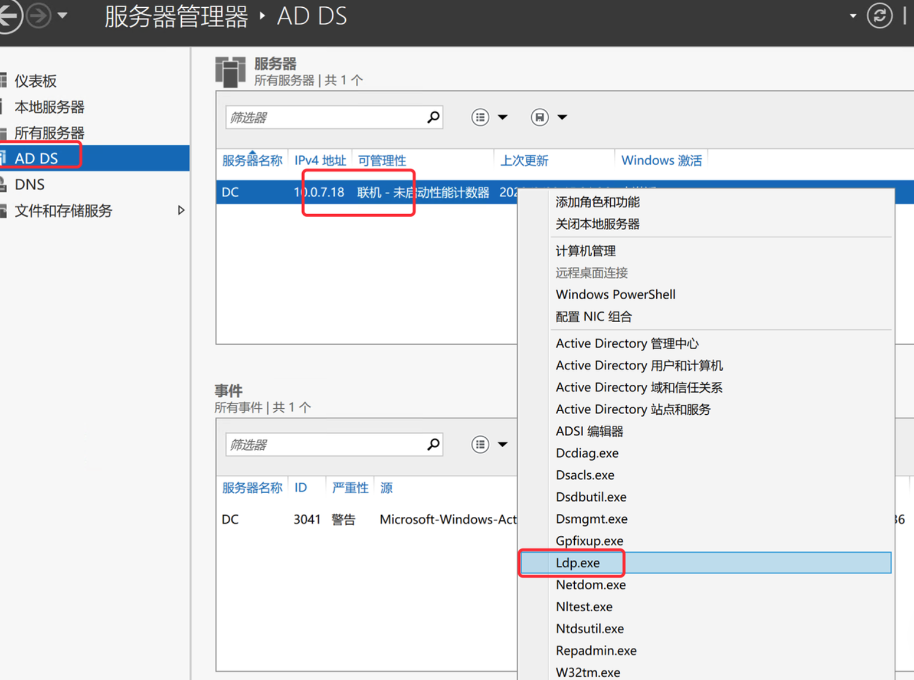
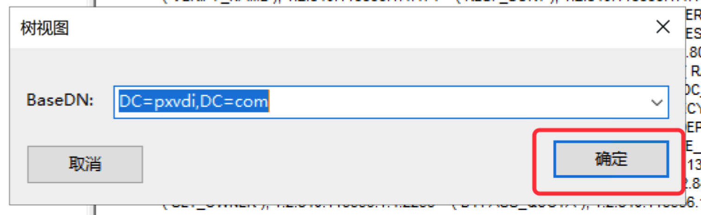
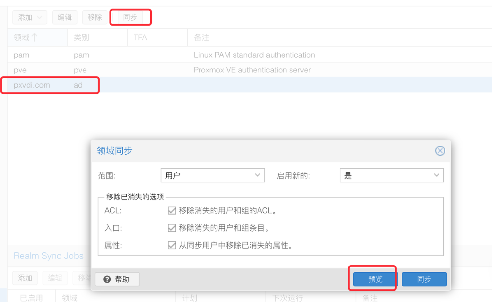
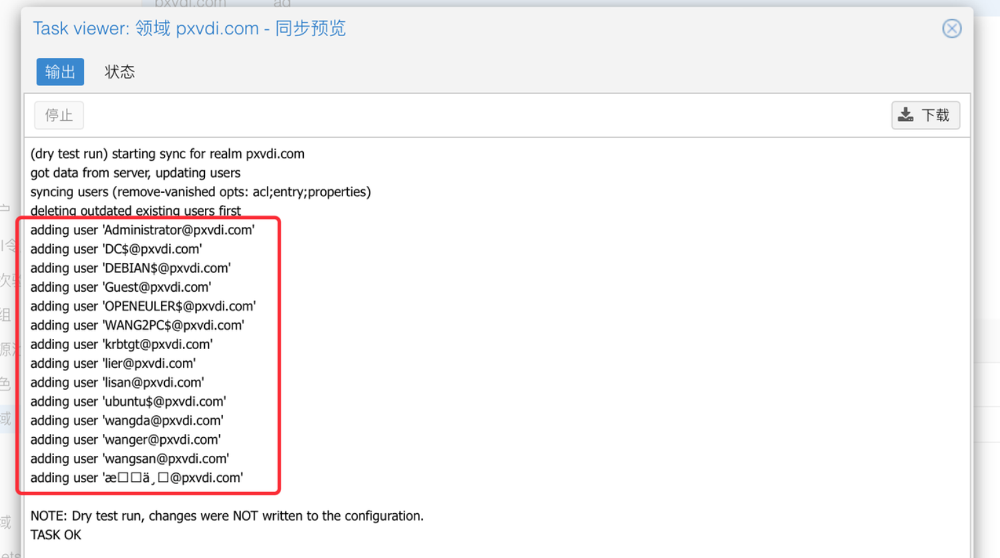
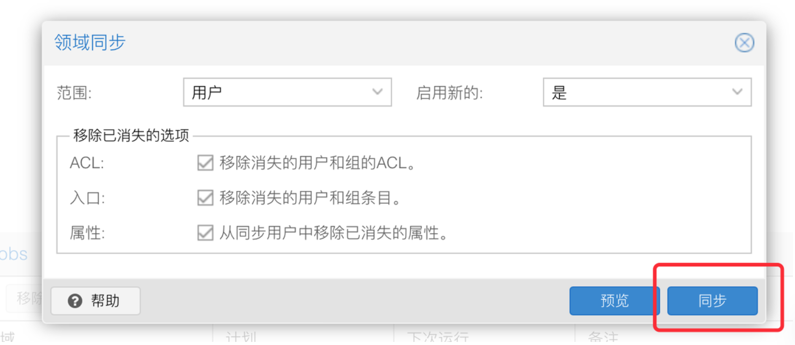
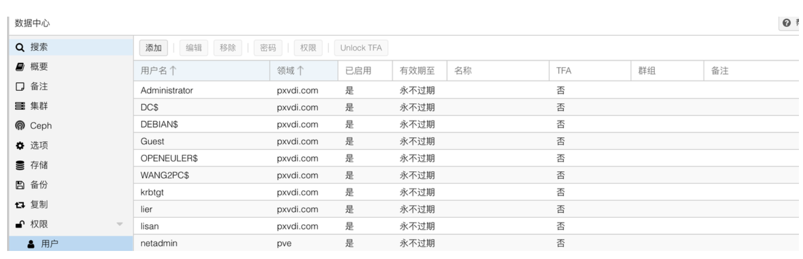
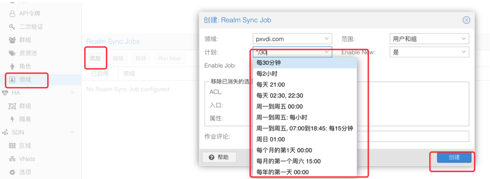

# 用户管理

直连模式依赖PVE自身的用户认证，支持pam用户、ldap/ad、openid用户

> PXVDI不支持二次验证

常用的用户类型有如下

- Linux 自身用户： linux的用户，如root@pam
- PVE用户：PVE集群的用户管理模块中的用户，如user@pve
- LDAP/AD用户：外部的域用户，如jiangcuo@lierfang.com

用户可以同时选择全部或者其中一种去管理Proxmox VE 资源。

下表列出了3种用户类型的主要异同点。

| 用户 特性     | 节点之间共享 | Shell访问 | 密码修改 |可和虚拟机互通|
| --------------- | -------------- | ----------- | ---------- |---------- |
| linux自身用户 | X            | √        | √       |X       |
| pve用户       | √           | X         | √       |X       |
| 域用户        | √           | X         | X        |√       |

对于PXVDI的场景，我们推荐使用域用户。域用户可以使用同一套用户管理后端进行PVE认证和桌面认证，能够实现自动进入桌面。

## 1. Proxmox VE和AD域

可以在Proxmox VE上添加AD域，这样Proxmox VE就可以读取AD域上的用户，并且管理员可以给AD域上的用户进行资源权限分配。但是无法在AD上去配置ProxmoxVE的资源权限，AD只是提供了用户，权限的本身还是由Proxmox VE分配。

我们来结合PXVDI看一下AD模式下的认证流程。

在这个流程中，我们可以看到Proxmox VE去验证用户信息也是要通过AD去验证的，资源检查则是Proxmox VE完成。

>因为虚拟机也是加了域的，所以也要通过域去验证一下用户信息。
>
>因为是同一个域，所以如果能登录，那么第二次用户验证，理论上也是没有问题的，所以在AD模式下，用户只需要输入一次密码就可以登录PXVDI和桌面。

## 2. PXVDI的ADmode

PXVDI 使用`ADmode`选项控制传递给桌面的账号密码。

当`ADmode`处于启用状态，那么PXVDI会将用户的登录账号密码传递给虚拟机，例如用户以账号`root@pam`和密码`12345678`登录PXVDI客户端，那么PXVDI客户端将会把账号`root@pam`和密码`12345678`作为连接凭据传给虚拟机。

如果虚拟机的账号密码不是`root@pam`和`12345678`，那么就会连接失败。

当`ADmode`处于关闭状态，那么PXVDI将不会传递账号密码信息给虚拟机，因此需要虚拟机关闭`nla`认证。

例如用户以账号`root@pam`和密码`12345678`登录PXVDI客户端，那么PXVDI客户端将会把账号` `和密码` `作为连接凭据传给虚拟机。用户需要在页面输入账号密码才能登录进去，如下图:

我们推荐使用ad域作为PXVDI的后端，实现更好的安全性和虚拟机管理。

## 3. Proxmox VE 添加ad域

### 3.1 添加ad

进入Proxmox VE 网页，点击`数据中心`，在中间的菜单中 展开`权限`-`领域`，随后点击`添加`-`活动目录服务器（AD）`。

如下图所示，填写相关的基本信息：

下面是选项的解释

| 选项       | 说明                                                                                                           |
| ------------ | ---------------------------------------------------------------------------------------------------------------- |
| 领域       | 一个可自定义的名字，类似别名，但我们这里建议和域名相同，以便能够一次通过认证。                                 |
| 域名       | AD的域名，和我们创建AD的时候相同，如[pxvdi.com](http://pxvdi.com/)                                                |
| 默认       | 是否将此领域设为默认领域，如果启用，则默认把[pxvdi.com](http://pxvdi.com/)域用作身份验证。建议不开启              |
| 服务器     | AD域的地址                                                                                                     |
| 后备服务器 | 域服务器的备用地址，可以是主域的第二个ip，或者是第二个域控制器ip。                                             |
| 端口       | ad域查询的端口，默认不是在ssl的情况，使用389。如果是ssl，则是636。如果更改了ldap端口，需要在这里指定。建议默认 |
| ssl        | 是否启用ssl，也就是ldaps协议。建议不勾选。                                                                     |
| 验证凭证   | 在启用ssl之后，出现此选项。是否验证ssl的证书。                                                                 |
| 需要TFA    | 是否需要两步验证。建议不开启。                                                                                 |

按照上图的填写即可。

这里旁边还有一个`同步选项`。

Proxmox VE 同步AD内的用户有2种方式。

-  Proxmox VE主动去同步AD内的用户，把ad的用户同步到Proxmox VE的数据库中。
-  Proxmox VE管理员手动在Proxmox VE后台添加AD用户（仅是将用户添加到pve数据库中，而不是直接在AD域内添加用户）。使用这个动作，管理员可以添加任意的用户，例如sfdasfgseg@pxvdi.com。PVE并不会去验证这个用户是否有效。只是在用这个账户登录时，Proxmox VE会提交这个用户的信息到AD验证，当然如果ad里面没有这个人，自然就会验证失败。所以要使用这种方式，需要AD内有那个账号。

如上，我们建议将ad用户同步到本地，并且进行定时同步。

下图是一个基本的同步选项。

最下面的3个选项建议勾上，这能够更加精准的同步用户。

注意这里的绑定用户需要basedn，basedn可以从下面渠道获取。

打开服务器管理控制台，按照如下操作，打开ldp程序。

点击查看树

选择基本的dn，然后确定

找到administrator，然后右击复制dn，这个就是basedn。

随后键入管理员密码，保存

### 3.2 同步用户

在PVE的网页上，找到领域

然后选择域，点击`同步`按钮，进入同步页面。

我们先预览，可以测试是否能够和ad连接。

如下 能够出现用户的信息，就说明连接正常，可以选择同步。

我们回到同步页面，点击同步，开始同步。

如果返回task ok就是同步完成。

我们可以去Proxmox VE的用户页面，可以查看到当前能够同步的用户。

### 3.3 添加定时同步任务

>Proxmox VE和域之间是一个边缘的存在，它不会主动去更新域的用户信息，只有当域用户去登录Proxmox VE的时候，它会提交给ad去认证。

如果我们要经常把ad的用户信息同步到Proxmox VE上，可以添加一个定时同步的任务。

在领域页面，的`Realm sync Jobs`下面，点击添加：

选择我们的域和同步时间就好了。