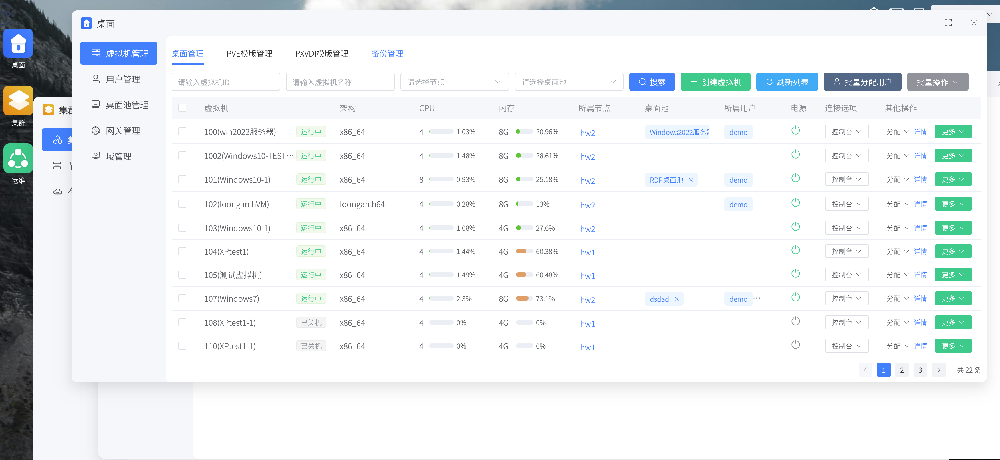
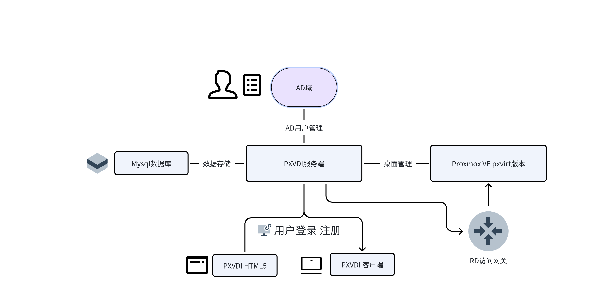
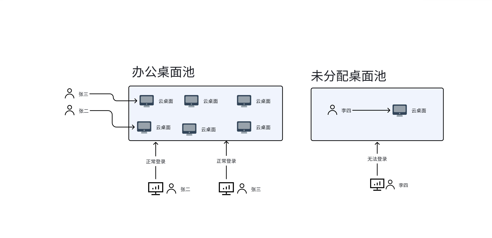

# 总控模式

## 和直连模式区别

总控模模式和直连模式主要的区别在于管理方法，因为我们给总控模式赋予了更多的管理方法，使PXVDI在复杂的环境管理更加的简单。

下面我们列出了现有的一些区别

| 类型 | 直连模式 |总控模式 |总控说明 |
| --- | --- | --- |--- |
| 桌面池 | x |√  |桌面池是桌面的集合，可以统一管理 |
|  用户管理|x  | √ |支持AD\ldap用户的增删改 |
|  批量克隆|x  | √ | 批量克隆虚拟机|
|  用户批量分配|x  | √ |支持用户和桌面批量分配 |
|  关机还原|x  | √ |虚拟机关机自动清除临时数据 |
|  一键更新|x  | √ |使用快照技术，从模板批量更新桌面池虚拟机|
|  资源统一管理|x  | √ |客户端的资源策略由服务端统一管理|
|  日志审计|x  | √ |用户操作均有历史记录 |
|  客户端统一管理|x  | √ |具有对客户端进行升级、重启、远程连接等功能 |
|  混合架构|x  | √ |支持arm64\amd64多架构桌面池|
|  安全网关|x  | √ |配置对外访问或者内网安全隔离|
| 虚拟机中文名称|x  | √ |创新实现了虚拟机的中文名显示|
| 集群纳管|x  | √ |支持对集群的管理|
| 用户注册和审核|x  | √ |用户自主注册，管理员审核|

我们重新设计了服务端的UI,比原生ProxmoxVE更加好看

以PXVDI服务端为核心，控制用户和资源。

我们通过桌面池来定义一个用户、桌面和客户端三方的关系。

只有将桌面加入了桌面池，绑定该桌面的用户才能连接到虚拟机，否则将无法获取到资源。

