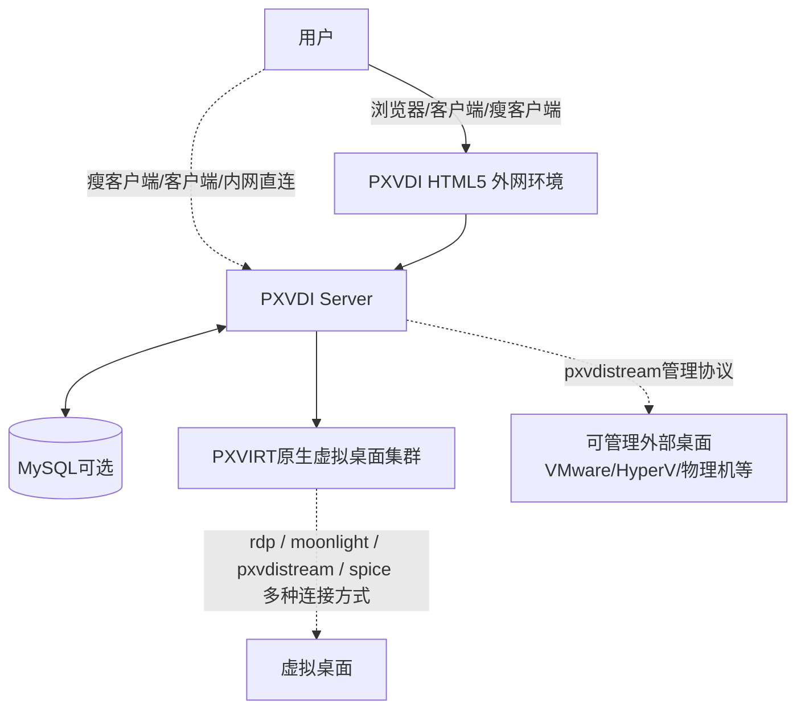

# 什么是PXVDI云桌面

PXVDI云桌面是一种基于服务器算力的桌面服务。用户通过一台低成本的小主机（瘦客户机），经网络连接到云桌面，即可获得高性能算力，完成办公、工程绘图和影视剪辑等工作。

借助网络，用户还可以在任意地点、用任意终端访问同一台桌面。管理员创建好桌面后，用户输入账号密码即可连接。

## 云桌面相比物理机的优势

相比传统物理机，云桌面有以下优势：

1. **资源利用率更高**

    例如一台 4 核 PC，日常办公往往只用到 1 核左右，75% 的性能长期闲置，而物理 PC 价格高昂、成本偏高。云桌面能充分利用计算与存储资源，实现一机多用。

2. **配置可以灵活扩展**

    同样是 4 核资源，可以分 1 核给普通办公用户，3 核给重度用户，按需分配。

3. **安全性更高**

    - 云桌面是虚拟的、没有实体，不存在被盗或物理破解的风险。
    - 具备传入传出安全策略，可防止敏感数据泄露。
    - 系统更稳定，且能定时备份，系统与文件的安全性更好。

4. **管理更方便**

    - 员工离职无需更换物理设备，删除账号、关闭虚拟机即可。
    - 远程开关机，无需到场维护物理 PC。
    - 具备权限管理，可控制数据能否落到本地、用户能否接入外设。

::: tip 这一节和「产品优势」的区别
以上是云桌面相比物理机的共性优势，所有云桌面产品都具备。PXVDI 相比其他云桌面产品（如 VMware Horizon）的差异化优势，参见 [为什么选 PXVDI](./zong-kong-mo-shi/advantage.md)。
:::

## PXVDI总控模式

总控模式是相对于我们最早的直连模式而言的。我们引入了一个管理服务 PXVDI Server，承担用户认证、权限管理、资源管理的角色。

用户认证、有哪些虚拟机资源、有哪些外部资源，乃至对瘦客户端和虚拟机内部系统的管理，都由 PXVDI Server 负责。

它是整个 PXVDI 方案的核心部件。

## 整体架构

- **服务端中枢**：PXVDI Server 云桌面管理软件，负责认证、调度、运行虚拟机。用户看不见它。由管理员管理。

- **接入终端**：用户实际坐在面前、拿在手上的设备——PC、瘦客户机、手机或浏览器。它是用户连接桌面的"入口"。

下图是总控模式的基本架构：

### 服务端组件

通过与 VMware 体系的类比，方便对照理解：

| 组件 | 角色 | 类比 VMware |
|------|------|-------------|
| **PXVIRT** | 虚拟化底层，运行所有虚拟机，是桌面真正跑的地方 | Esxi vSphere |
| **PXVDI Server** | 整套方案的大脑：用户认证、权限、资源、桌面池都归它管 | Horizon Connection Server |
| **PXVDI HTML5** | 网页接入 + 安全网关，可部署于 DMZ，让外网用户不必直连服务端 | UAG / HTML Access |
| **PXVDI Stream** | 自研连接协议，兼具远程串流与集中控制能力 | Horizon Agent |

### 接入终端

用户最终用哪种设备连接桌面，PXVDI 提供四类终端，可在同一套系统里混用：

| 终端 | 是什么 | 典型场景 |
|------|------|------|
| **PC 客户端**（Windows / macOS / Linux 桌面） | 基于 Flutter 的桌面客户端，内置 RDP 与 PXVDIStream，界面与网页版一致 | 员工已有 PC / 笔记本，装上客户端即可复用现有设备 |
| **瘦客户端 / 瘦客户端系统**（ThinOS） |使用我们的Thinos 瘦终端系统；覆盖 amd64 / arm64 / riscv64 / loongarch64 | 新建机房、批量工位、信创终端，用低成本小主机替代 PC |
| **移动端**（安卓 / iOS） | 通过 PXVDIStream 协议接入 | 出差、移动办公、平板临时接入 |
| **Web 浏览器**（PXVDI HTML5） | 免安装，浏览器直接打开；HTML5 组件同时充当外网安全网关 | 临时接入、外网访问、不便安装客户端的电脑 |

### 终端的选择

使用什么终端，都是由实际场景决定的，不同终端都可以共存。

| 场景 | 推荐终端 |
|------|------|
| 员工已经有 Windows / Mac 电脑 | PC 客户端 |
| 新建机房 / 批量工位 / 想降低硬件成本 | 瘦客户端 + ThinOS |
| 有国产化、信创终端要求 | 瘦客户端（arm64 / 龙芯 / riscv64） |
| 出差、移动、平板 | 安卓 / iOS 移动端 |
| 外网访问、临时使用、设备上不能装软件 | Web 浏览器（HTML5） |

> 各终端的详细安装与使用，参见 [客户端文档](./client/README.md)；终端的硬件最低要求参见 [硬件要求](./client/hardware.md)。

## PXVDI 总控模式优势

总控模式在授权成本、信创适配、纳管范围、部署复杂度等方面，相比 VMware Horizon 这类传统商业 VDI 有明显优势。

完整的卖点说明与对标 VMware Horizon 的逐项对比表，参见 [为什么选 PXVDI](./zong-kong-mo-shi/advantage.md)。
