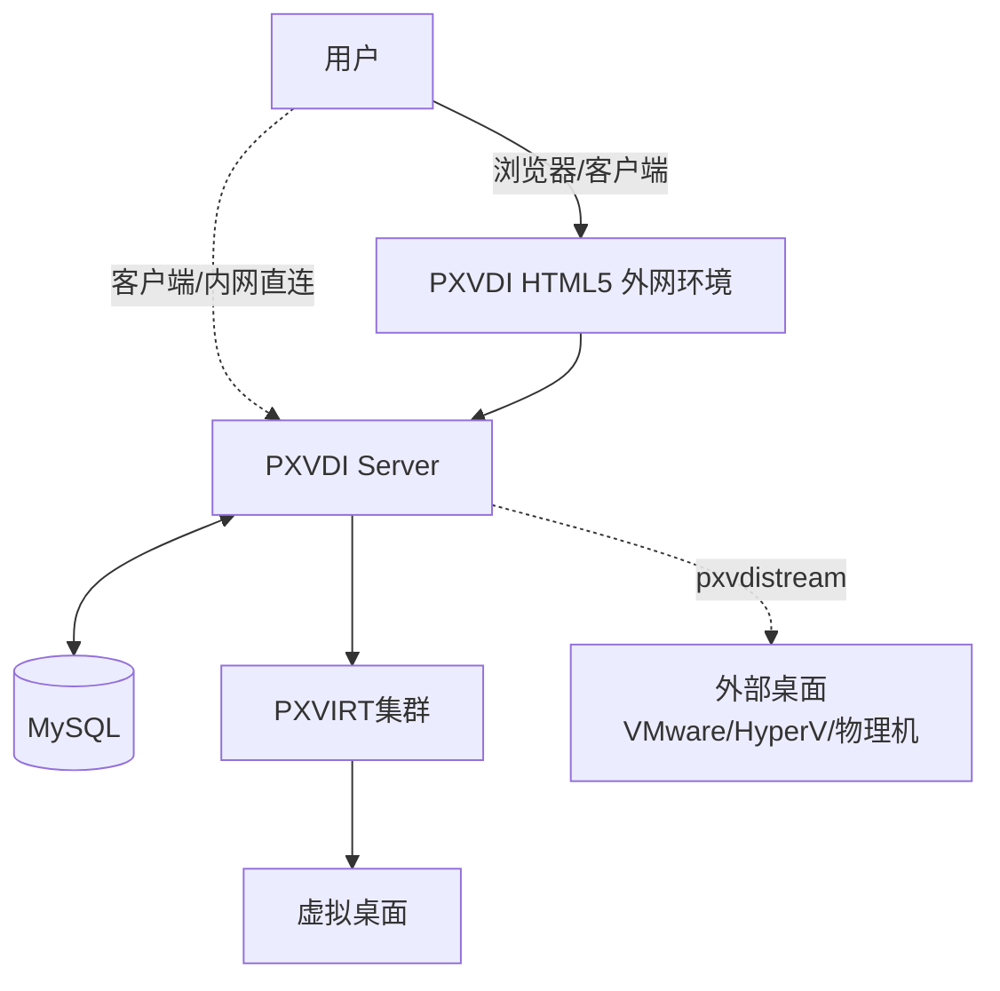
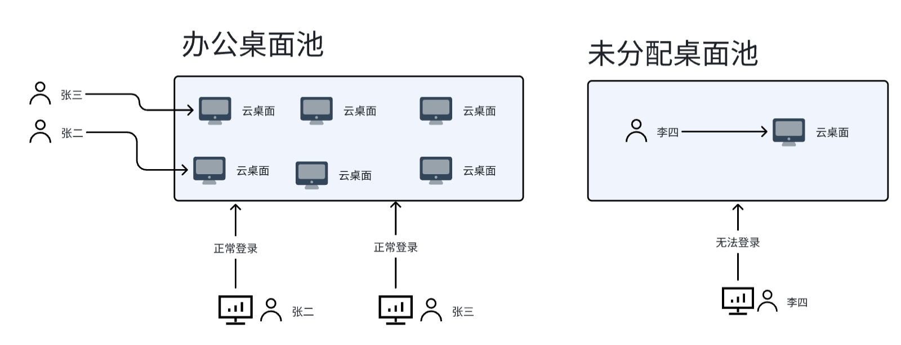

## 总控模式

总控模式是相对于我们最开始的直连模式，我们引入了一个管理服务（pxvdiserver）作为用户认证、权限管理、资源管理的角色，

用户的认证，虚拟机资源有哪些，外部资源有哪些，甚至对瘦客户端和VM内部的系统管理都是pxvdiserver的功能。

他是整个PXVDI方案的核心部件。

## 架构概览

下图是总控模式的基本架构图！

| 组件 | 说明 | 类比 VMware |
|------|------|-------------|
| **PXVIRT** | 虚拟化底层，运行所有虚拟机 | vSphere |
| **PXVDI Server** | VDI管理服务端，管理桌面池和用户 | Horizon Connection Server |
| **PXVDI HTML5** | HTML5客户端/安全网关，可部署于DMZ | UAG / HTML Access |
| **PXVDI Stream** | 自研的连接协议，带有远程和集中控制的功能 | Horizon Connect agent |

## PXVDI 总控模式优势

| 类型 | pxvdi | TOP级产品|
|------|------|-------------|
| **用户认证** | 平台用户，ad用户,ldap | ad用户，ldap,openid |
| **架构** | 组件清晰明了，单二进制发行 |组件复杂，功能众多，维护难度大 |
| **性能** | 4k144串流 | 4k60串流 |
| **扩展性** | 支持管理外部VM或者物理机 | 仅平台VM |
| **终端支持** | 桌面、浏览器、移动端 | 桌面、浏览器、移动端  |
| **瘦客户端支持** | 开放瘦终端软件，arm64/amd64/riscv64/loongarch64 | arm64或者amd64 商业硬件 |
| **系统管理** | 自带对agent或者瘦客户端系统管理 | 需要额外的组件或者软件 |
| **价格** | 一次性买断，永久有效 | 按年收费、按功能收费 |

## 桌面池架构

PXVDI Server 作为一个中间件，协调用户和桌面的关系。

我们通过桌面池来定义一个用户、桌面和客户端三方的关系。

只有将桌面加入了桌面池，绑定该桌面的用户才能连接到虚拟机，否则将无法获取到资源。

同时管理员可以针对桌面池为单位设置一些资源配置，连接策略
