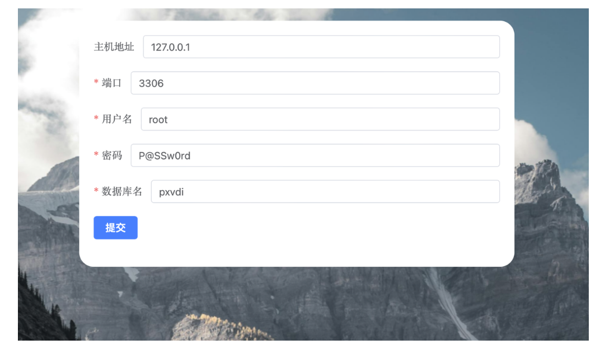
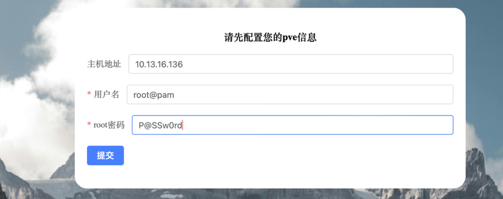

# 安装服务端程序

## 一、准备PXVIRT集群

PXVIRT是我们基于Proxmox VE二次开发的程序。PXVDI基于PXVIRT，因此如果要使用PXVDI总控模式，必须安装PXVIRT。

安装PXVIRT请参考PXVIRT文档！

## 二、准备虚拟机或者物理机

服务端需要使用debian12系统。

## 三、安装数据库

仅只是mysql数据库，在debian 12上，执行命令
```
apt update
apt install default-mysql-server -y
```
修改数据的账号密码。
```
mysql -uroot -p #此时再回车一下
ALTER USER 'root'@'localhost' IDENTIFIED BY '新密码';
```

## 四、安装主程序
```
wget  https://download.lierfang.com/pxvdi/MIDServer/server/pxvdiserver_latest_amd64.deb

```

上面命令会自动下载最新的服务端版本，如果要安装其他版本，或者服务器不允许连接外网，请前往以下地址下载

https://download.lierfang.com/pxvdi/MIDServer/server/

使用`dpkg`安装软件包
```
dpkg -i pxvdiserver_latest_amd64.deb
systemctl enable pxvdiserver #开机启动
systemctl start pxvdiserver  #启动程序
```

## 五、初始化服务端

使用chrome浏览器，访问服务器ip地址:3002端口，假如安装pxvdiserver的服务器地址为10.13.16.222，那么请用浏览器访问https://10.13.16.222:3002


在初次的页面，填入数据库信息。



数据库连接成功之后，程序会自动重启，可能会有1-2分钟左右，请耐心等待。

服务器重启之后，会提示配置pxvirt信息，请输入任意pxvirt节点的ip地址。端口默认为8006端口。



配置完成之后，可以进入登录页面


默认账号为admin，默认密码为P@SSw0rd