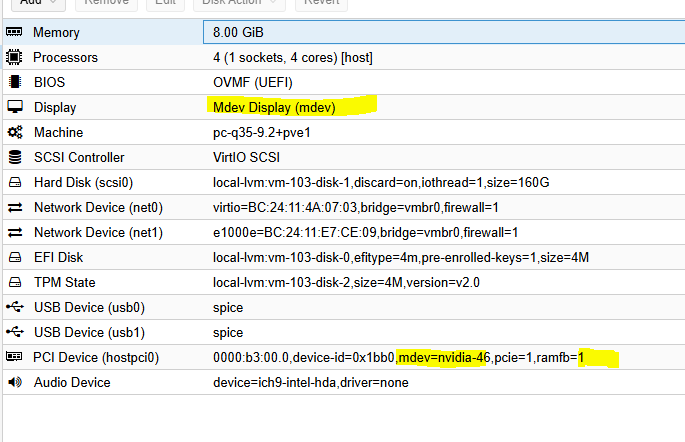

# GPU 桌面

Pxvdi 因为兼容多种协议，可以支持不同的vGPU类型！下面是兼容列表，不包含SPICE协议！

|架构 |系统|vgpu类型|说明|
|-|-|-|-|
|x86_64|Windows|Nvidia vGPU| 全兼容|
|x86_64|Windows|Intel Sriov|horizon\RDP兼容（moonlight和pxvdistream须有虚拟显示器）|
|x86_64|Windows|Amd vGPU|全兼容|
|x86_64|Windows|摩尔线程|全兼容|
|x86_64|Windows|物理机GPU|全兼容|
|x86_64|Linux|Nvidia vGPU|moonlight和pxvdistream|
|x86_64|Linux|Intel Sriov|pxvdistream|
|x86_64|Linux|Amd vGPU|moonlight和pxvdistream|
|x86_64|Linux|摩尔线程|moonlight和pxvdistream|
|x86_64|Linux|物理GPU|moonlight和pxvdistream|
|aarch64|Linux|摩尔线程|moonlight和pxvdistream|
|aarch64|Linux|物理GPU|moonlight和pxvdistream|

## 支持的GPU 列表

|平台 |型号|说明|
|-|-|-|
|Nvidia vGPU|NVIDIA L40S| 全兼容|
|Nvidia vGPU|NVIDIA L40| 全兼容|
|Nvidia vGPU|NVIDIA L4| 全兼容|
|Nvidia vGPU|NVIDIA L2| 全兼容|
|Nvidia vGPU|NVIDIA RTX 6000 Ada| 全兼容|
|Nvidia vGPU|NVIDIA RTX 5000 Ada| 全兼容|
|Nvidia vGPU|NVIDIA A40| 全兼容|
|Nvidia vGPU|NVIDIA A16| 全兼容|
|Nvidia vGPU|NVIDIA A10| 全兼容|
|Nvidia vGPU|NVIDIA RTX A6000| 全兼容|
|Nvidia vGPU|NVIDIA RTX A5500| 全兼容|
|Nvidia vGPU|NVIDIA RTX A5000| 全兼容|
|Nvidia vGPU|Tesla T4| 全兼容|
|Nvidia vGPU|Quadro RTX 6000| 全兼容|
|Nvidia vGPU|Quadro RTX 6000 passive| 全兼容|
|Nvidia vGPU|Quadro RTX 8000| 全兼容|
|Nvidia vGPU|Quadro RTX 8000 passive| 全兼容|
|Nvidia vGPU|Tesla V100 SXM2| 全兼容|
|Nvidia vGPU|Tesla V100 SXM2 32GB| 全兼容|
|Nvidia vGPU|Tesla V100 PCIe| 全兼容|
|Nvidia vGPU|Tesla V100 PCIe 32GB| 全兼容|
|Nvidia vGPU|Tesla V100S PCIe 32GB| 全兼容|
|Nvidia vGPU|Tesla V100 FHHL| 全兼容|
|Nvidia vGPU|Tesla P4| 全兼容|
|Nvidia vGPU|Tesla P6| 全兼容|
|Nvidia vGPU|Tesla P40| 全兼容|
|Nvidia vGPU|Tesla P100 PCIe 16 GB| 全兼容|
|Nvidia vGPU|Tesla P100 SXM2 16 GB| 全兼容|
|Nvidia vGPU|Tesla P100 PCIe 12GB| 全兼容|
|Nvidia vGPU|Tesla P100 PCIe 12GB| 全兼容|
|Nvidia vGPU|Tesla M6| 全兼容|
|Nvidia vGPU|Tesla M10| 全兼容|
|Nvidia vGPU|Tesla M60| 全兼容|
|Nvidia vGPU|GTX 2080ti| unlock|
|Nvidia vGPU|GTX 2070| unlock|
|Nvidia vGPU|GTX 2060| unlock|
|Nvidia vGPU|GTX 1080| unlock|
|Nvidia vGPU|GTX 1070| unlock|
|Nvidia vGPU|GTX 1060| unlock|
|Nvidia vGPU|GTX 1050| unlock|
|Nvidia vGPU|Tesla T10| unlock|
|Intel Sriov|B50 | 兼容|
|Intel Sriov|12/13/14/15代核显| 兼容|
|摩尔线程|MTT S3000| 全兼容|

## 虚拟机配置

|类型 |配置|说明|
|-|-|-|
|办公 |4H 8G|多媒体、ppt、网页特效|
|编程 |8H 8G|前端设计|
|画图视频设计 |8H 16G |1080p视频剪辑|

PXVIRT 支持mdev直接显示，目前仅nvidia-vgpu支持该功能

此功能是将vGPU的显示画面直接暴露到VNC且只有一个显示器，就像普通PC插了张独显一样！

其他vGPU 需要安装好驱动之后，将vGPU的显示器设为唯一显示器才可行！

否则将会导致捕获延迟，造成卡顿！使用nvidia-vGPU,pxvdistream可以做到编码+解码一共低于10ms！在局域网内，体验和本机相似！

