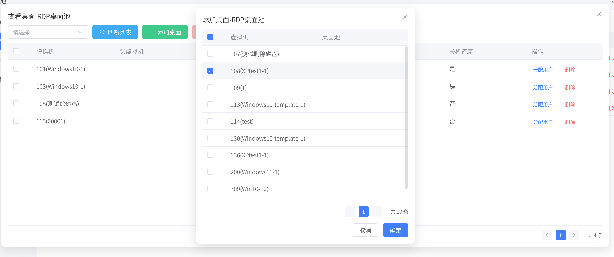
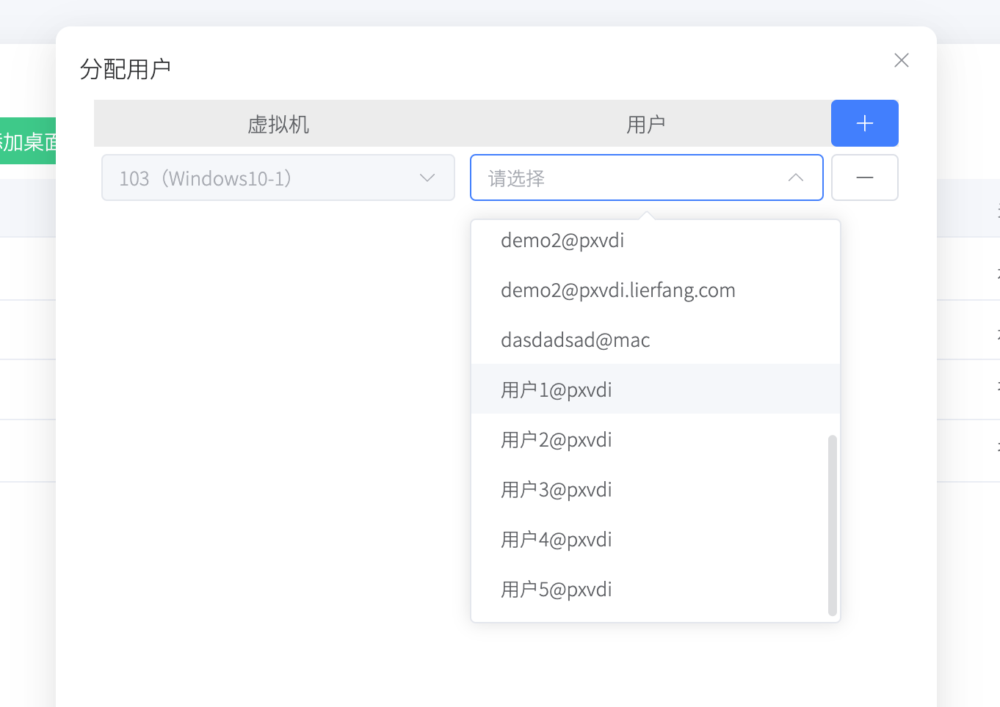
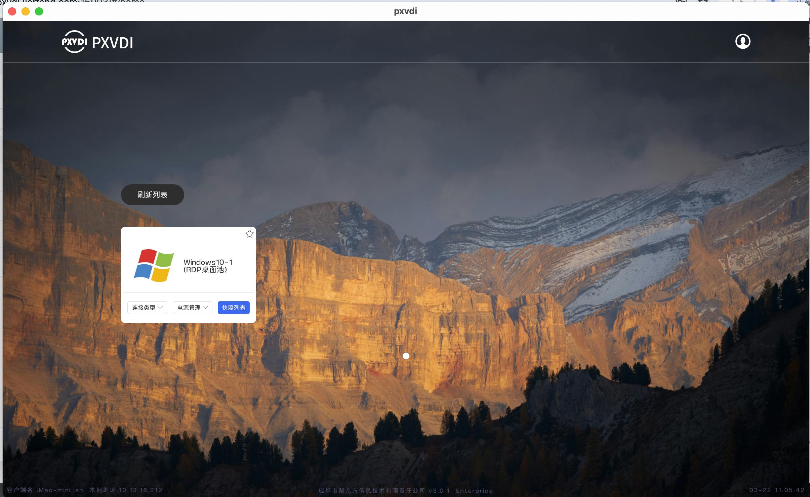

# 日常桌面

这里我们使用RDP协议 作为连接协议。

Windows的默认账号为admin，密码为P@SSw0rd。

用户可以更改自己的密码，但不能更改账户名。

创建10个桌面。

## 1. 准备虚拟机

请参考[虚拟机管理](../vm/createvm.md)，创建对应的VM，并且开启对应的功能。在未加域的情况下，请关闭[`NLA`](https://cloud.tencent.com/developer/article/2337085)认证。

随后对虚拟机进行克隆10个。

## 2. 创建桌面池

点击`桌面池`-`桌面池管理`-`添加桌面池`。

- 基本信息
    - 桌面池名称 `随意输入`
    - 桌面池类型 `普通桌面池`
- 网关策略
    - 是否使用网关 `否`
- 资源策略
    - 根据需求开放
- 连接策略
    - 连接类型 `all`
    - spice代理: `任意pxvirt的ip+3128，`
        ::: tip
        例如`10.13.14.1:3128`
        :::
    - RDP连接端口 `默认`
    - 连接参数 `默认`
- 账号策略
    - 系统账号使用规则 `只使用用户名` 
        ::: tip
        `只使用用户名`这个规则，PXVDI会将用户名传递给虚拟机，随后用户输入自己的账号即可进入到虚拟机桌面。
        :::
保存即可。

## 3. 创建用户

参考[创建用户](../user/adduser.md)

## 4. 将虚拟机添加到桌面池

可以在`虚拟机管理`和`查看桌面池`中添加虚拟机

## 5. 分配用户

可以在`虚拟机管理`和`查看桌面池`中分配用户

## 6. 客户端登录

在客户端中配置服务端地址，然后使用步骤5分配的用户，登录即可访问到桌面

