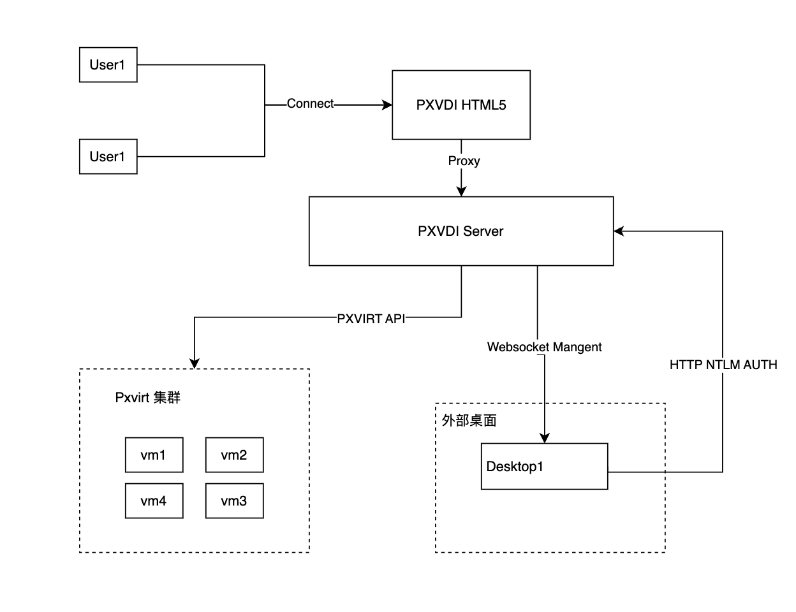
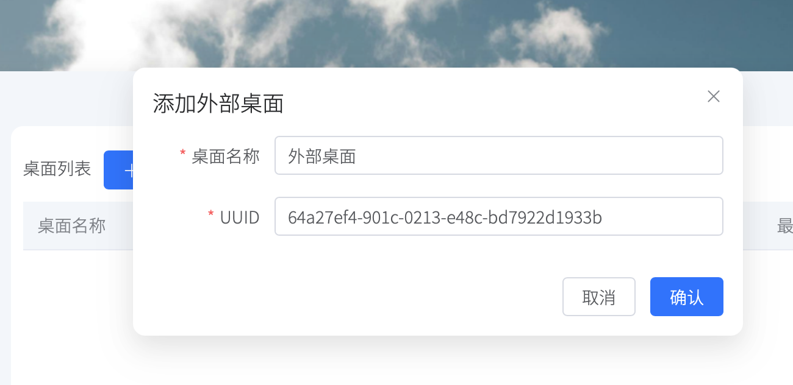
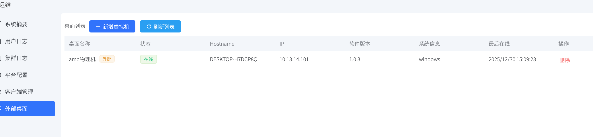
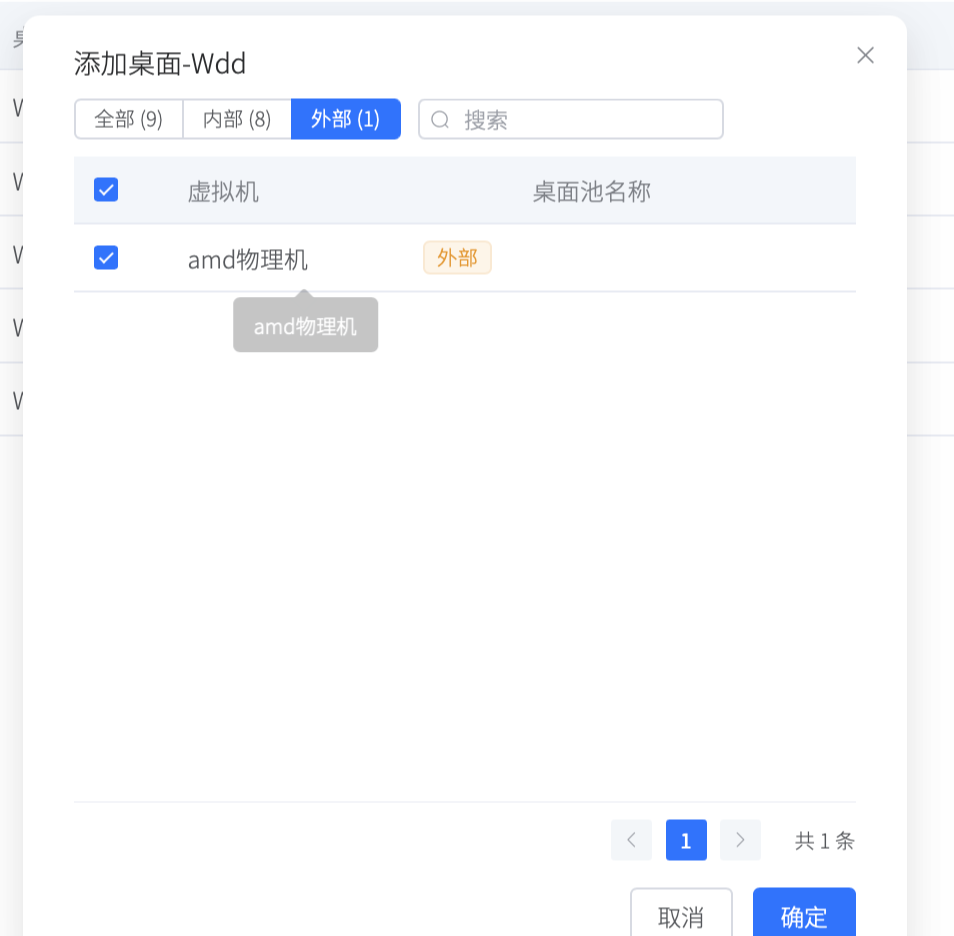

# 外部桌面管理

PXVDI 服务端添加局域网的桌面，支持VMware\HyperV\KVM\物理机等等其他非管理类型桌面！此类桌面必须和PXVDI 服务端处于同一局域网，或者和客户端能够联通

`PXVDI Server` 和 外部桌面通过`pxvdistream` websocket通信！`pxvdistream`处理用户的会话以及认证。

基于本架构，如果为局域网模式

只需要 外部桌面可以和`PXVDI Server`通信即可！用户需要和外部桌面位于同一个局域网。

例如`PXVDI Server` 在一个公网，外部桌面是局域网A的一台机器，那么局域网A的用户可以直接连接到外部桌面。

如果需要外网访问，需要 `PXVDI Server`直接和外部桌面通信。

例如`PXVDI Server` 在一个局域网A，外部桌面必须是局域网A的一台机器，那么不管是外网还是内网，用户都可以连接到外部桌面。

如果RDP 协议！可以单独配置网关即可，也可以实现外部链接。

注意！外部桌面不支持电源管理、快照管理、usb重定向等操作

## 部署

1. 外部桌面需要`PXVDI Server` 版本达到`1.0.7`

2. 按照我们 [部署pxvdistream](./vm/pxvdistreamvm.md)

3. 创建一个随机的UUID,写到pxvdistream的配置文件当中，例如`uuid=64a27ef4-901c-0213-e48c-bd7922d1933b`

4. 前往`运维`->`外部桌面管理`->`添加虚拟机`

输入自定义的桌面名称 和 UUID

如果外部桌面在线的话！这里可以列出来，并且在桌面池内添加外部桌面即可！

