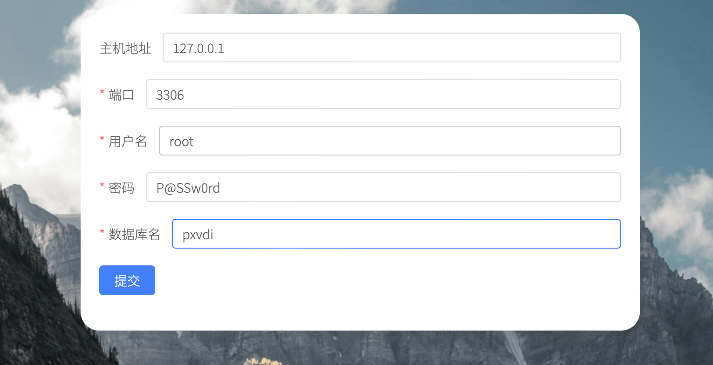
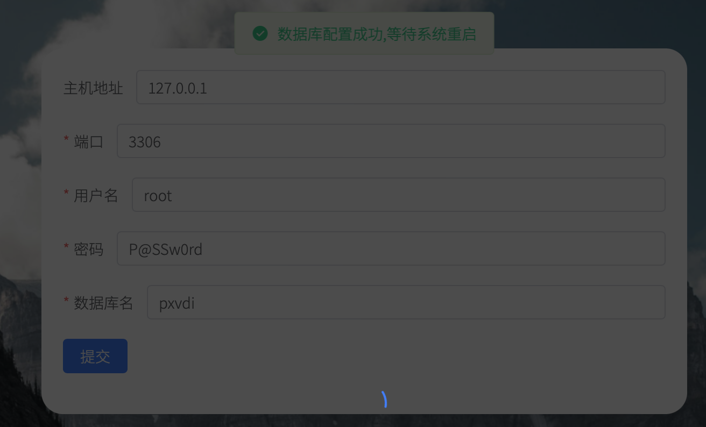
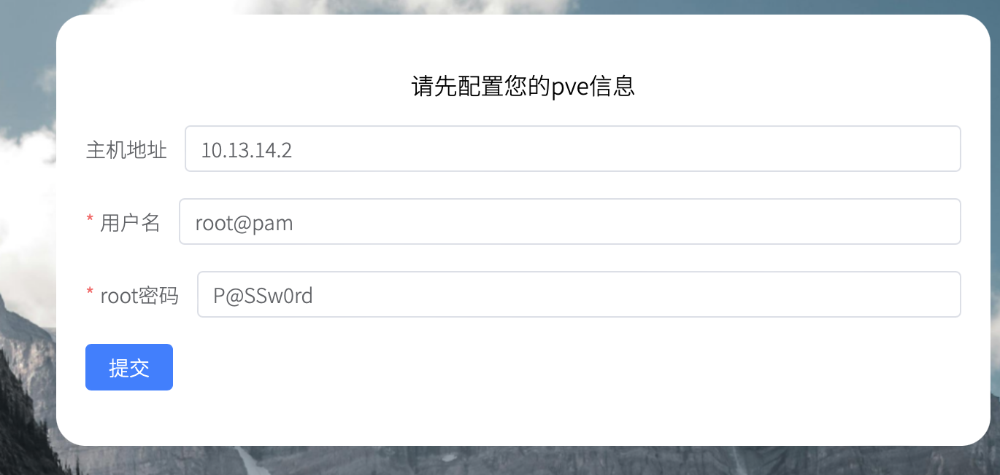

# PXVDI 安装
## 配置PXVIRT主机

PXVIRT是梨儿方对Proxmox VE开发的虚拟化底层。PXVIRT是PXVDI的基础。

请先安装PXVIRT。参考文档https://docs.pxvirt.lierfang.com

在安装好后，请创建一个集群。

## 设计PXVDI服务端的安装位置。

<font color=red  size=5> PXVDI可以安装到虚拟机或者硬件服务器。

如果您要购买授权，最好将PXVDI安装到虚拟机内。这样虚拟机迁移，也不会影响授权。

如果安装到硬件服务器上，要请确保服务器的文件系统不出现问题。如果磁盘损坏，那么授权将丢失。
</font>

## 安装数据库

仅只是mysql数据库，在debian 12上，执行命令

```
apt update
apt install default-mysql-server -y
```

修改数据的账号密码。

```
mysql -uroot -p #此时再回车一下
ALTER USER 'root'@'localhost' IDENTIFIED BY '新密码';
```

>如果您的数据库和PXVDI服务端不是在同一服务器上，请开启远程访问权限。
>
>如果您的数据库不用root访问，请确保用户具有数据库的所有权限。


## 安装主程序

我们仅支持debian系安装PXVDI服务端登录

服务端程序下载地址为：

https://download.lierfang.com/pxvdi/MIDServer/server/

请上传到服务器中

```
dpkg -i pxvdiserver.deb #安装服务端
systemctl enable pxvdiserver #开机启动
```

## 配置

服务端安装成功之后，会监听本地3002端口，请从浏览器打开主机的https://xxx:3002端口，初次使用会配置数据库。

第一步需要初始化数据库。



主机地址为数据库地址，端口为数据库端口，用户名和密码为数据的账号密码。数据库名需要指定一个。不需要新建

因为这里数据库和pxvdi服务端在同一个服务器，所以地址为127.0.0.1

`如果数据库配置成功，程序会自动重启，请耐心等待`。



服务器重启之后，需要配置Pxvirt的地址，必须使用root@pam账号。主机地址为pve的ip，不填端口



配置成功之后即可进入系统的登录页面,默认的账号为`admin`，密码为`P@SSw0rd`


## 更新

PXVDI 服务端支持2种更新方式。

1. 从web上直接更新（免费版没有此功能）。
    
2. 在系统内更新。

### 在web后台更新

点击`运维`——`平台配置`

点击上传deb包，随后确认更新即可。更新之后需要重启一下平台才能生效。

### 在系统内更新。

如果配置了软件源
```
apt update
apt upgrade pxvdiserver
```

如果没有配置软件源，下载deb包到系统内

```
dpkg -i pxvdiserver_1.0.2_amd64.deb
systemctl restart pxvdiserver
```
