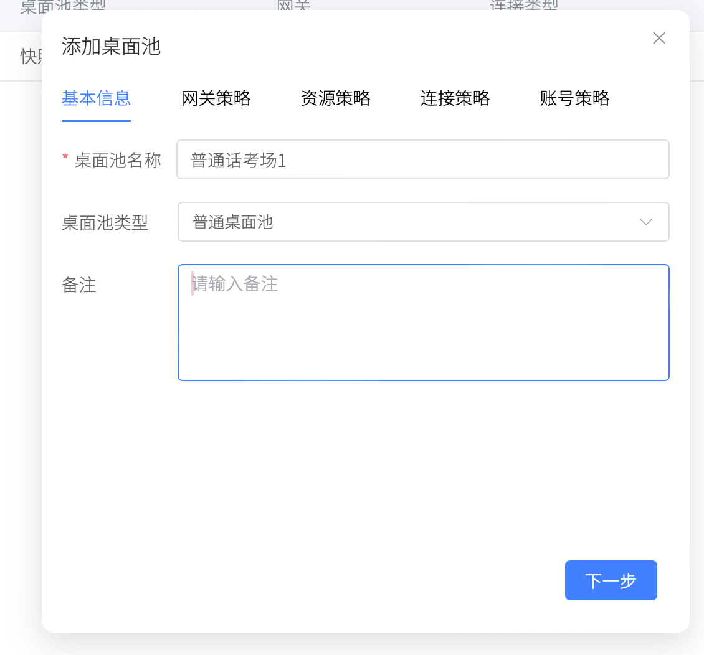
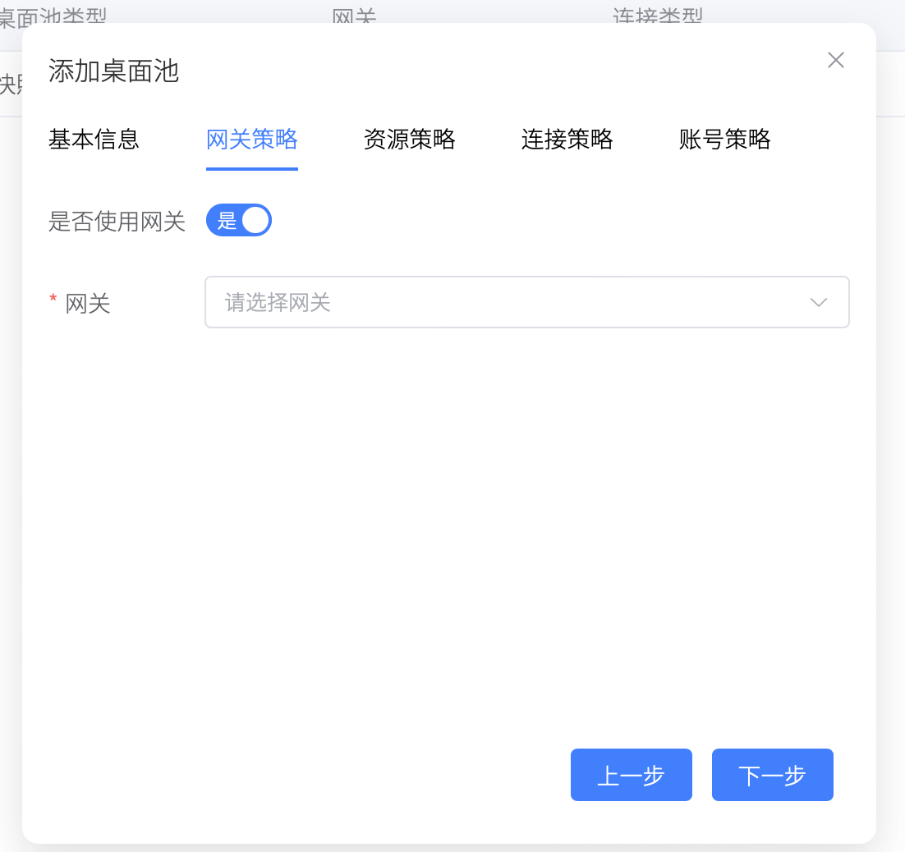
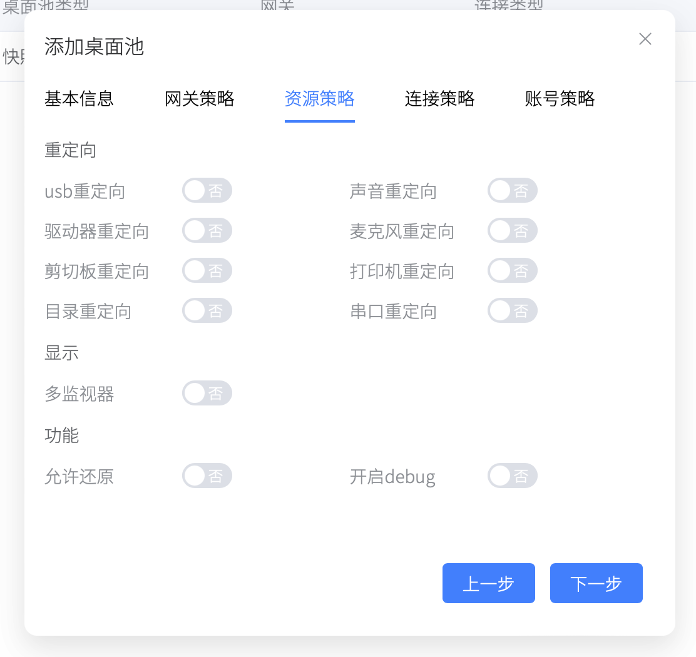
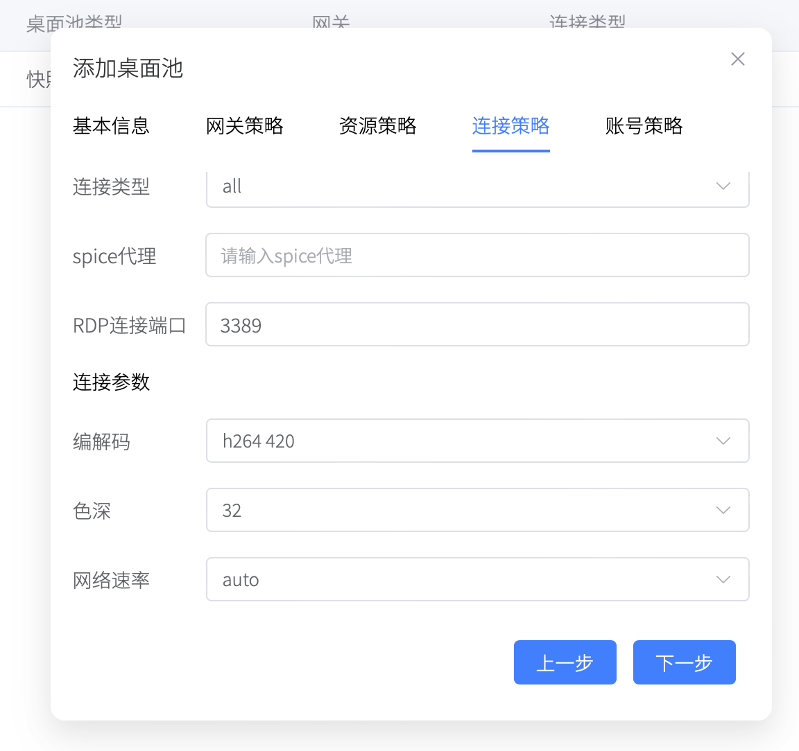
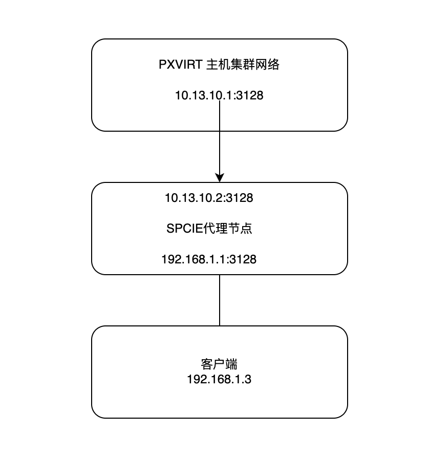
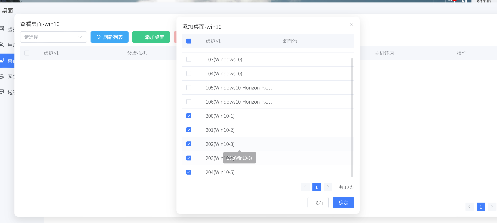
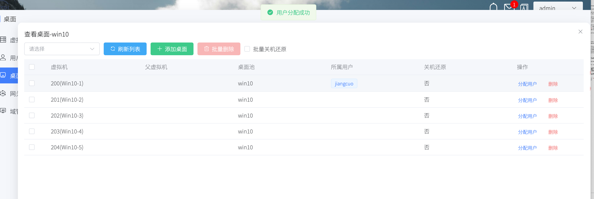

# 桌面池管理

桌面池是虚拟机的集合。一个虚拟机只能对应一个桌面池。

一个用户可以拥有多个桌面池或者多个虚拟机。

只有在桌面池的虚拟机，才能够被连接。

假设为用户`张三`分配了虚拟机`100`，`张三`登录PXVDI将不会显示虚拟机。假设把虚拟机`100`关联到了桌面池B，那么`张三`登录PXVDI将显示虚拟机。

# 桌面池类型

桌面池具有2种类型。
- 普通桌面池。
- 快照桌面池。

这部分将在下级目录详细解释。

# 添加桌面池

点击添加桌面池，即可进入桌面池添加流程。

## 基本信息

这部分主要是设置桌面池的类型和名称。 类型一旦被设置，将无法被更改。

## 网关策略

这里可以配置rdp网关，配置以后，客户端在连接的时候，会通过网关来连接到虚拟机。

这个功能适用于网络隔离的环境中，例如从外网访问内网桌面，从一个内网访问另外一个隔离内网的桌面。

详情请参考 [网关](./gw.md)

## 资源管理

这里控制着客户端所能使用的资源。某些功能只在rdp场景下有效。

>注意 当开启了`允许还原`时。
>
>用户可以访问虚拟机的快照。并且进行还原。

## 连接策略

连接类型 有以下几种

- all
- spice
- freerdp2
- freerdp3
- pcoip (vmware pcoip)
- blast (vmare blast)
- moonlight

选择all时，客户端可以选择任意协议进行连接，默认的连接策略，由本地客户端配置进行控制。

如果没有选择all，客户端只允许一种协议进行连接，客户端的配置将无效。

>特殊处理
>
>在Macos下，不管选择的freerdp2还是freerdp3，客户端均使用freerdp3。
>
>在Windows下，使用freerdp3将激活Windows内置的msrdp控件（性能会更好），使用freerdp2则使用freerdp控件（具有剪切板限制）。
>

### spice代理

当选择spice或者all时，必须需要配置一个spice代理。

ProxmoxVE具有原生的spice代理，位于集群中任意一个节点的`3128/tcp`端口。

如果是在内网，那么spcie代理可以设置为Pxvirt（pve）主机的`ip:3128`,如`10.13.14.2:3128`

如果是在网络隔离情况下，如果将spcie代理的3128暴露出来，实现访问。

### RDP连接端口

这里可以设置rdp端口，出于安全需求，管理员会修改默认的rdp端口，但PXVDI默认使用3389端口，通过这个设置，可以修改PXVDI连接到桌面的端口。

### 编解码

这里可以设置rdp的编解码参数，这些参数对Windows版本无效。

## 账号策略

这里控制着连接到虚拟机所用的账号密码信息。不适用于SPICE协议。

|策略|说明|举例|
|-|-|-|
|均不使用|不使用策略|连接到虚拟机时，将使用登录PXVDI的账号密码应用于虚拟机|
|只使用用户名|只将用户名传递给虚拟机|连接时，将用户名传递给虚拟机，用户需要手动输入账号密码|
|均使用|将保存的账号密码传递给虚拟机|例如虚拟机的账号密码为admin/admin，那么将这个值设置成admin/admin，那么即可直接登录到虚拟机|
|ad账号密码|用户账号为ad用户，且虚拟机加入了ad域|用户是域用户，虚拟机也是域虚拟机，直接通过用户账号即可登录|

如果是Linux或者macos使用rdp连接，虚拟机必须关闭NLA认证，（参考[虚拟机开启RDP功能](vm/rdpvm.md)）才能在账号密码不对的情况下访问。不然无法连接到虚拟机。

# 查看桌面池

桌面池创建完成之后，通过`查看桌面池`进行添加桌面，分配用户。

点击`添加桌面`即可批量添加

添加好了，可以点击`分配用户`，完成用户和虚拟机绑定。

之后用户登录到客户端，即可查看到虚拟机。

## 关机还原功能

PXVIRT引入了关机还原功能，为虚拟机配置`关机还原`，可以让虚拟机还原到开机之前的数据状态。

参考 https://docs.pxvirt.lierfang.com/zh/cli/qm.html#snapshot

