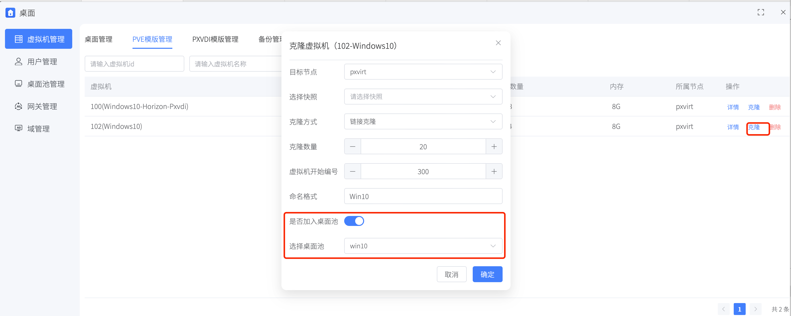

# 普通桌面池

普通桌面池是相对于快照桌面池来说的，他是普通虚拟机的集合。集群中任意VM都可以被添加到这个桌面池。

## 通过克隆添加VM到普通桌面池

可以在`虚拟机管理`—>`PVE模板管理`中进行批量克隆。在克隆的时候，可以批量加入到`普通桌面池`

## 普通桌面池模板要求

普通桌面池模板是PVE原生的模板。

需要磁盘支持链接克隆，支持ZFS/Lvm-thin/ceph-rbd/dir(qcow2)存储。

>注意：tpm只能在ZFS/Lvm-thin/ceph-rbd存储底层中被快照。如果不是用的这些存储，建议为模板删除tpm设备,否则会影响虚拟机的快照功能。

