# 创建域

目前PXVDI仅为微软AD域开发，或许兼容LDAP域，需要用户自己测试。

## 准备虚拟机

创建一个 Windows Server 2012 r2以上版本的Windows Server虚拟机。

设置服务器的主机名、静态ip，并且安装好域角色、dns角色、证书颁发机构

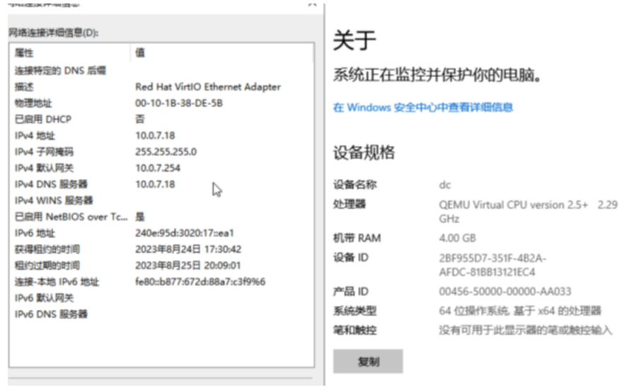

接着打开服务器管理

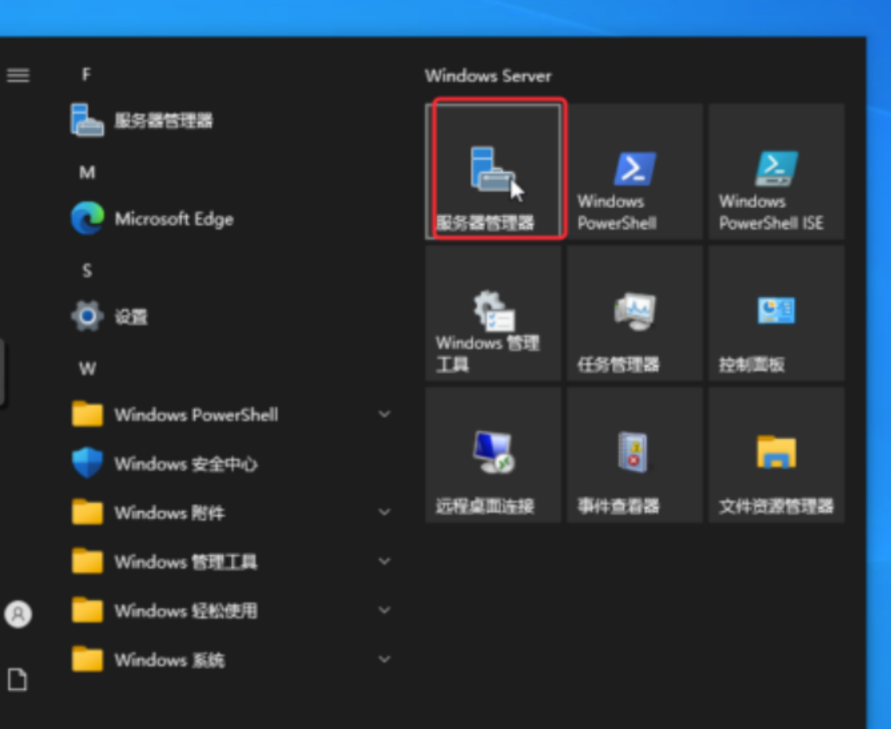

选择管理，添加功能

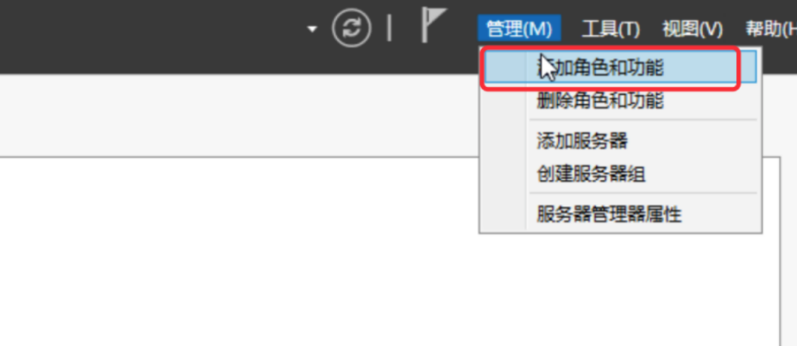

选择基于角色或基于功能的安装

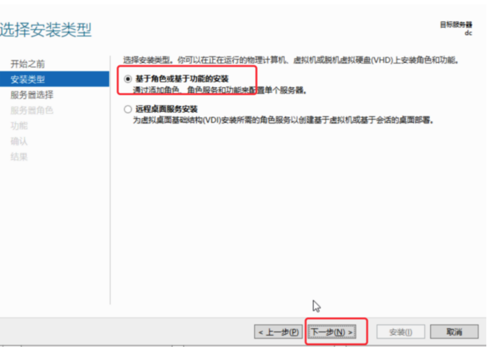

选择当前的服务器

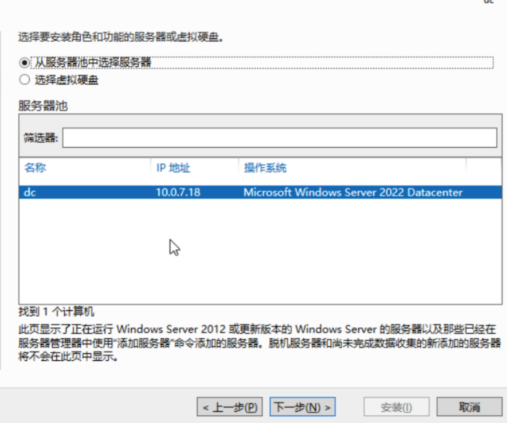

勾选Active Directory 域服务和DNS服务器

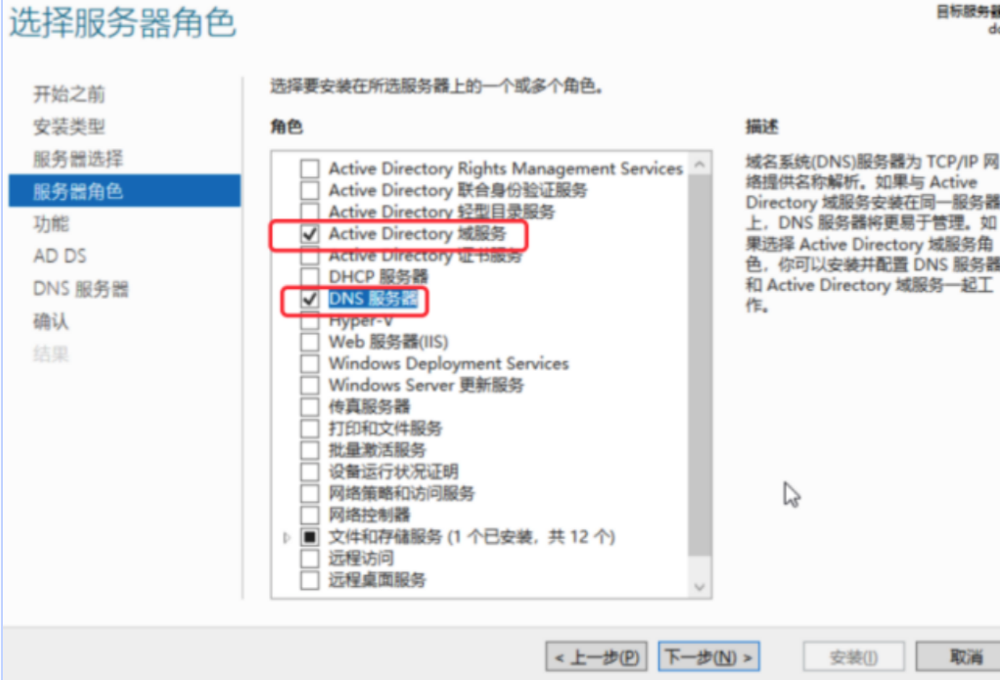

随后一直下一步进行安装

在域功能安装成功之后，在窗口中点击 `将此服务器提升为域控制器`

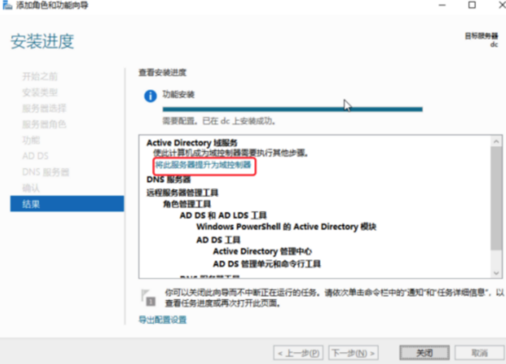

选择`添加新林`，在根域名处输入规划好的`pxvdi.com`。然后点击下一步。

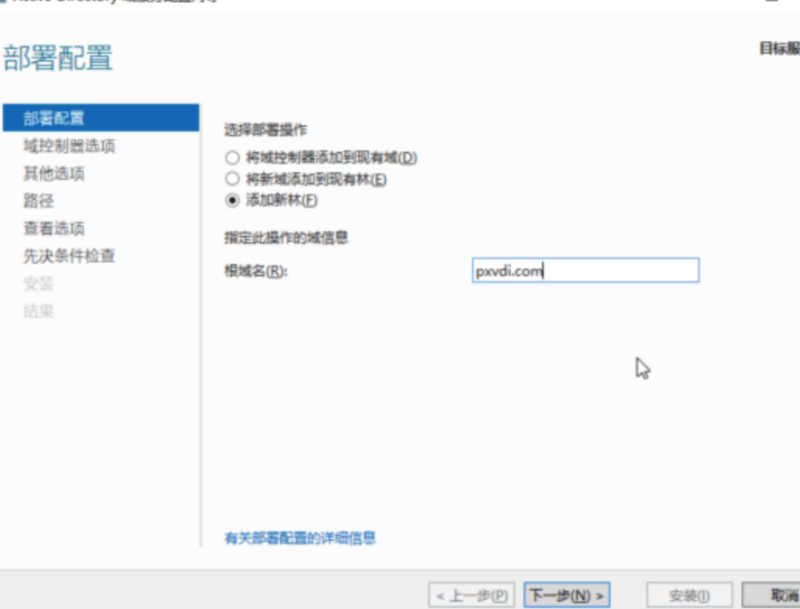

输入 DSRM的密码

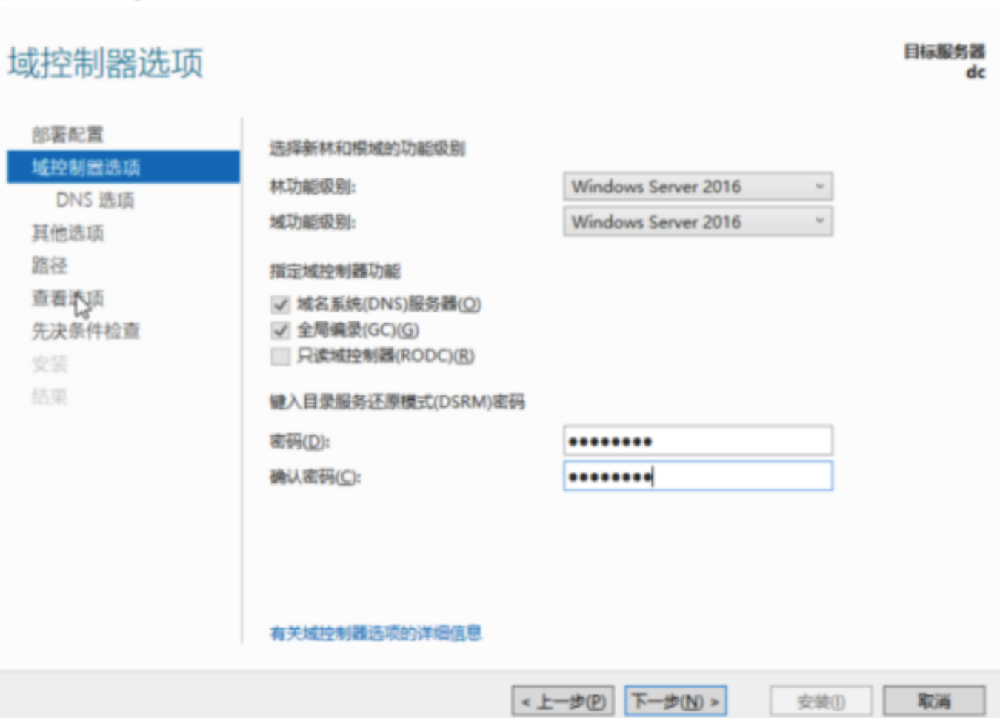

一直下一步，直到他验证先决条件。

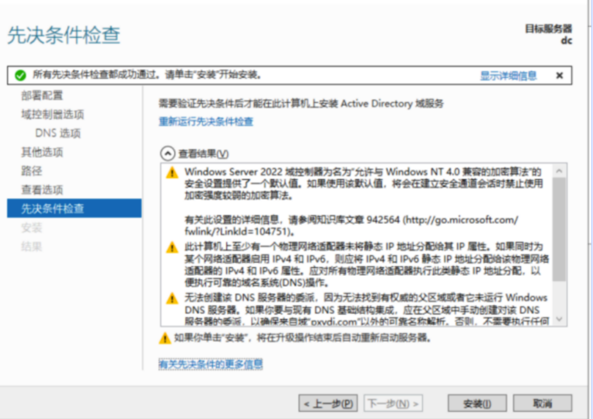

如果没有问题，就可以点击安装。安装完成会要求重启，随后才能配置好ad域。请等待安装完成。

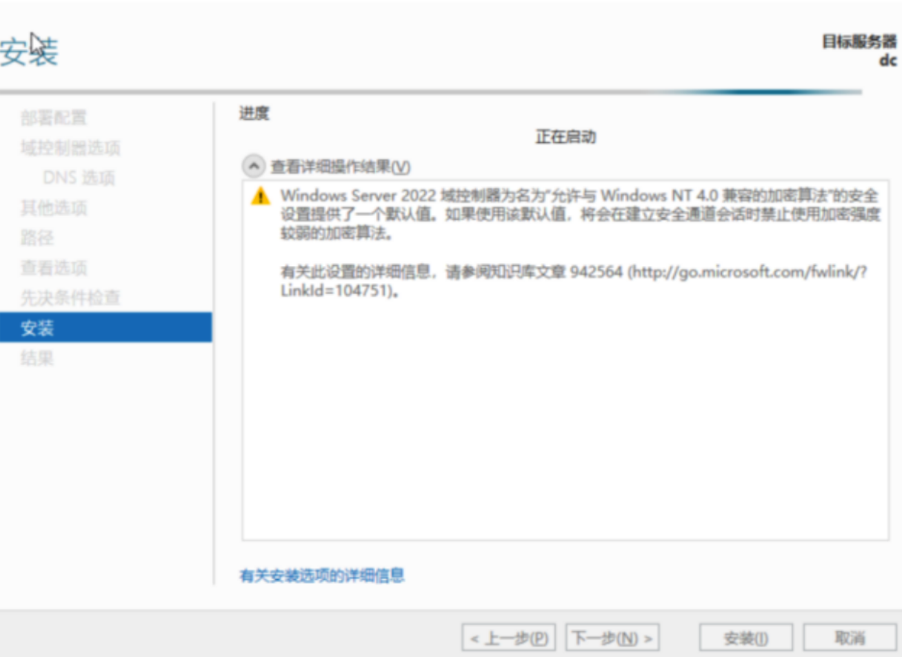

不出意外，出现登录画面，就安装结束了

## 使用ldaps

参考

https://support.huaweicloud.com/workspace_faq/workspace_07_0100.html

