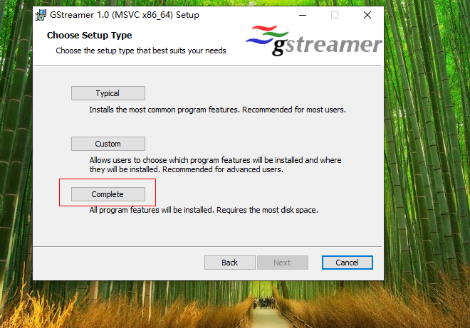
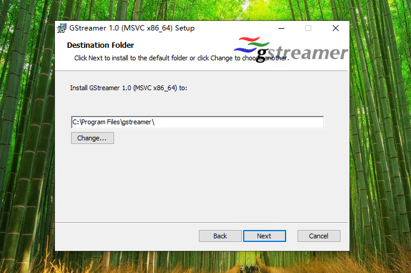
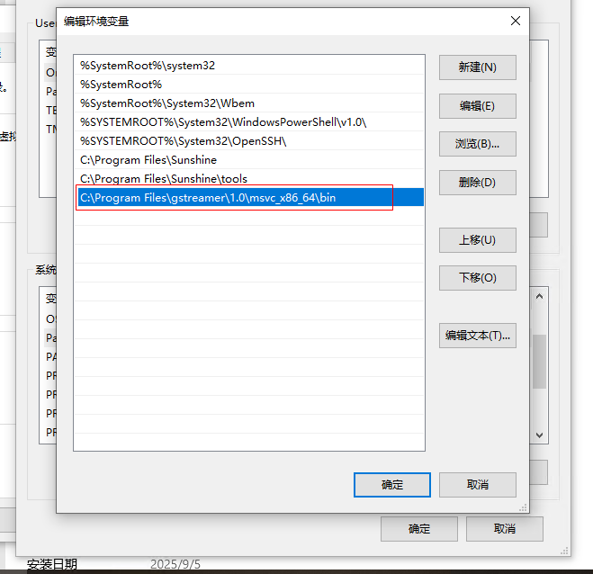
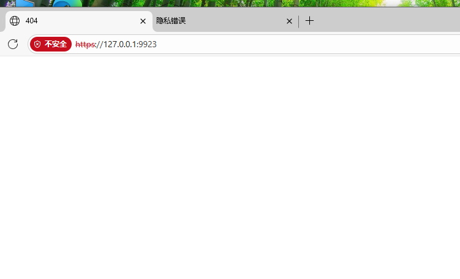
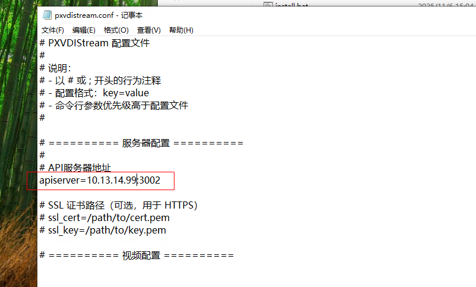

# PXVDIStream 操作说明

PXVDIStream 是我们自研的一个串流工具，可以完整的发挥CPU和GPU性能，在多媒体场景中，可以获得更好的体验，例如视频，ppt放映。剪映，直播等。还可以进行云游戏，如饥荒等单机游戏。即便虚拟机不带GPU，我们也可以实现60fps 低延迟高性能远程。

相比其他的远程工具，我们深度将PXVDIStream 和PXVDI 结合起来，远程权限全部由PXVDI 管理平台管理。

同时PXVDIStream 和我们的新版本客户端v4.0 完美结合，实现了PC\手机\平板\WEB的共同兼容，我们同时还提供嵌入式的系统包，利用嵌入式的GPU进行硬件解码，在极低的配置中，我们也可以获得更好的性能体验！

PXVDIStream原生支持外网映射，通过部署我们的PXVDI HTML5组件 即可完成网页版访问和外网连接，更加的简单易用


## 产品架构

在Windows上我们使用dxgi进行屏幕捕获，
在Linux上，我们支持x11 和drm捕获，默认以root权限进行drm捕获。

最后通过gstreamer 进行编码使用硬件编码或者x264进行编码串流


## PXVDIStream 支持的系统

|系统|架构|最低系统版本|
|-|-|-|
|windows10| x86_64 | 1809 |
|windows11| arm64 | 24h2 |
|开源系统|
|Ubuntu| x86_64 |  20.04 |
|Ubuntu| arm64 |  20.04 |
|debian| x86_64 |  11 |
|debian| arm64 |  11 |
|debian| riscv64 |  13 |
|debian| loongarch64 |  13 |
|openeuler| x86_64 | 2203|
|openeuler| arm64 |  2203 |
|openeuler| loongarch64 |  2203 |
|Fedora|x86_64| 42|
|Fedora|arm64| 42|
|商业系统|
|UOS| x86_64 |  1070 |
|UOS| arm64 |  1070 |
|UOS| loongarch64 |  1070 |
|Kylin| x86_64 |  v10 |
|Kylin| arm64 |  v10 |
|Kylin| loongarch64 |  v10 |
|MacOS| arm64 | sonoma |

Linux 系统使用Appimage构建，基本兼容现代主流的linux，如果需要适配目标的linux或者bsd，请联系商务进行处理

## PXVDIStream 虚拟机GPU要求

|系统类型|GPU类型|状态|
|-|-|-|
|windows|virtio-gpu|支持|
|windows|nvidia-vgpu|支持|
|windows|intel-vgpu|不支持|
|windows|直通|不支持|
|linux|virtio-gpu|支持|
|linux|其他|不支持|

## PXVDIStream 各客户端硬件解码支持状态

某些平台不支持硬件解码，因此体验不是很好。这个问题会在以后完善硬件解码！

在不受支持的硬件解码平台上，建议使用web访问！

|系统类型|GPU类型|状态|
|-|-|-|
|windows|amd|不支持硬件解码|
|windows|nvidia|不支持硬件解码|
|windows|intel|支持|
|linux|any|不支持硬件解码|
|andriod|any|支持硬件解码|
|ios|any|支持硬件解码|
|macos|any|支持硬件解码|

## PXVDIStream 下载和安装

### 下载地址

https://mirrors.lierfang.com/pxcloud/pxvdi/PxvdiStream


## Windows 安装

### 先安装gstreamer

Windows 平台依赖gstreamer 环境

https://mirrors.lierfang.com/pxcloud/pxvdi/PxvdiStream/gstreamer-1.0-mingw-x86_64-1.26.8.msi



下载之后，点击安装，点击上图的complete 模式安装 



随后一直进行即可。

添加以下 gstreamer path到环境变量  

`C:\Program Files\gstreamer\1.0\mingw_x86_64\bin`




### 安装vc运行库

本软件需要vc运行时，可以前往 https://www.downza.cn/soft/186638.html 下载。注意点普通下载

### 安装PxvdiStream

https://mirrors.lierfang.com/pxcloud/pxvdi/PxvdiStream/

文件名为pxvdistream---版本号

随后直接双击即可，一直下一步即可


如果提示dll 找不到，请安装vc运行库和gstreamer。


此时打开浏览器 ，输入https://127.0.0.1:9923



这样出现404，就代表服务安装成功

### 配置pxvdiserver地址

进入以下路径

`C:\Program Files (x86)\lierfang\pxvdistream`

将 `pxvdistream.conf` 复制到桌面，然后编辑，



去掉apiserver前的`#`号。 后面改成pxvdiserver的地址

例如你的pxvdiserver地址为 https://192.168.1.250:3002 这样访问的，你就填

```
apiserver=192.168.1.250:3002
```

重启系统就完成了


## Linux 安装

###  Linux前置要求

Linux 分为2种捕获模式，一种为x11捕获，一种为drm捕获。

|捕获类型|性能|声音捕获|权限要求|登录画面|wayland支持|
|-|-|-|-|-|-|
|drm|高|无声音|root|支持|支持|
|x11|一般|声音|普通用户|不支持|不支持|

x11 是指使用xserver环境，一般的国产系统，如uos kylin还有debian基本用的都是xserver，比较现代的例如Ubuntu 25 和 fedora 等用的是wayland

如果桌面用的是waylan的，那么只能使用root权限运行 drm模式，也不支持声音捕获。

如果桌面用的是x11，那么既支持drm，又支持x11。


普通用户的x11，只能由普通用户发起进程，请勿用root发起进程。

由于x11 无法捕获登录窗口输入账号密码那个页面，所以需要设置自动登录到桌面

如果没有声音要求，建议使用 drm捕获，性能更好


下载地址

https://mirrors.lierfang.com/pxcloud/pxvdi/PxvdiStream/

请选择对应的架构下载

|架构 |常见cpu|
|-|-|
|x86_64| intel amd 海光 兆芯|
|aarch64| 飞腾 鲲鹏 |
|loongarch64| 龙芯|


软件包均为appimage格式，特殊的国产系统，我们深度适配包，请联系销售获取


这里以ubuntu 22 x86_64 架构  为例 

下载pxvdistream-{version}-common_x86_64.AppImage

添加可执行权限
```
chmod +x pxvdistream-1.0.0-common_x86_64.AppImage
```
复制到bin目录

```
mv pxvdistream-1.0.0-common_x86_64.AppImage /usr/bin/pxvdistream
```

### 以drm方式捕获

创建systemd服务
```
cat > /etc/systemd/system/pxvdistream.service  << EOF
[Unit]
Description=PXVDIStream Virtual Desktop Streaming
StartLimitIntervalSec=500
StartLimitBurst=5
After=network.target multi-user.target

[Service]
Type=simple
User=root
Group=root
ExecStart=/usr/bin/pxvdistream
Restart=on-failure
RestartSec=5s

StandardOutput=journal
StandardError=journal
SyslogIdentifier=pxvdistream


[Install]
WantedBy=multi-user.target

EOF
```

随后设置开机启动

```
systemctl daemon-reload
systemctl enable pxvdistream
systemctl start pxvdistream
```

修改配置文件指定api server 地址

配置文件在用户的主目录下，`~/.lierfang/pxvdistream.conf`

和Windows一致

```
apiserver=192.168.1.250:3002
```

修改之后，重启以下虚拟机，即可生效


### 以x11 用户模式捕获

注意，以下命令请在用户登录的图形环境中操作，不要在ssh中操作

创建systemd服务


```
sudo bash -c "cat > /etc/systemd/system/add-dmi-permission.service"  << EOF
[Unit]
Description=Set DMI file permissions
After=sysinit.target local-fs.target
Before=pxvdistream.service

[Service]
Type=oneshot
ExecStart=/bin/sh -c 'chmod 444 /sys/devices/virtual/dmi/id/* 2>/dev/null || true'
RemainAfterExit=yes

[Install]
WantedBy=multi-user.target

EOF
```
sudo systemctl daemon-reload
sudo systemctl enable add-dmi-permission.service

创建pxvdistream服务
```
sudo bash -c "cat > /etc/systemd/user/pxvdistream.service"  << EOF
[Unit]
Description=PXVDIStream Virtual Desktop Streaming
StartLimitIntervalSec=500
StartLimitBurst=5
After=graphical-session.target

[Service]
Type=simple
ExecStart=/usr/bin/pxvdistream
Restart=on-failure
RestartSec=5s

StandardOutput=journal
StandardError=journal
SyslogIdentifier=pxvdistream


[Install]
WantedBy=graphical-session.target

EOF
```

将当前用户添加到input组(把lucas替换成用户名)
sudo usermod -a -G input lucas

修改udev权限，使用户组能够使用uinput
```
echo 'KERNEL=="uinput", GROUP="input", MODE="0660", OPTIONS+="static_node=uinput"' | \
sudo tee /etc/udev/rules.d/85-pxvdistream-input.rules

systemctl --user enable pxvdistream
systemctl --user start pxvdistream
```

修改配置文件指定api server 地址 和 设置x11捕获

配置文件在用户的主目录下，`~/.lierfang/pxvdistream.conf`

和Windows一致

```
apiserver=192.168.1.250:3002
x11=true
```

修改之后，重启以下虚拟机，即可生效

