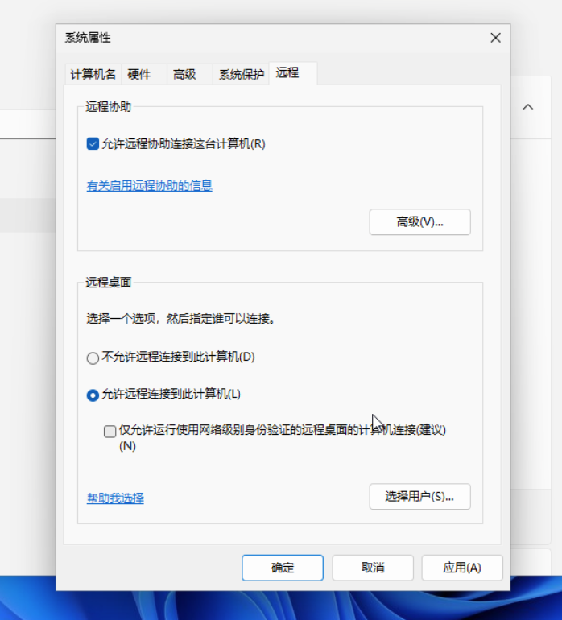
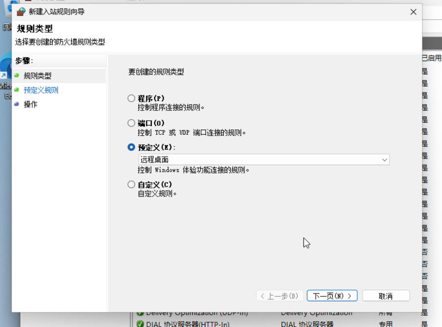
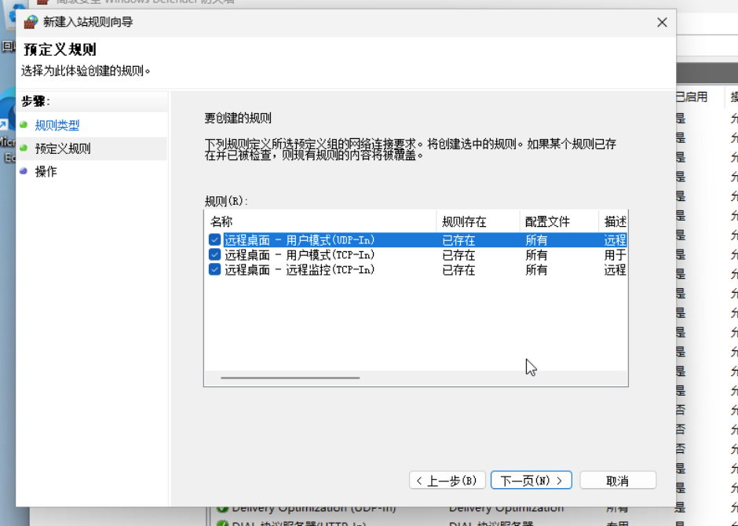

虚拟机开启RDP功能

## Windows 虚拟机

打开系统属性选项卡的 远程。

勾选允许连接到此计算机。



如果是用户使用域用户登录，请勾选`仅允许运行使用网络级别身份验证的远程桌面计算机连接（nla）`。

如果客户端只使用Windows或者Html5，请勾选`仅允许运行使用网络级别身份验证的远程桌面计算机连接`。

在防火墙中，新建入站规则



选择`预定义`，选择`远程桌面`.



接下来一直下一步即可。

## Linux 虚拟机

如debian-13 ，请直接运行命令

```bash
sudo apt update
sudo apt install xrdp qemu-guest-agent -y
sudo systemctl enable xrdp
sudo systemctl start xrdp
sudo systemctl enable qemu-guest-agent
sudo systemctl start qemu-guest-agent
```

安装好xrdp即可！

如果是Ubuntu系统，直接使用gnome的远程桌面功能即可，无需安装xrdp。


不建议使用gnome桌面！

