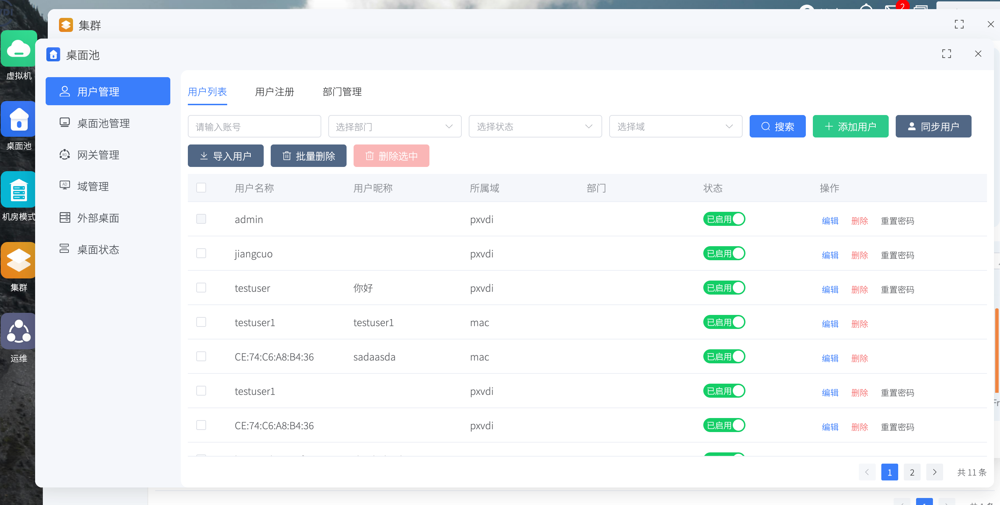

# 桌面池模块

桌面池模块用于把“用户、桌面、接入方式、策略”组织成最终可交付的桌面服务。虚拟机模块属于“管资源”，桌面池模块则负责“设策略”——允许谁连接、用什么策略连接。

## 桌面池架构

PXVDI Server 作为中间件，协调用户和桌面的关系。

我们通过桌面池来定义用户、桌面、客户端三方的关系。只有将桌面加入桌面池、并绑定到用户，该用户才能连接到虚拟机，否则无法获取到资源。

管理员还可以以桌面池为单位，统一设置资源配置和连接策略。

## 用户管理

负责准备用户账号、部门、导入、同步、注册审核等基础数据。

## 桌面池管理

负责定义交付策略，包括：

- 桌面池类型
- 网关使用方式
- 资源重定向限制
- 连接协议
- 账号规则

## 网关管理

RDP网关管理

## 域管理

负责接入 AD 域等目录服务，为域用户同步和认证提供基础。

## 外部桌面

负责把平台外部来源的桌面纳入统一管理。

## 桌面状态

负责观察在线桌面，并做消息、文件、会话等实时控制。
