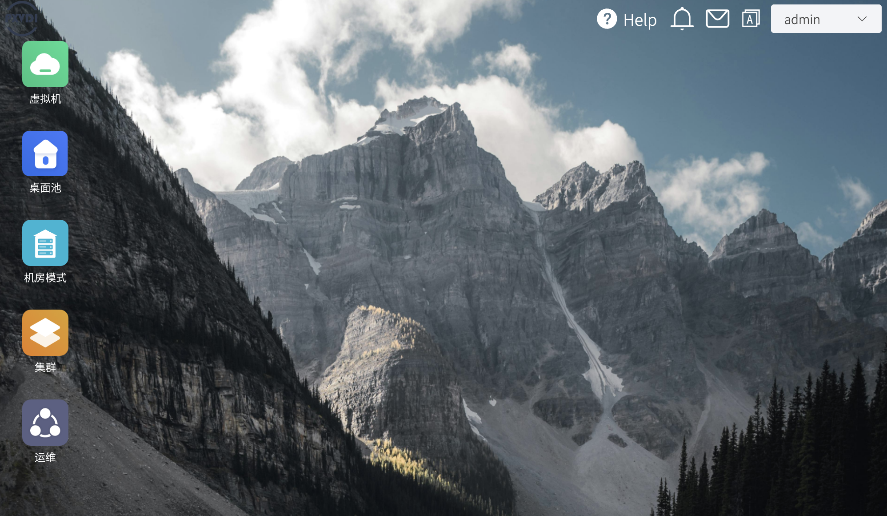

# 主页

PXVDI 总控模式管理平台的主页采用桌面式布局。

### 左侧桌面入口区

当前前端中有 5 个一级入口：

- `虚拟机`
- `桌面池`
- `机房模式`
- `集群`
- `运维`

点击后，系统通常会以窗口形式打开对应模块。

下面是各个模块的功能

### 顶部功能区

- 平台 Logo
- 语言切换
- 当前管理员菜单

### 虚拟机

- 单台虚拟机配置
- 模板
- 备份
- 克隆、迁移、快照

### 桌面池

- 用户操作
- 域
- 网关
- 桌面池
- 在线桌面状态

### 集群

- 节点
- 存储
- 集群资源监控

### 运维

适合处理：

- 系统摘要
- 日志
- 平台升级
- 客户端管理

## 顶部管理员菜单

### 修改密码

1. 点击右上角管理员账号。
2. 选择`修改密码`。
3. 输入新密码并确认。
4. 保存后重新登录验证。

### 退出系统

1. 点击右上角管理员账号。
2. 选择`退出系统`。
3. 系统会返回登录页。
