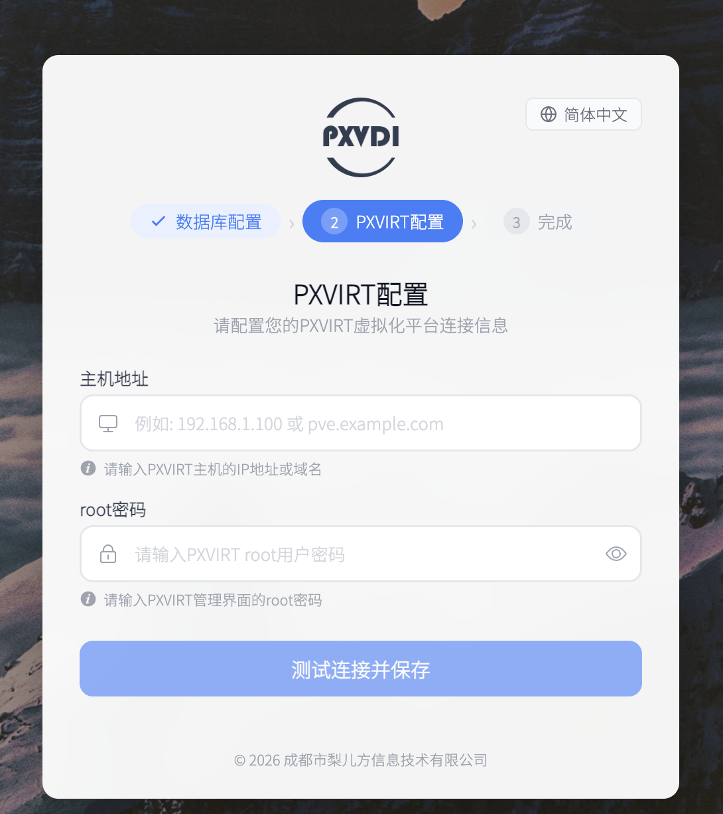

# PXVDI 安装

本页说明 PXVDI 总控模式 Web 管理系统的安装和首次初始化流程。

这里介绍的是 `PXVDI Server` 的安装，也就是你们日常使用的这套管理后台服务端。

## 安装前准备

正式安装前，建议逐项核对：

- PXVIRT 已经安装完成。
- 已准备一台 Debian(12或者13版本)或者openeuler 24版本 主机或虚拟机安装 PXVDI Server。最低配置为2核4G内存16G磁盘。也可以使用我们[预构建的镜像](../pxvdiserver-img.md)
- 已准备数据库地址、端口、账号和密码（可选）。
- 浏览器可以访问 PXVDI Server 监听的 `3002` 端口。
- PXVDI Server所在的网络可以访问 PXVIRT 管理地址。

## 总控模式的组件说明

| 组件 | 作用 | 是否必须 |安装位置| 说明 |
| --- | --- | --- | --- |--- |
| PXVIRT | 提供底层虚拟化能力 | 必须 | 物理服务器 |所有虚拟机和集群资源的底座 |
| PXVDI Server | 提供 Web 管理平台和交付逻辑 | 必须 | 虚拟机 |当前这套管理系统 |
| MySQL | 提供平台数据库 | 按需 | 虚拟机，可和PXVDI Server一起 | 初始化时要连接 |
| PXVDI HTML5 | 提供浏览器接入能力 | 按需 | 虚拟机| 需要浏览器访问桌面时部署 |
| PXVDI Stream | 提供自研远控和集中控制能力 | 按需 | 被远程访问的虚拟机| 需要远控或集中控制时使用 |
| PXVDI 客户端 / 瘦终端 | 供终端用户接入桌面 | 按需 | 终端设备| 视终端接入方式而定 |


## 第一步：安装数据库(可选)


PXVDI Server 支持2种数据库类型，一种是mysql类型，一种是内置的数据库。

两者在性能上没有显著区别，我们推荐新装用户使用内置的数据库。

如果想使用mysql，可以参考下面流程，如果不使用mysql，直接跳至第二步。

### 安装数据库

```bash
apt update
apt install default-mysql-server -y
```

### 设置 root 密码

```bash
mysql -uroot -p # 这里会直接进入数据库命令行
ALTER USER 'root'@'localhost' IDENTIFIED BY '新密码'; #这些直接修改root的密码，请替换'新密码'为密码
```

### 如果数据库和 PXVDI 不在同一台机器

还需要额外处理：

- 开启远程访问权限
- 给 PXVDI 使用的账号授权

示例：

```bash
mysql -uroot -p
create user 'pxvdi'@'%' identified by 'P@SSw0rd';    # 创建一个用户
GRANT ALL PRIVILEGES ON *.* to 'pxvdi'@'%';;  # 给予用户所有的数据库权限
FLUSH PRIVILEGES;
```

## 第二步：安装 PXVDI Server 主程序

主程序下载地址 `https://mirrors.lierfang.com/pxcloud/pxvdi/MIDServer/server/`

有6个版本，按架构和系统类型选择对应包：

| 文件名 | 架构 | 适用处理器示例 | 适用系统 |
| --- | --- | --- | --- |
| `pxvdiserver_latest_amd64.deb` | x86 / c86 | Intel、AMD 处理器 | Debian  ubuntu 系列 |
| `pxvdiserver_latest_arm64.deb` | arm64 | 鲲鹏、飞腾处理器 | Debian ubuntu 系列 |
| `pxvdiserver_latest_loong64.deb` | loongarch64 | 龙芯 3C5000 处理器 | Debian  ubuntu 系列 |
| `pxvdiserver_latest_riscv64.deb` | riscv64| riscv64系列机器 | Debian  ubuntu  系列 |
| `pxvdiserver_latest_amd64.rpm` | x86 / c86 | Intel、AMD 处理器 | RHEL openeuler centos系列 |
| `pxvdiserver_latest_arm64.rpm` | arm64 | 鲲鹏、飞腾处理器 |  RHEL openeuler centos系列  |
| `pxvdiserver_latest_loong64.rpm` | loongarch64 | 龙芯 3C5000 处理器 |  RHEL openeuler centos系列  |
| `pxvdiserver_latest_riscv64.rpm` | riscv64| riscv64系列机器 | RHEL openeuler centos系列 |


把安装包（可以通过scp上传，或者通过wget直接在服务器上完成下载）上传到 Debian 主机后执行：

```bash
dpkg -i pxvdiserver.deb
systemctl enable pxvdiserver
```

如果你们部署规范要求安装后立即启动，也可以再执行：

```bash
systemctl start pxvdiserver
```

随后看服务，如果服务正常，则没什么问题
```bash
systemctl status pxvdiserver
```

## 第三步：打开初始化页面

安装完成后，在浏览器访问：

```text
https://服务器地址:3002
```

示例：

- `https://10.13.14.121:3002`


如果浏览器打不开，优先检查：

- 服务是否启动
- 防火墙是否放行 `3002`
- 地址和端口是否正确
- 证书告警是否被浏览器拦截

## 第四步：初始化数据库连接

进入初始化页面后，第一步通常是填写数据库信息。 

### mysql字段说明(仅选择mysql数据使用)

| 字段 | 含义 | 推荐值 / 示例 | 注意事项 |
| --- | --- | --- | --- |
| 数据库地址 | PXVDI Server 连接数据库的地址 | `127.0.0.1` | 本机数据库一般这样填 |
| 数据库端口 | 数据库监听端口 | `3306` | 默认 MySQL 端口 |
| 数据库用户名 | 登录数据库使用的账号 | `pxvdi` | 正式环境更推荐专用账号 |
| 数据库密码 | 上述账号的密码 | 实际密码 | 不要填错环境 |
| 数据库名称 | 供 PXVDI 使用的库名 | `pxvdi_prod` | 建议测试和生产分开 |


## 第五步：配置 PXVIRT 连接

数据库初始化完成后，系统会继续要求配置 PXVIRT 连接。



| 字段 | 含义 | 推荐值 / 示例 | 注意事项 |
| --- | --- | --- | --- |
| PXVIRT 主机地址 | 要对接的 PXVIRT |PVE管理地址 | `10.10.10.10` | 一般不需要写路径 |
| PXVIRT 管理账号 | 平台连接 PXVIRT |PVE的账号 | `root@pam` | 初始化阶段最常见 |
| PXVIRT 管理密码 | 上述账号对应的密码 | 实际密码 | 填写错误会导致对接失败 |


## 第六步：首次登录系统

初始化完成后，系统会进入登录页面。

默认管理员为：

- 用户名：`admin`
- 密码：`P@SSw0rd`


进入系统之后，可去主页顶部用户图标处，修改默认密码！