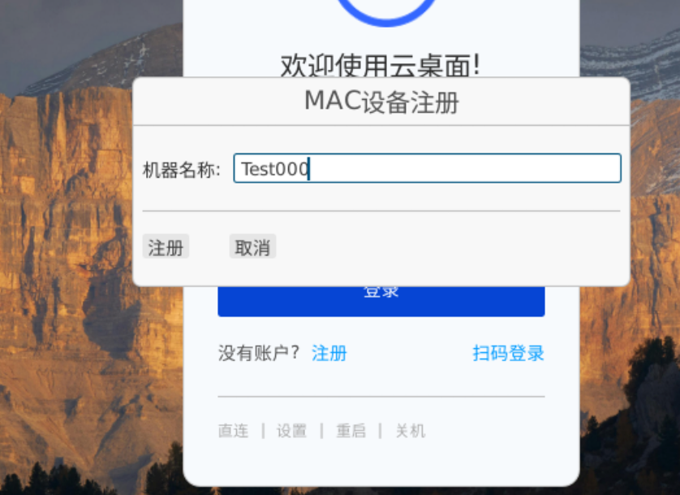
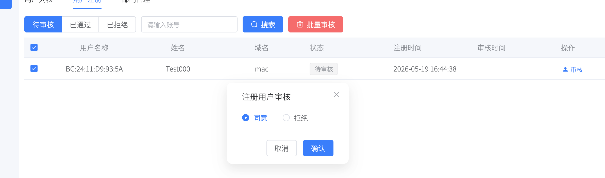
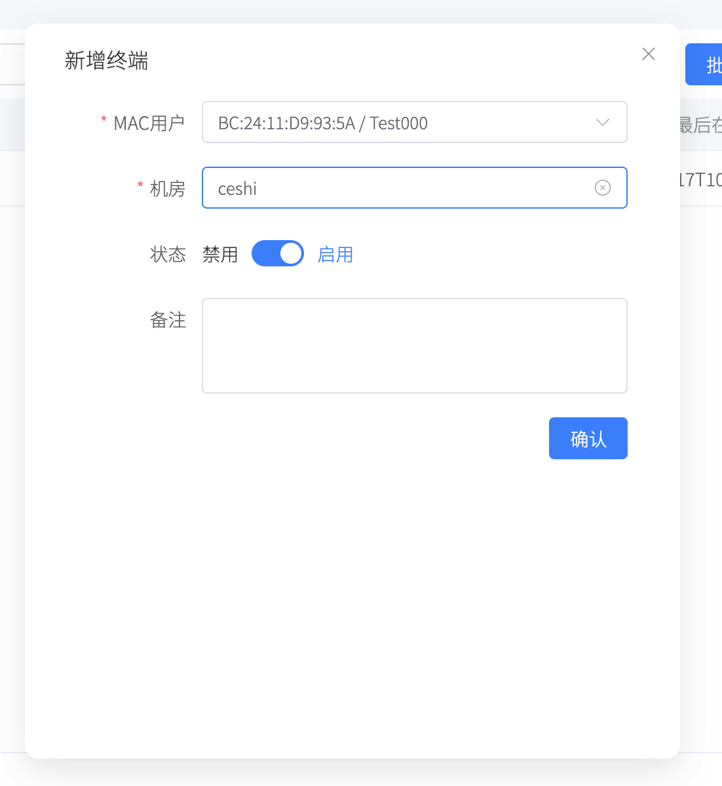
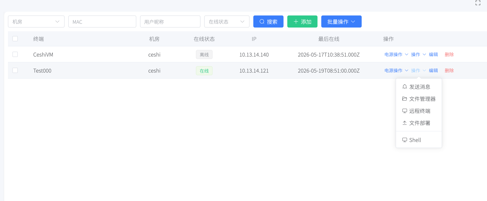

# 终端管理

## 如何启用终端管理

### 1. 安装pxvdistream服务

终端管理和我们的pxvdistream复用。pxvdistream已在瘦客户机系统中内置。

在瘦客户端系统中，直接运行下面命令，安装pxvdistream服务
```bash
pxvdistream install
```

随后编辑配置文件
```bash
nano ~/.lierfang/pxvdistream.conf
```

修改apiserver 为pxvdiserver的地址，例如：
```
apiserver=https://10.13.14.4:3002
```

随后重启服务
```bash
systemctl restart pxvdistream
```

### 2. 在瘦客户端中注册mac用户

瘦客户端设置中启用mac模式，返回到主页，进行注册。请准确输入



注册成功后，可以在pxvdiserver的后台->桌面池->用户管理->用户审核中，同意用户



### 3. 在机房管理中添加终端



此时就可以操作终端了


