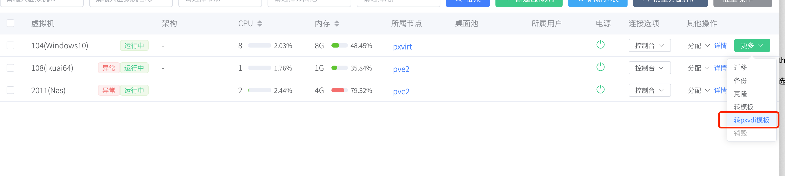
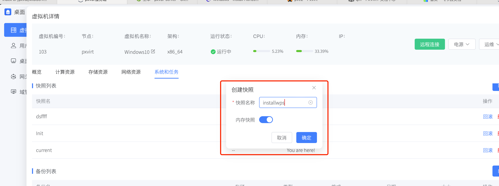
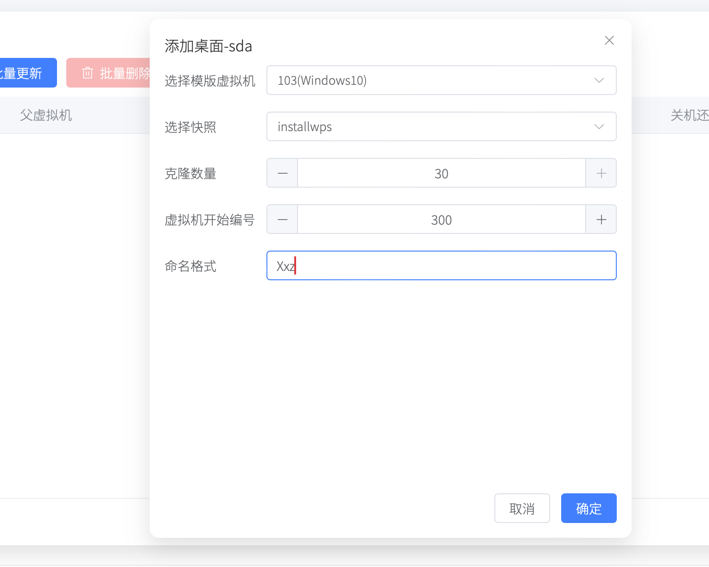
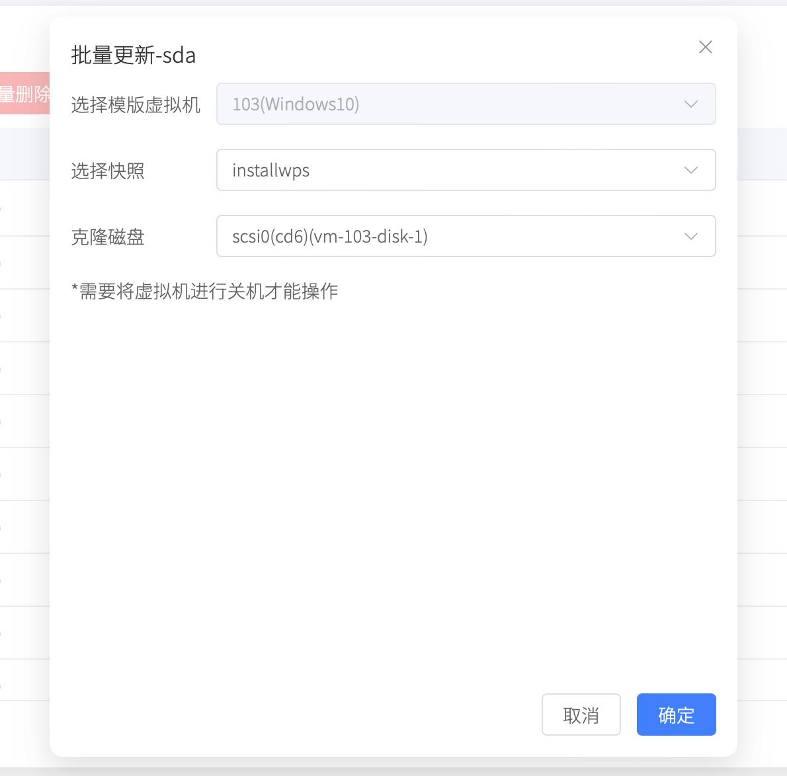

# 快照桌面池

快照桌面池利用磁盘快照技术，将一个磁盘作为基础磁盘。管理员可以通过快照进行快速同步磁盘数据到其他虚拟机，实现系统批量更新。

快照桌面池依靠pxvdi模板。

## PXVDI模板管理

PXVDI模板需要虚拟机使用lvm-thin/zfs/ceph-rbd存储。

如果要转成PXVDI模板，只需要选中一个虚拟机，点击`转为pxvdi模板`即可

## PXVDI 模板用法

PXVDI模板和PVE模板不同，PXVDI模板支持开机修改数据，当管理员为PXVDI模板 安装一个wps软件时，向将这个时刻的数据同步到桌面池虚拟机，可以为模板打一个快照。

随后前往桌面池，进行批量添加桌面。

或者进行批量更新

在批量更新之前，请务必使虚拟机进行关机。

## 快照桌面池缺陷

1. 更新磁盘而不是更新数据

快照桌面池的批量更新是更新一个磁盘，而不是更新变动的数据，如果数据存放在更新的磁盘上，那么将会丢失数据！

如果要存数据，请给虚拟机设置数据盘。添加另外的一个磁盘

快照桌面池仅适合机房等不需要保存数据的场景下。

2. 不支持跨节点克隆，只支持在本节点克隆

