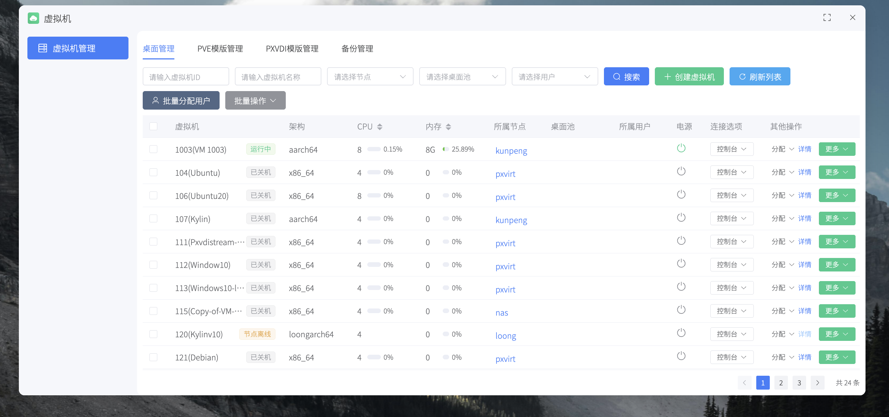
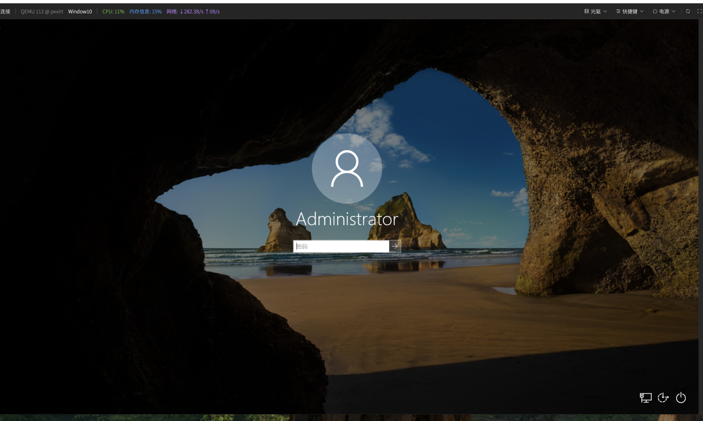
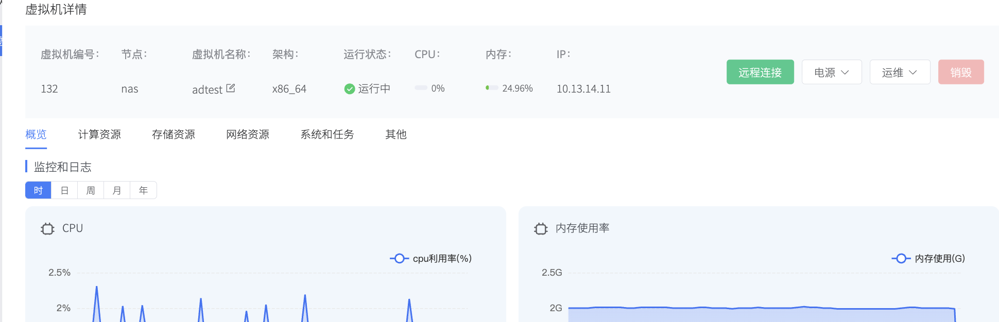

# 桌面详情

桌面详情用于查看和修改单台虚拟机的完整配置，是日常运维最核心的页面之一。

这里包含4个tab菜单

## 远程连接

点击`远程连接`后系统会打开 VNC 页面，常用于安装系统、排查启动问题等场景。

## 电源操作

| 操作 | 说明 |
| --- | --- |
| 开机 | 正常启动 |
| 关机 | 向系统发送关机信号，系统自行处理 |
| 强制关机 | 直接断电，系统无响应时用，有丢数据风险 |
| 重启 | 正常重启 |
| 强制重启 | 系统卡死时用 |
| 恢复 | 从暂停或挂起状态恢复 |

## `运维`菜单

点击`运维`后包含：迁移、备份、快照、克隆。

### 运维 -> 备份

| 字段 | 说明 |
| --- | --- |
| 备份格式 | 推荐 `zstd`，速度和压缩率均衡；`lzo` 最快；`gzip` 压缩率最高但慢 |
| 备份存储 | 选剩余空间足够的存储 |
| 备份模式 | `snapshot` 对业务影响最小，优先选；`suspend` 短暂暂停；`stop` 需停机 |
| 备注 | 建议写清楚时间和原因，例如 `2026-03-11 显卡驱动升级前`、`考试封版备份` |

完成后在`虚拟机管理 -> 备份管理`查看结果。

### 运维 -> 快照

输入快照名称后提交即可。名称建议用"日期+场景"的格式，例如 `2026-03-11_before_patch`、`exam_baseline`，方便后续恢复时辨认。

打补丁、换驱动、测试软件安装前都是做快照的好时机。

### 运维 -> 克隆

1. 选择目标节点（确认资源够用）。
2. 选择快照（没有快照可不选）。
3. 选择克隆方式。
4. 填写克隆数量、起始编号、命名规则。
5. 提交后等待完成，回到`桌面管理`确认新桌面。

| 字段 | 说明 |
| --- | --- |
| 克隆方式 | 链接克隆：快、省空间，批量发桌面首选；非链接克隆：每台独立，存储占用更多，适合长期个人桌面 |
| 克隆数量 | 大批量会占用较多 IO，需要等待 |
| 起始编号 | 新虚拟机 VMID 起始值，需避开已有编号 |
| 命名规则 | 支持 `{n}` 占位符，例如 `ClassA-Desk{n}` 会生成 `ClassA-Desk-1`、`ClassA-Desk-2` |

### 运维 -> 迁移

选择目标节点后提交即可。常见场景：原节点资源紧张、节点维护前腾挪、硬件异常需转移、手动做资源均衡。

## 概览页

显示虚拟机的基本状态和资源使用情况，包括 CPU / 内存 / 磁盘 / 网络，以及虚拟机内部 IP。

如果看不到内部 IP，这会导致客户端连接失败，原因一般是 qemu-guest-agent 未安装或未启动，确认虚拟机内驱动已全部装好。

## 计算资源页

用于修改 CPU 数量、内存大小、CPU 类型、内存回收等配置。部分改动需要先关机。

CPU 类型没有特殊需求保持默认即可，只在跨节点迁移兼容或特定软件有要求时才需要调整。

内存回收允许宿主机在资源紧张时从虚拟机回收闲置内存，高密度桌面环境下有用，但对图形负载重或实时性要求高的桌面不建议开。

## 存储资源页

可以管理系统盘、数据盘、光驱、EFI 磁盘，以及调整启动顺序。

添加磁盘：点击`添加磁盘`，选择总线类型和编号，选存储池，填大小，提交。

| 总线类型 | 说明 |
| --- | --- |
| `scsi` | 半虚拟化，通用首选 |
| `virtio` | 性能最好，需系统有对应驱动 |
| `sata` | 全虚拟化，免驱但性能差 |
| `ide` | 旧系统兼容，仅支持 x86 |
| `nvme` | 模拟 NVMe，免驱，通用性一般 |

## 网络资源页

查看和修改虚拟网卡，包括桥接、VLAN、带宽限速等配置。

## PCIe / USB / 设备直通

用于给桌面直通显卡、USB 控制器等硬件。针对显卡等 PCIe 设备，请在 PXVIRT 后台完成直通配置。
