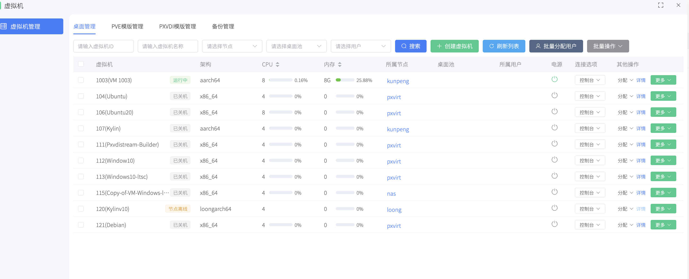
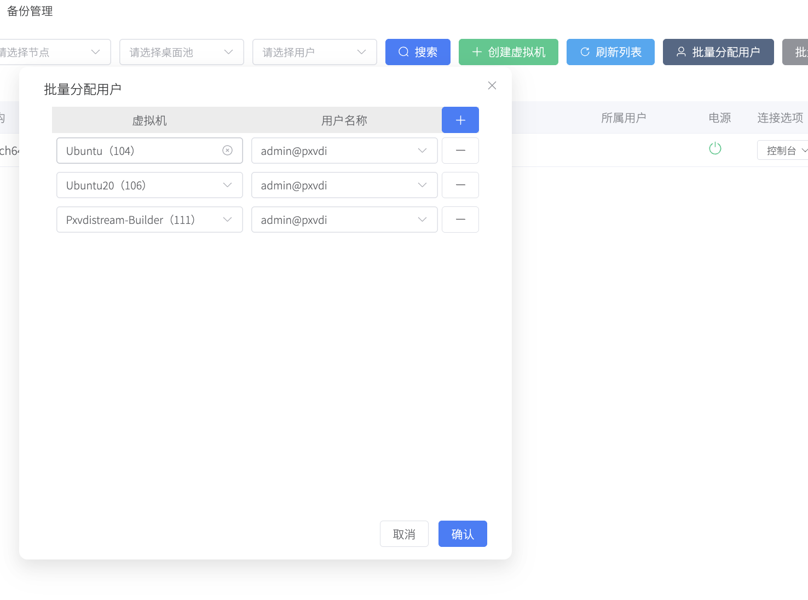
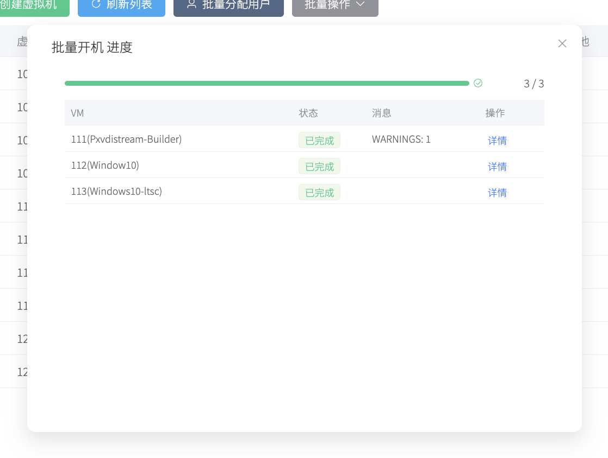

# 桌面管理

桌面管理用于查看平台中的普通虚拟机，并执行最常用的日常运维动作。

## 1. 创建虚拟机

本弹窗创建虚拟机和在PVE创建虚拟机基本一致，在2处地方创建均可！

### 1.1 基本设置

| 字段 | 说明 |
| --- | --- |
| 节点 | 选择虚拟机所在的节点 |
| 虚拟机 ID | 手动设置虚拟机的 ID |
| 虚拟机名称 | 输入虚拟机的名称 |
| 架构 | 虚拟机的架构，需要和主机架构一致 |
| 机型 | x86 机器建议选择 `q35` |

### 1.2 硬件

| 字段 | 说明 |
| --- | --- |
| CPU 数量 | 虚拟机的 vCPU 数量 |
| 内存大小 | 内存大小，单位为 G |
| 系统类型 | 选择目标虚拟机的操作系统 |
| BIOS | win7 及更早系统选 `seabios`，其他建议 `ovmf` |
| 安全启动 | win11 需勾选，否则无法启动 |

### 1.3 磁盘

| 字段 | 说明 |
| --- | --- |
| 磁盘控制器 | 默认即可 |
| 磁盘 Bus 类型 | 可选 `sata`/`scsi`/`nvme`/`ide`，建议使用 `scsi` |
| Bus 号 | 每个磁盘有唯一 Bus 号，从 0 开始，不可重复 |
| 存储池 | 虚拟机硬盘的存储位置 |
| 大小 | 硬盘大小，单位为 G |
| 硬盘类型 | 虚拟硬盘格式，推荐 `qcow2` |
| 光驱 Bus 类型 | x86 虚拟机可用 `ide`（免驱），非 x86 机器不可使用 `ide` |

针对Windows，可以创建2个光驱，一个作为iso，一个作为驱动光盘，这样安装会非常顺利。

### 1.4 网络

| 字段 | 说明 |
| --- | --- |
| 硬件类型 | `virtio` 性能最佳 |
| 网络 | 选择虚拟机的虚拟交换机 |
| VLAN | 需要配置 VLAN 时填写，否则留空 |
| MTU | 需要配置 MTU 时填写，否则留空 |

## 2. 搜索功能

支持按虚拟机 ID、名称、所属节点、所属桌面池、所属用户筛选，填入条件后点击`搜索`即可。

## 3. 虚拟机更多菜单
| 操作 | 说明 |
| --- | --- |
| 迁移 | 选择目标节点后提交，等待完成后列表中的所属节点会更新 |
| 备份 | 选择格式、存储、模式，填写备注后提交；结果在`备份管理`中查看 |
| 克隆 | 选择目标节点、克隆方式、数量、起始编号后提交 |
| 转模板 | 将虚拟机转为 PVE 原生模板，需要先关机 |
| 转 PXVDI 模板 | 将虚拟机转为 PXVDI 模板，需要先关机 |
| 销毁 | 删除虚拟机，不可恢复 |

## 4. 分配功能

### 4.1 单一分配

管理员可以把一个虚拟机绑定到一个桌面池或者分配给某个用户

点击分配按钮可以分配

### 4.2 批量分配功能

点击顶部批量分配用户，可以进行对多个虚拟机和多个用户同时操作

### 5 批量功能

点击批量，勾选列表虚拟机即可

注意！

批量停止是强制关闭虚拟机，批量销毁，请先关闭虚拟机。

